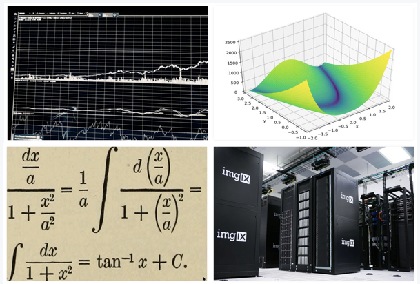

# 1주차 - 데이터 사이언스 마인드

## 이번 주 목표

### 데이터 사이언스 마인드

**우리가** **하려는** **데이터** **사이언스가** **무엇인지** **알고 데이터를** **다루는** **법을** **배워봅시다.**

데이터 사이언스에 대해 정의하고 앞으로 우리가 공부해나갈 범위에 대해 이해합니다.  
이후 엑셀과 Pivot Table을 이용해 데이터를 조작하여 타이타닉의 생존자를 찾아볼 것 입니다.  
이 과정에서 Feature Engineering에 대해 학습합니다.

