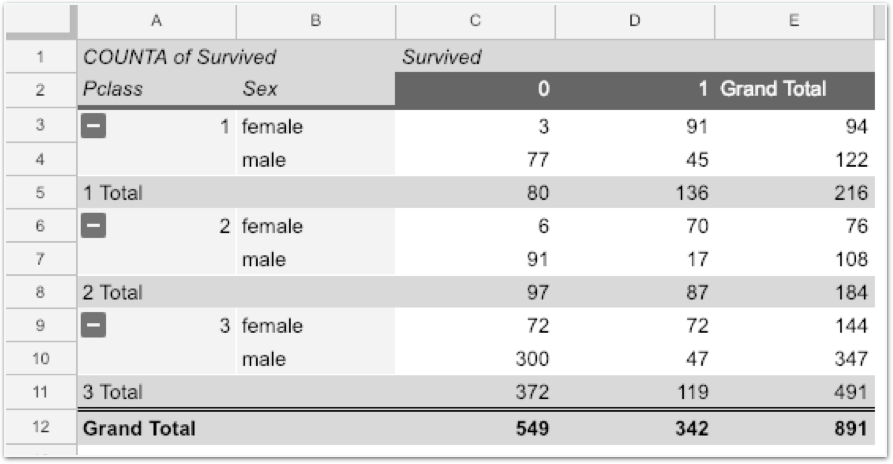

# Challenge1 - 각 티켓 등급에 따른 성별별 생존 가능성 예측하기

## 문제

### 각 티켓 등급에 따른 성별별 생존 가능성 예측하기

위 그림과 이와 같은 pivot table을 구성합니다.

**Challenge가** **완료되면** **다른** **방식으로도** **해보세요. \(Pclass와** **Sex가** **아닌** **다른** **조합으로도\)**

## **방법**

### **오른쪽** **멤버가** **강의자료를** **열고,** **오른쪽** **멤버가** **메모장을** **열어** **답을** **적습니다. 서로** **의논하여** **답을** **채워주세요.**

1. **Rows는** **무엇으로** **설정해야** **할까요?**  **\[                  \] \[                  \]**
2. **Columns는** **무엇으로** **설정해야** **할까요?**  **\[                  \]**
3. **Values는** **무엇으로** **설정해야** **할까요?  \[                  \]**
4. **Rows와** **Columns를** **바꾸면** **어떻게** **될까요?**  **각자** **진행하고** **짝과** **비교해** **보세요.**

#### **답안** **작성이** **완료되면** **리더에게** **확인** **받으세요!**


데이터 분석에 정답은 없습니다. 같은 결과를 다른 방식으로 찾아낼 수 있고, 남이 생각하지 못한 방식으로 새로운 결론에 도달할 수도 있습니다. 자신만의 방식으로 자신있게 하세요!


