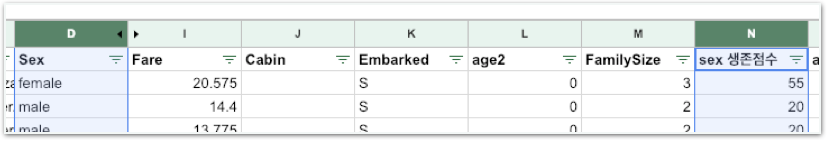

# Challenge2 - 나만의 방식으로 Kaggle에서 높은 점수 받기

## 문제

### 나만의 방식으로 Kaggle에서 높은 점수 받기

앞서 생존 점수를 구하기 위해 성별과 연령대를 점수화 하였습니다. 이외에도 생존에 영향을 미치는 요소가 많습니다.

다른 조합을 이용해 생존 점수를 계산해보고 Kaggle에 제출하여 점수를 확인해보세요!

**제출할 때는 반드시 PassengerId와 Survived열만 남겨야 합니다.**

## **방법**

### **오른쪽** **멤버가** **강의자료를** **열고,** **왼쪽** **멤버가** **메모장을** **열어** **답을** **적습니다. 서로** **의논하여** **답을** **채워주세요.**

1. **생존에** **영향을** **미칠** **수** **있는** **요소는** **무엇이** **있나요?**  **\[ Sex \] \[ age2 \] \[                  \] \[                  \]  \[                  \] \[                  \] \[                  \]**
2. **왼쪽** **멤버는** **어떤** **2가지를** **특징을** **분석해보시겠어요?**  **\[                  \] \[                  \]**
3. **오른쪽** **멤버는** **어떤** **2가지** **특징을** **분석해보시겠어요?  \[                  \] \[                  \]**
4. **각자** **맡은** **특징을** **분석하고** **결과를** **공유합니다.**

**답안** **작성이** **완료되면** **리더에게** **확인** **받으세요!  
확인** **후** **각자의** **방식으로** **생존점수를** **취합해** **생존자를** **예측하고** **결과를** **Kaggle에** **제출합니다.**

