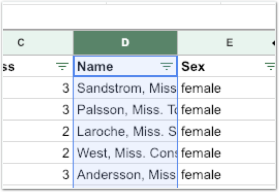

# 과제1 - 필요없다고 생각한 Name 필드로 부터 정보 얻기

드디어 첫 과제가 나갑니다. 물론 과제를 하지 않는다고해서 손바닥을 때리지는 않을 거예요. 자율이란거죠.

그래도 **할 수 있다면 하세요!** 과제를 하지 않은 사람보다 훨씬 높은 수준에 도달할 수 있습니다. 확신합니다.

**어렵다면 언제든 질문하세요.** 우리에겐 질문에 답변해주고 싶어서 안달난 **리더와 스터디 동료들**이 있잖아요? 카톡방과 페이스북 그룹\([https://www.facebook.com/groups/1673058032731901/](https://www.facebook.com/groups/1673058032731901/)\)에서 활발한 피드백이 오가고 있습니다.

## 문제

### 필요없다고 생각한 Name 필드로 부터 정보 얻기

사람의 이름이 생존율에 영향을 미친다고 생각하기는 어렵겠죠. \(‘박지성’, ‘이청용’, ‘손흥민’ 이름 때문에 생존율이 바뀌지는 않겠죠?\)

하지만 Name열을 자세히 살펴보면 다른 정보가 숨어 있습니다. Miss, Mrs, Mr과 같은 타이틀은 어쩌면 영향을 미칠 수도 있겠네요. 이름에 포함된 타이틀 정보를 다루는 새로운 열을 만들어 Pivot Table로 분석해보세요. 이를 반영하여 생존을 예측해 Kaggle에 제출하여 점수를 확인해보세요!

* **제출할 때는 반드시 PassengerId와 Survived열만 남겨야 합니다.**

## **방법**

### **다음** **단계를** **따라** **과제를** **진행하세요.**

**\[단계1\]** Stage3을 복습합니다.

**\[단계2\]** Name열에서 Miss, Mrs, Mr과 같은 타이틀 정보만  
추출합니다.

**\[단계3\]** 나만의 가중치 합산 방식을 만들어 Name으로 부터 얻은 데이터까지 사용해봅시다.

**\[단계4\]** Kaggle에 제출하여 채점해보세요!  
몇 점 나오셨나요? **\[ \]**

\*\*\*\*

