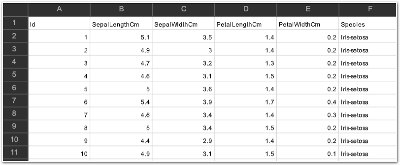
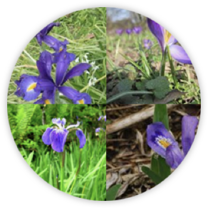
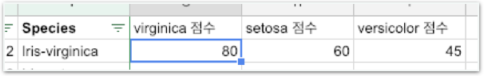
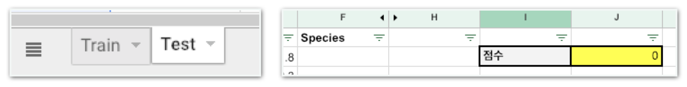

# 과제2 - IRIS\(붓꽃\) 구분하기

## 문제

### IRIS\(붓꽃\) 구분하기

데이터 다운로드 [http://bit.ly/코알라\_DS\_1주차\_과제2](http://bit.ly/코알라_DS_1주차_과제2)

이 데이터 셋은 3가지 아이리스를 구분하고 있어요. \(Iris-setosa, Iris-versicolor, Iris-virginica\) 이 종들을 구분하는 특징으로는 꽃잎의 길이, 꽆입의 너비, 꽃받침의 길이, 꽃받침의 너비가 있습니다.

이 특징들을 Pivot Table로 분석해보세요.

* **이 예제는 3주후 머신러닝 분석으로 다시 다룹니다.**
     [`https://www.kaggle.com/uciml/iris`](https://www.kaggle.com/uciml/iris)**\`\`**

## 방법

### **다음** **단계를** **따라** **과제를** **진행하세요.**

**\[단계1\]** 데이터를 다운로드 합니다.

**\[단계2\]** 엑셀 혹은 구글 스프레드 시트에서 실행하여  
첫번째 시트\(Train\)을 살펴봅니다.

**\[단계3\]** 피봇 테이블을 이용해 각 특징들이 종을 구분하는데 미치는 영향을 파악해봅니다.  
\(차트로 표현할 수 있으면 시도해보세요! 앞으로 이러한 visualization 능력을 배워갈거예요.\)

**\[단계4\]** 분류가 3가지라 헷갈리시죠? 가중치 점수는 이렇게 나와야해요.

**\[단계5\]** 내 가중치 기준으로 분류하여 Test 시트에서 채점해보세요.

몇 점 나오셨나요? **\[ \]**

