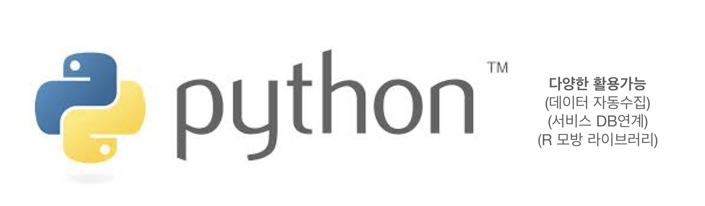
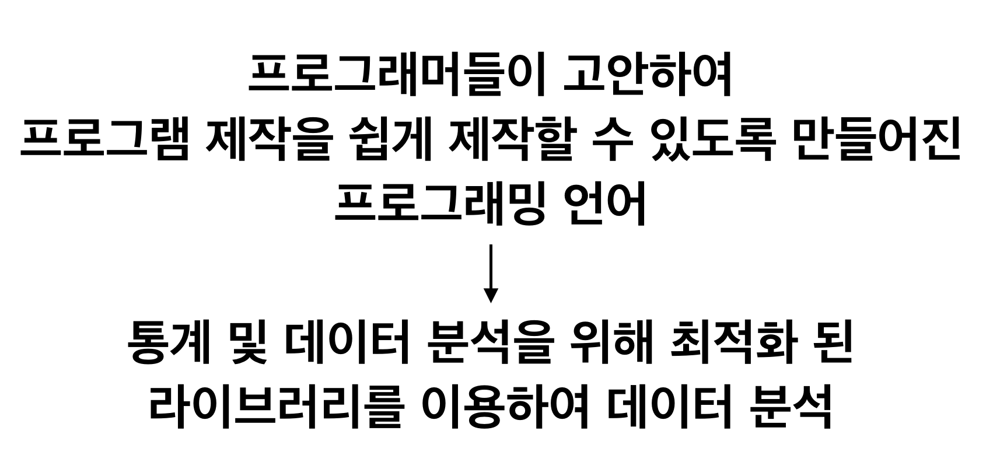
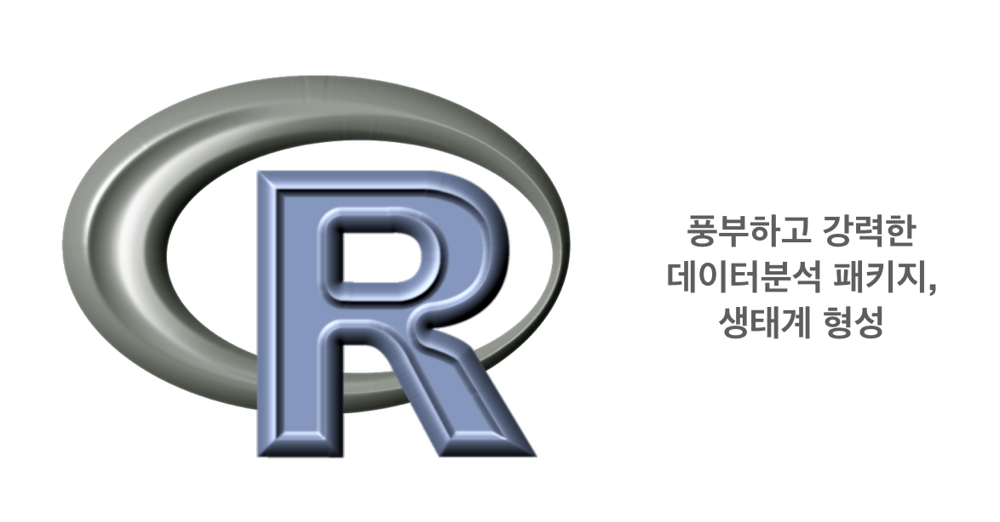

# 쉬는 시간 - Python vs R

## 시작점은 다르지만 ‘데이터 분석’이라는 목적은 같으며 둘 모두 성능과 자료가 충분합니다.

문서작성을 위해 ‘한글’을 배울지 ‘MS 워드’를 배울지 크게 고민할 필요는 없죠. 어떤 것이든 하나만 잘해도 문서작성을 완벽히 할 수 있습니다. 사실 원리는 같기 때문에 하나를 잘 하게되면 남은 하나도 잘하게 됩니다.

