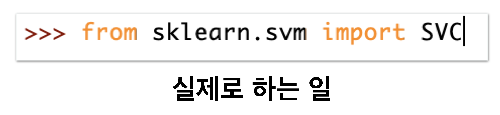
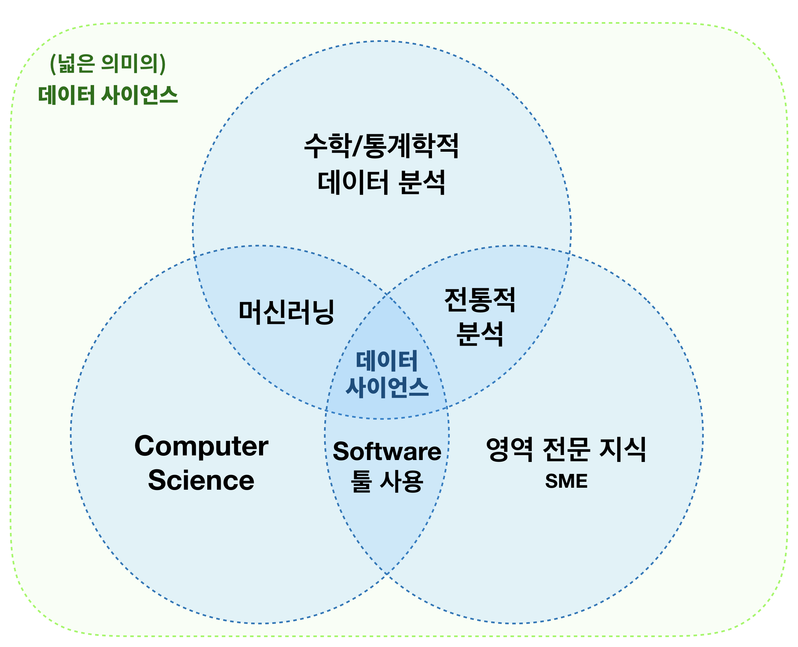
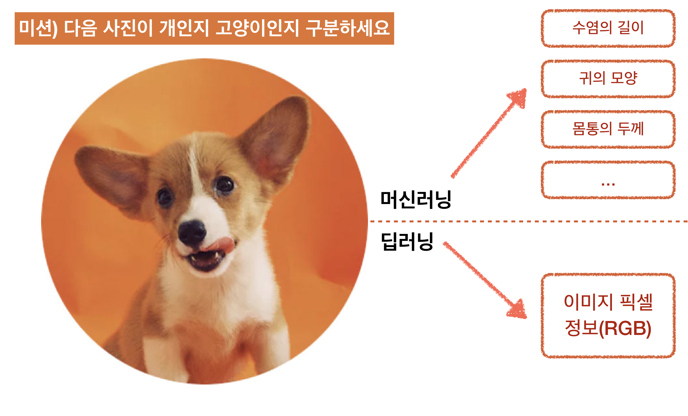
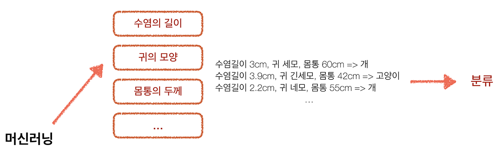
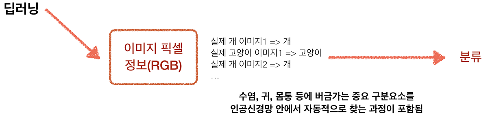
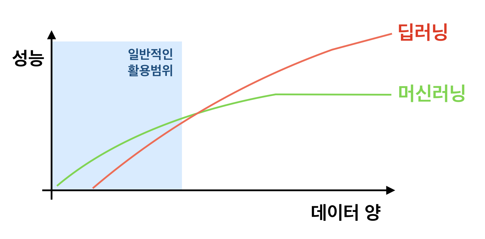
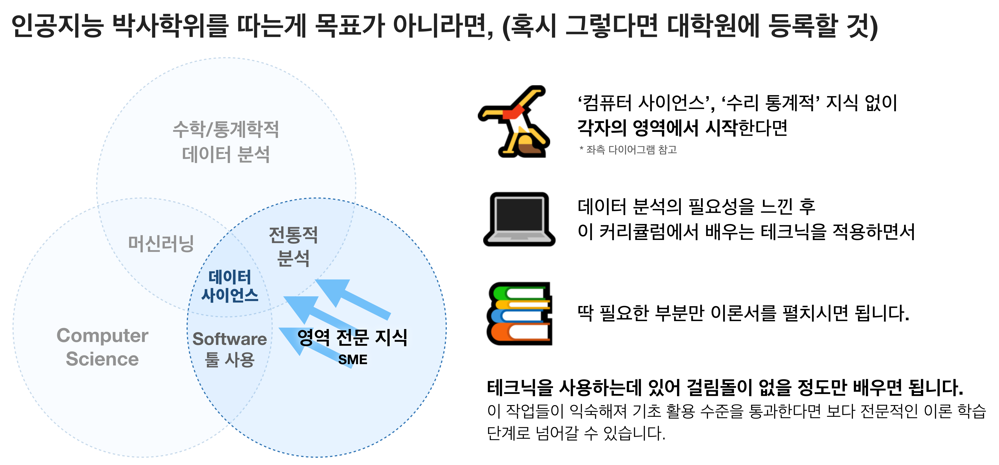
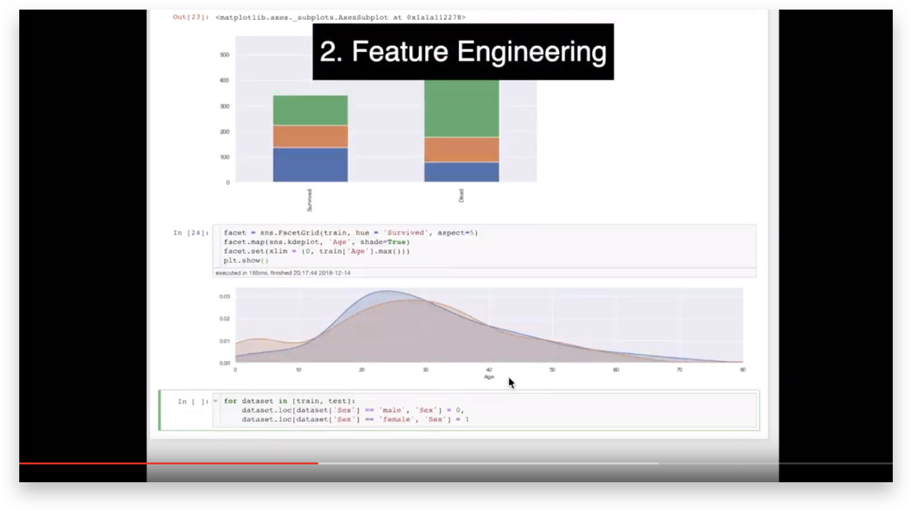

# Stage1 - 데이터 사이언스의 오해와 진실

## 사람들이 생각하는 데이터 사이언스

각자, 또 내 주변 사람들이 생각하는 데이터 사이언스에 대한 이미지가 많이 다르죠. 환상에 젖어 있는 분들도 계실테고 지극히 수학적인 것으로 치부하시는 분들도 계실겁니다. 코딩의 일종이라 생각하시는 분들도 많구요.

여러분이 생각하는 데이터 사이언스는 어디에 가까웠나요?

저 같은 경우는 데이터만 잘 구해와서 데이터 사이언스라는 뭔가를 적용만하면, **'주변사람들이 놀라고 좋아해줄만큼 화려한 인사이트가 툭하고 튀어 나오는 행위'**라는 상상에 빠져 있었습니다.

하지만 데이터 분석을 하고 있는 저를 비롯한 동료들, 학자들, 앞으로의 여러분들이 실제로 하고 있는 일은 아래에 가깝습니다.

실제로 데이터 분석을 시행하는 코드는 몇줄 되지 않습니다. 코드 한줄 한줄이 해낼 수 있는 능력이 엄청나다는 의미겠죠.

저 한줄에는 그만큼 수많은 의미가 내포되어 있고 수많은 사람들에 노력에 섞여 있습니다. 우리는 누군가 이미 피땀 흘려 만들어둔 도구를 활용할 겁니다. 이 도구의 제작자들은 친절하게도, 모든 자료를 완벽하게 공개했고 심지어 상업적으로도 무료로 쓸 수 있도록 권한을 풀어줬습니다. 자세한 메뉴얼도 올려줬구요.

앞으로 우리는 천천히 그 사용법과 코드 한줄한줄에 담긴 의미를 이해해 나갈 예정입니다. 이 클래스는 다른 어떤 강의나 서적보다도 직관적으로 이해하는 것에 초점을 두고 있습니다. 데이터 사이언스가 정말로 처음이라면 가장 효율적으로, 가장 쉽게 원리를 익힐 수 있는 방법을 만나보게 되실 겁니다. 만약 이미 데이터 사이언스를 공부하셨다면 놓치고 있던 원리와 이해를 채울 수 있는 기회가 될 겁니다.

## 데이터 사이언스란?

위키에서 아래와 같이 정의하고 있습니다.

> 데이터 과학\(data science\)이란, 데이터 마이닝\(Data Mining\)과 유사하게 정형, 비정형 형태를 포함한 다양한 데이터로부터 지식과 인사이트를 추출하는데 과학적 방법론, 프로세스, 알고리즘, 시스템을 동원하는 융합분야다.  
> [https://ko.wikipedia.org/wiki/데이터\_사이언스](https://ko.wikipedia.org/wiki/데이터_사이언스)

데이터 사이언스를 공부하다 보면 놀라는 점 중 하나는, 데이터 분석의 전문가, 석박사들 조차도 합치된 정의를 내리지 못하고 있다는 점입니다.

데이터 분석과 관련된 용어만 몇개 나열해볼까요?

> 데이터 마이닝, 머신러닝, 데이터 사이언스, 데이터 분석, 데이터 분석학...

데이터 마이닝과 데이터 사이언스는 엄연히 다르다고 이야기 하는 사람이 있는 반면, 완벽히 같다라고 주장하는 사람도 있습니다. 스스로가 데이터 마이닝 전문가라고 이야기하면서 실제로 하는 일은 데이터 분석가와 완전히 같은 사람들도 많습니다.

미세한 정의는 다를 수 있습니다. 그러나 사람에게 이로움을 주는 데이터를 창출하자는 궁극적인 목적이 같기에 그 과정에서 동원되는 방법이 겹치는 경우가 많을 뿐 입니다.

합치된 정의가 없고 각자의 이해관계 마다 다른 의미로 통용된다면, 우리의 목적에 맞는 데이터 사이언스를 새로 정의하는게 낫겠죠?

앞으로 우리가 하려는 데이터 사이언스는 보다 넓은 개념입니다. 전통적인 데이터 분석과 머신러닝, 각종 소프트웨어 툴을 사용하고 자신의 영역지식을 통합적으로 사용하는 사람의 추론 과정 그 자체입니다.

특별히 이 클래스에서 다루는 것은 그 중 '머신러닝'을 활용한 방법론이 될 것 입니다.

## 머신러닝?

기계에게 데이터를 학습시켜 그 속에 숨겨진 일련의 규칙성을 찾아내고 이를 통해 미래를 예측하거나 분류, 인식하는데 이용합니다.

### 가장 유명한 정의

> A computer program is said to learn from experience E with respect to some class of tasks T and performance measure P if its performance at tasks in T, as measured by P, improves with experience E. **경험\(E\)를 학습하여 TASK\(T\)의 성능\(P\)가 개선 되도록 하는 컴퓨터 프로그램**

### **활용분야**

스팸 메일 필터, 기상 예측, 고객 분석, 상품 추천, 영화 추천, 부정거래 탐지 등 예측이 중시되는 모든 분야

즉 머신러닝이란 컴퓨터가 사람이 부여한 행동절차가 아닌, 데이터를 판단 기준으로 삼아 동작할 수 있는 능력을 말하며 **결국 컴퓨터가 이해할 수 있는 학습 방법\(알고리즘\)을 개발하는 일**을 일컫습니다.

### 그럼 딥러닝과는 무엇이 다른가요?

딥러닝은 주로 인공신경망을 이용하며 데이터 전체를 학습해 보다 어려운 문제 해결에 사용됩니다.

쉽게 말하면 머신러닝으로 해보려 했는데 잘 안되니 고안한게 더 복잡한 딥러닝입니다.

특히 다른 점은 머신러닝의 경우 각 특징을 인간이 미리 구분하여 정제된 데이터를 제공한다는 점, 딥러닝은 그 특징 조차도 전체 이미지로부터 스스로 찾아간다는 점 입니다.

### 딥러닝이 아닌 머신러닝을 배우는 이유는?

1. 데이터가 매우 많고 고성능의 GPU를 포함한 장비가 있어야 효과를 볼 수 있다.
2. 더 어렵고 설계하는데 많은 시간이 걸린다.
3. 딥러닝의 모든 부분이 해답을 주진 않는다. 오히려 전통적인 방법이 세밀한 부분에서 더 큰 정확도를 가져다 준다.
4. 우리가 풀려는 문제는 대부분 머신러닝으로도 해결이 가능하다. \(더욱 복잡한 문제는 결국 딥러닝으로 풀어가야 한다.\)

## 이론은 얼마나 알아야 할까?

스스로 관심을 갖고 공부하시는 분들이 가장 어려워 하시는 부분입니다. 자신의 목적이 어디인지 정하면 명확해집니다. '활용/실용'에 목적이 있다면 이론보단 실전은, '학위'에 목적이 있다면 이론을 배우시면 됩니다.

## 데이터 분석 시연

앞으로 진행할 데이터 분석의 한 예제를 간단히 살펴보고 가겠습니다.

[https://youtu.be/O-vGl\_TJ0jY](https://youtu.be/O-vGl_TJ0jY) 에서 확인하시죠!

