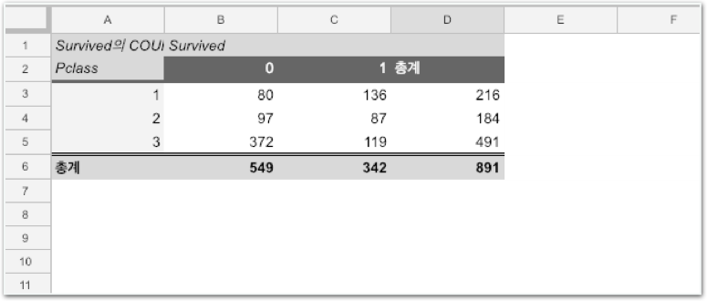

# Stage2 - 엑셀로 타이타닉 생존자 예측해보기

## 타이타닉 생존차 찾기 문제

타이타닉호에 탑승한 승객들의 데이터를 받아 각 승객들이 살았는지 죽었는지 판단하세요!

타이타닉에 승선한 사람들의 나이, 이름, 성별, 승선항구 등 9개의 특징 데이터를 바탕으로 특정 승객이 살았는지 죽었는지 판단하는 Kaggle의 대표적인 문제입니다.

## 엑셀의 Pivot Table

**엑셀**은 데이터를 쉽게 정리하고 전체적인 내용을 파악할 수 있도록 도와주는 도구입니다.

### Pivot Table

시트의 데이터들을 필터링, 정렬, 재편성, 계산, 요약하여 정보를 쉽게 파악할 수 있도록 도와줍니다.


Microsoft Excel이 없는 분들을 위해 동일한 기능을 가진 Google Spread Sheet을 사용합니다. 엑셀을 잘 다루신다면 해당 프로그램을 사용하셔도 좋습니다.


### 실습 준비

\*\*\*\*[**http://bit.ly/코알라\_DS\_1주차\_데이터**](http://bit.ly/코알라_DS_1주차_데이터) 링크를 통해 1주차 실습 자료를 다운로드해주세요.

다운로드가 완료되었다면, 자신의 구글 드라이브에 위 파일들을 모두 업로드합니다. 이후 train.csv를 실행해주세요. \(구글 스프레드 시트를 통해 실행됩니다.\)

train.csv를 구글 스프레드 시트 혹은 엑셀로 열었다면 이제 피봇 테이블 기능을 사용해보겠습니다.

### 함께실습$1

#### 승선한 항구\(Embarked\)에 따른 평균 요금\(Fare\)을 나타내보세요!

### 함께실습$2

#### 승선한 항구\(Embarked\)에 따른 성별\(Sex\)별 인원 수를 나타내보세요!

## Pivot Table로 생존가능성 알아보기

### 미션$1

#### 승선한 항구\(Embarked\)에 따른 성별\(Sex\)별 생존자 수를 보여주세요.

### 미션$2

#### 티켓등급\(Pclass\)에 따른 **사망자** **수,** **생존자** **수**를 각각 보여주세요.

* 피봇테이블 Values 요약 속성

| **Summarize by** | **설명** |
| :--- | :--- |
| COUNTA | 개수 |
| SUM | 합계 |
| AVERAGE | 평균 |

### 미션$3

각 티켓등급\(Pclass\)별 생존율을 계산하시오.

생존율 계산이 끝났으면 아래의 질문에도 답해보세요!

**생각해보기1**  
“가장 생존율이 높은 티켓등급은 무엇인가요?”

**생각해보기2** - **미션1** **자료만을** **보고**  
“S항구에서 탑승한 여성의 생존 가능성이 가장 높다고 말할 수 있나요?”

**생각해보기3** - **미션2** **자료만을** **보고**  
“3등급 티켓의 생존율이 가장 낮다고 말할 수 있나요?”

### 미션$4

각 성별\(Sex\)별 생존율을 계산하시오.

### 미션$5

**생각해보기1**  
“여성의 생존 가능성이 더 높다고 볼 수 있나요?”

**생각해보기2**  
“승선한 항구가 생존 가능성에 영향을 준다고 볼 수 있나요?”

**생각해보기3**  
“전체 탑승자의 생존율은 얼마인가요?”

