# Stage3 - Basic Feature Engineering

## Feature Engineering with Pivot Table

### Feature Engineering

모델에 입력하기 전단계로\(즉 학습하기 전에\), 학습모델이 데이터의 특성을 잘 이해하고 반영하여 성능이 향상될 수 있도록 특징을 생성, 수정, 가공하는 것입니다.

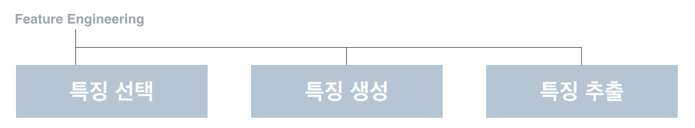

1주차에서는 Feature Engineering의 목적과 방법을 이해하기 위해 누구나 사용하기 쉬운 엑셀을 이용할 것 입니다.

**이후 Python을 통해 완전히 동일한 작업을 코드 상에서 진행할 예정**입니다. 엑셀을 사용하냐, Python을 사용하냐는 Feature Engineering의 툴이 바뀐 것일 뿐 그 목적과 방법은 다르지 않습니다.


#### Feature Engineering은 데이터 분석에서 가장 중요한 단계입니다.

이 분야만 파고 들어도 몇개월, 수년은 족히 걸릴 정도로 어렵고 깊은 영역입니다. 이 커리큘럼에서는 광의의 개념으로 Feature Engineering에 접근하며 일반적인 데이터 분석에 꼭 필요한 부분만 중점적으로 학습합니다.


## 특징 선택 - Feature Engineering with Pivot Table

### 분석 목표

승객이 생존할 지, 사망할 지 생존여부 예측하기

### 특징 선택

각 특징별 중요도를 매기고 분석 결과에 큰 영향을 줄 수 있는 특징을 선별합니다.

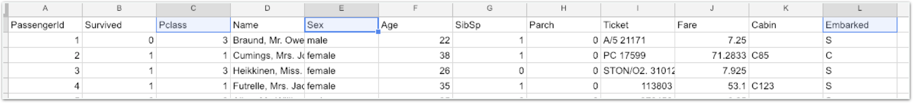

앞서 실습과 미션을 진행한 바로는, 티켓 등급\(Pclass\), 성별\(Sex\), 항구\(Embarked\)가 생존 여부에 큰 영향을 끼칠 것으로 보입니다.

아직 확인하진 않았지만 Age\(나이\), SibSp\(형제자매 수\), Parch\(동반 부모님 수\), Fare\(요금\), Cabin\(객실\)도 생존 가능성에 영향을 미칠 수 있겠네요.

## 특징 생성 - Feature Engineering with Pivot Table

### 분석 목표

승객이 생존할 지, 사망할 지 생존여부 예측하기

### 특징 생성

흔히 Feature Engineering이라고 하는 대부분의 작업으로, 주어진 데이터를 이용해 새로운 특성을 조합, 분리하는 등의 과정을 거쳐 새로운 특성\(feature\)를 만들어내는 작업을 말합니다.

데이터를 꼼꼼히 살펴보면 다음과 같은 문제가 있습니다.

1. Age\(나이\)의 종류가 너무 많아 통계 내기 어렵습니다. \(0살부터 80살까지 총 91가지 분류\) 
2. Fare\(운임\)도 Age\(나이\)와 마찬가지로 가지 수가 너무 많습니다. 
3. SibSp\(형제자매 수\)와 Parch\(부모님 수\)는 굳이 나눌 필요 없이 가족구성원 수로 합치는게 분석에 유리해보입니다.
4. Cabin\(객실\)은 ‘C85’처럼 표시되는데, 뒤에 따라오는 숫자가 실제로 의미가 있을지 의심됩니다. 
5. Age, Cabin 등의 항목에서 채워져있지 않은 빈칸이 꽤 많습니다.

**이러한 문제들을 해결하는 작업이 Feature Engineering의 특징 생성 부분입니다.**

### 함께실습$1

#### **현재 데이터의 문제점**

Age\(나이\)의 종류가 너무 많아 통계 내기 어렵습니다.

#### **해결법**

연령대별로 범위 묶기 \(10대 미만은 0, 10대는 1, 20대는 2, 30대는 3, 40대는 4, 50대 이상은 5\)

#### 1. 데이터 가장 우측 열 오른 쪽에 age2 필드를 만들어줍니다.

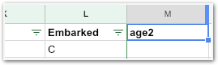

#### 2. 모든 데이터를 블록처리하고 filter를 적용합니다.

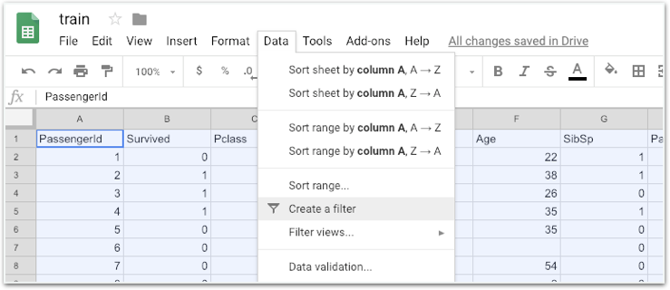

#### 3. age를 기준으로 정렬합니다.

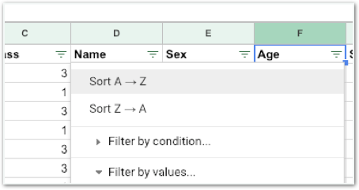

#### 4. 나이대별로 정리한 값을 age2에 다시 입력해줍니다.

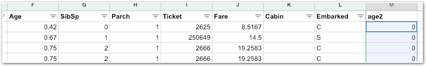

### 미션$1

#### 현재 데이터의 문제점

Fare\(운임\)의 종류가 너무 많아 통계 내기 어렵습니다.

#### 해결법

운임 가격대별로 범위 묶기 \(17대 이하는 0, 18 초과 ~ 30 이하는 1, 30 초과 ~ 100이하는 2, 100 이상은 3으로 세팅하기\)

#### 1. fare를 기준으로 정렬합니다.

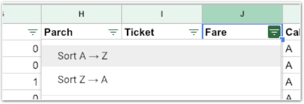

#### 2. 17원 이하의 모든 운임을 0으로 변경해줍니다.

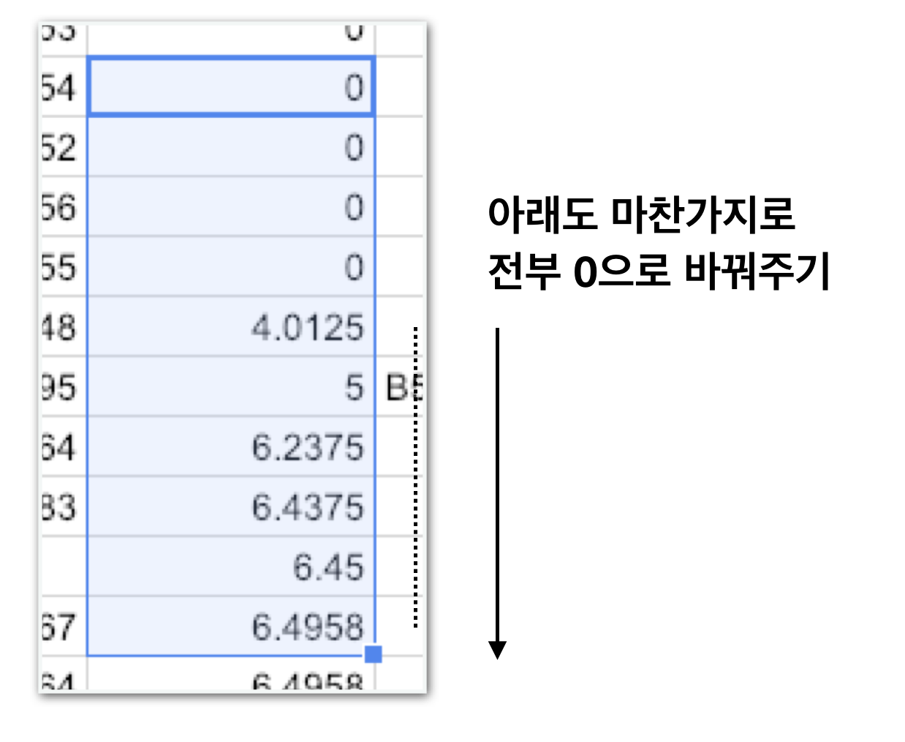

#### 3. 다른 운임 가격대에도 같은 방식을 적용합니다.

### 함께실습$2

#### 현재 데이터의 문제점

SibSp\(형제자매 수\)와 Parch\(부모님 수\)는가족구성원 수로 합치는게 분석에 유리해보입니다.

#### 해결법

SibSp와 Parch를 합쳐 FamilySize\(가족 수\)로 합치기

#### 1. 데이터 가장 우측 열 오른 쪽에 FamilySize 필드를 만들어줍니다.

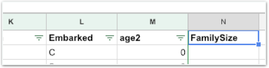

#### 2. SibSp와 Parch를 더하는 수식을 만들어줍니다.

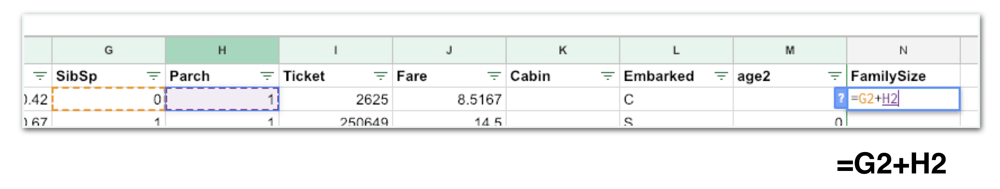

#### 3. 모든 부분에 적용해줍니다.

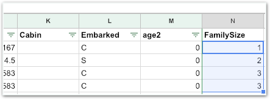

### 함께실습$3

#### 현재 데이터의 문제점

Cabin\(객실\)은 ‘C85’처럼 표시되는데, 뒤에 따라오는 숫자가 실제로 의미가 있을지 의심됩니다.

#### 해결법

객실 번호는 삭제하고 알파벳만 남깁니다.

#### 1. 객실 순으로 정렬합니다.

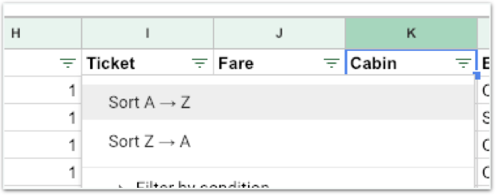

#### 2. AXX 객실 정보에서 첫글자인 알파벳만 남깁니다.

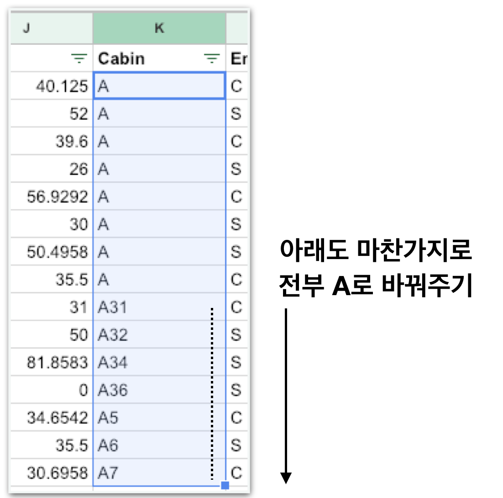

#### 3. BXX, CXX 등 모든 객실 정보에 같은 방식을 적용합니다.

### 함께실습$4

#### 현재 데이터의 문제점

Age 항목에서 채워져있지 않은 빈칸이 꽤 많습니다.

#### 해결법

전체 승객의 평균 나이를 구한다음 채워줍니다.

#### 1. age를 기준으로 정렬하고 데이터의 마지막 줄을 살펴봅니다.

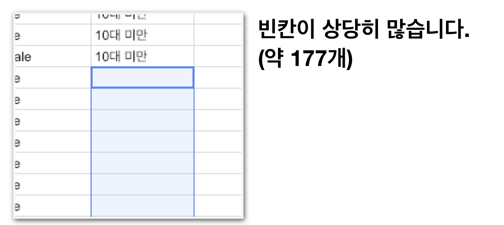

#### 2. 수식을 이용해 모든 승객 나이의 평균을 구합니다.

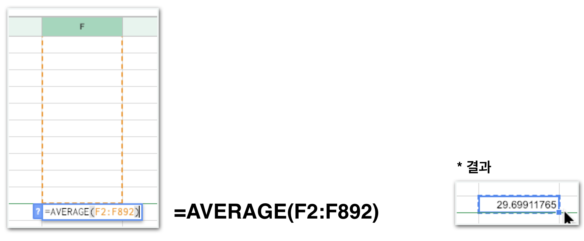

#### 3. age 빈칸을 모두 29.6으로 채워줍니다.

#### 4. age2의 빈칸도 마저 채워줍니다. \(20대니까 2로\)

**생각해보기1**  
“Average\(평균\)이 아닌 Median\(중간값\) 함수로 하면 어떨까요?”

### 미션$2

#### 1. cabin을 기준으로 정렬한 다음 A객실, B객실 등 모든 객실별 숫자를 세어줍니다.

#### 2. 가장 흔한 Cabin은 무엇이었나요? 그 객실 정보로 빈칸을 모두 채워주세요.

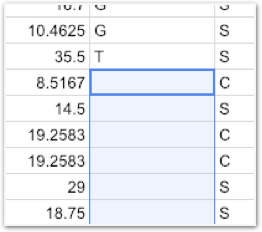

### 미션$3

Pivot Table을 이용해서 객실 종류별 수를 세어보세요.

### 미션$4

객실은 티켓등급\(Pclass\)와 관련성이 높을 수 있습니다. 티켓등급별로 가장 많이 탑승하는 객실 정보를 찾아 입력해보세요. Pivot Table을 사용하면 쉽습니다.

## 특징 생성 정리

아래 문제들을 해결하는데 성공했습니다.

1. Age\(나이\)의 종류가 너무 많아 통계 내기 어렵습니다. \(0살부터 80살까지 총 91가지 분류\)  **=&gt; 범위 묶기** 
2. Fare\(운임\)도 Age\(나이\)와 마찬가지로 가지 수가 너무 많습니다.  **=&gt; 범위 묶기** 
3. SibSp\(형제자매 수\)와 Parch\(부모님 수\)는 굳이 나눌 필요 없이 가족구성원 수로 합치는게 분석에 유리해보입니다.  **=&gt; 합치기**   가족구성원을 부모님 수, 형제자매수로 나누는게 분석에 유리하다고 판단되면 합치기가 아닌 나누기를 할 수도 있었겠죠?
4. Cabin\(객실\)은 ‘C85’처럼 표시되는데, 뒤에 따라오는 숫자가 실제로 의미가 있을지 의심됩니다.  **=&gt; 가공하기** 
5. Age, Cabin 등의 항목에서 채워져있지 않은 빈칸이 꽤 많습니다.  **=&gt; 채우기**

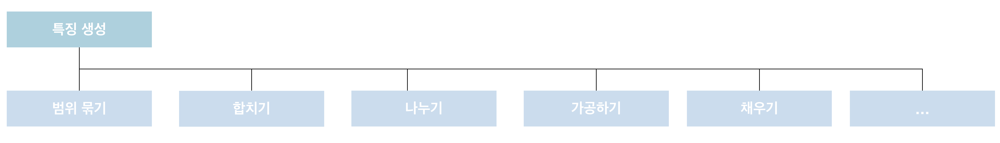

## 특징 추출 - Feature Engineering with Pivot Table

### 분석 목표

승객이 생존할 지, 사망할 지 생존여부 예측하기

### 특징 추출

데이터의 불필요한 부분을 삭제하고 나아가 데이터의 성질을 더 잘 설명할 수 있도록 압축하는 작업입니다.

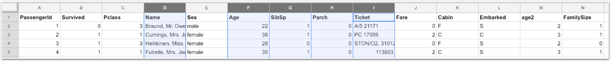

#### 불필요한 필드가 보입니다.

1. 사람의 이름과 생존율에 관계가 있을까요? 상식적으로는 없다고 보는게 맞습니다.  \(실제로 분석했을 때 상관이 있을 수도 있습니다. 다만 언제나 모든 요소를 분석할 순 없습니다. 이러한 부분에서는 자신의 지식을 이용해 판단해야합니다.\)
2. Ticket의 번호도 특별한 규칙이 보이지 않는 것으로 보아 관계가 없을 것 같습니다. 
3. SibSp와 Parch는 FamilySize로 합쳐져 더 이상 필요 없습니다. 
4. age2가 있어 age는 쓸모 없어졌습니다.

**이 5개의 열을 숨기기\(hide\) 처리 해주세요.**


집값을 예측한다고 가정하면, ‘집의 넓이’, ‘가로 길이’, ‘세로 길이’, ‘위치’ 등 여러 **features**가 존재할 수 있습니다. 이때 **집의 넓이는 가로길이\*세로길이**와 유사하다고 볼 수 있는데요. 이 세가지 특징을 한번에 쓰는 것은 분석에 혼란을 줄 수 있습니다. 이 때 **가로길이, 세로길이**를 없앤다면 2가지 필드가 사라져 분석은 더욱 빨라지고 정확해질 것입니다. 이 작업도 **특징추출의 일환**으로 차원 감소라 할 수 있습니다.


## 완성본

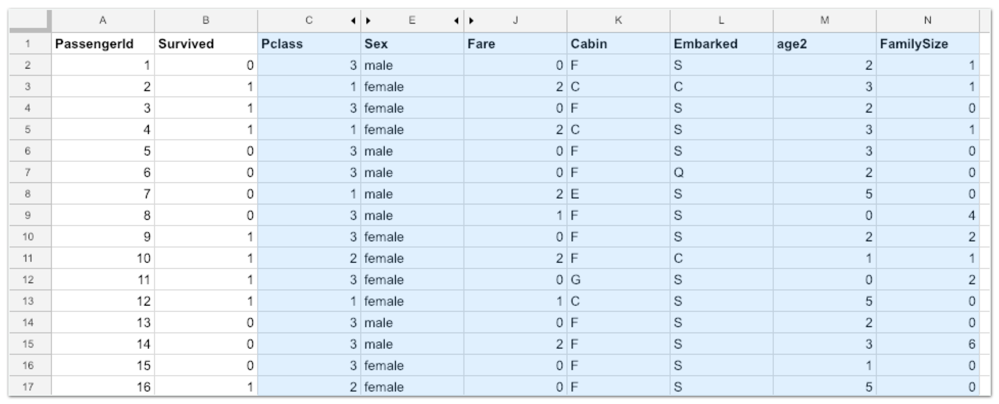

