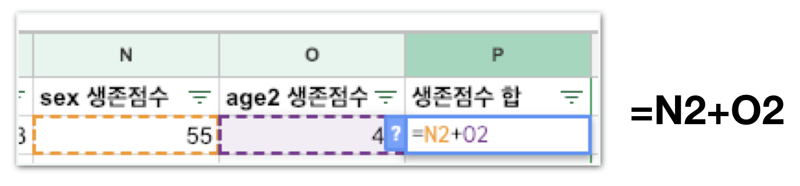

# Stage4 - Kaggle에 타이타닉 예측 제출하기

## 성별로 타이타닉 생존자 예측해보기

### 함께실습$1

#### 1. gender\_submission.csv 파일을 열어주세요 이 파일은 _**“**_`여자는 전원생존하고 남자는 전원사망한다.”`고 예측한 데이터입니다.

#### 2. kaggle에 가입 후 titanic 생존자 예측 문제로 이동해주세요. `https://www.kaggle.com/c/titanic`

#### 3. submit predictions로 이동합니다.

#### 4. gender\_submission.csv 파일을 제출해주세요.

## 내 가중치로 생존자 예측해보기

### 함께실습$2

#### 1. test.csv 파일을 열어 앞서 진행한 Featrue Engineering을 그대로 진행합니다.

* Age를 연령대로 구분하는 age2 필드를 생성합니다.
* SibSp와 Parch를 합하는 FamilySize 필드를 생성합니다. 
* 시간이 남을 경우 나머지 작업도 마저 해줍니다. \(우선 위에 2개만 하고 다음으로 넘어가주세요\)

#### 2. 가장 우측 열에 다음과 같은 열을 추가해주세요.

#### 3. pivot table을 사용해 각 age2와 sex의 중요도를 파악해보세요.

“20대의 생존율이 가장 낮고 영유아의 생존율이 가장 높구나!” **=&gt; 나이가 생존에 큰 영향을 미치는 것으로 보인다!**

#### 4. 연령대\(age2\)에 따른 생존점수를 입력해주세요.

### 미션$1

#### 1. 같은 방식으로 성별\(sex\) 생존점수도 채워주세요.

| **sex** | **점수** |
| :--- | :--- |
| female | 55 |
| male | 20 |

#### 2. 수식을 이용해 가중치 점수 합을 완성해주세요.

#### 3. 생존점수 합 오른쪽에 Survived 열을 생성해주세요.

#### 4. 생존점수가 50점을 넘으면 1, 넘지 않으면 0으로 입력해주세요. 50점을 초과해야 생존, 초과하지 못하면 사망이라고 판단합니다.

#### 5. PassengerId와 Survied만 남기고 남은 열을 모두 삭제한 후 Kaggle에 제출해보세요.

### 방법 분석

1. 연령대\(age2\)의 가중치는 총합 점수의 45%, 성별\(sex\)의 가중치는 55%를 차지하도록 구성하였습니다. 
2. 각 연령대 마다 상수 45, 30, 20, 35, 30, 25의 점수를 부여하였습니다. 
3. 각 성별 마다 55, 20의 점수를 부여하였습니다.

| **age2** | **age2** **점수** |
| :--- | :--- |
| 0 | 45 |
| 1 | 30 |
| 2 | 20 |
| 3 | 35 |
| 4 | 30 |
| 5 | 25 |

| **sex** | **점수** |
| :--- | :--- |
| female | 55 |
| male | 20 |

### 결과 분석

| **제출본** | **점수** |
| :--- | :--- |
| 성별로 분류해서 제출  \(gender\_submission.csv\) | 0.76555 |
| 성별과 age 두 요소를 모두 고려하여 가중치를 계산해 제출 | 0.70334 |

**점수가 떨어졌어요!**  
위의 상수와 특징 조합이 적절하지 않았기 때문입니다.

### 머신러닝이 필요한 이유

#### 분석가가 많은 시간을 들여 노력하면 황금비율의 상수와 특징 조합을 엑셀로도 찾아낼 수 있습니다.

하지만 특징이 많아질 수록, 데이터가 많아질 수록 사람이 처리하기 어려워집니다.  
`(100만개의 탑승자와 200개의 특성이 주어진다면?) (4차원 그래프, 5차원 그래프도 머릿속에 그려지시나요?)`

통계적, 수학적인 알고리즘을 컴퓨터가 수행하게 하여 다량의 데이터를 통해 학습하는 방식이 바로 **머신러닝**입니다.

#### “오늘 우리가 함께 한 분석 작업을 조금 더 정교화 했을 뿐 전혀 다르지 않은 작업을 컴퓨터가 빠르게 처리한것 뿐이죠.”


#### 더 좋고 효율적인 방법이 많이 있어요.

교육적인 목적으로 한가지 방법을 택하여 함께 실습해본 것일 뿐, 완전히 다른 방법으로 분석하여도 더 좋은 결과를 낼 수 있습니다.


