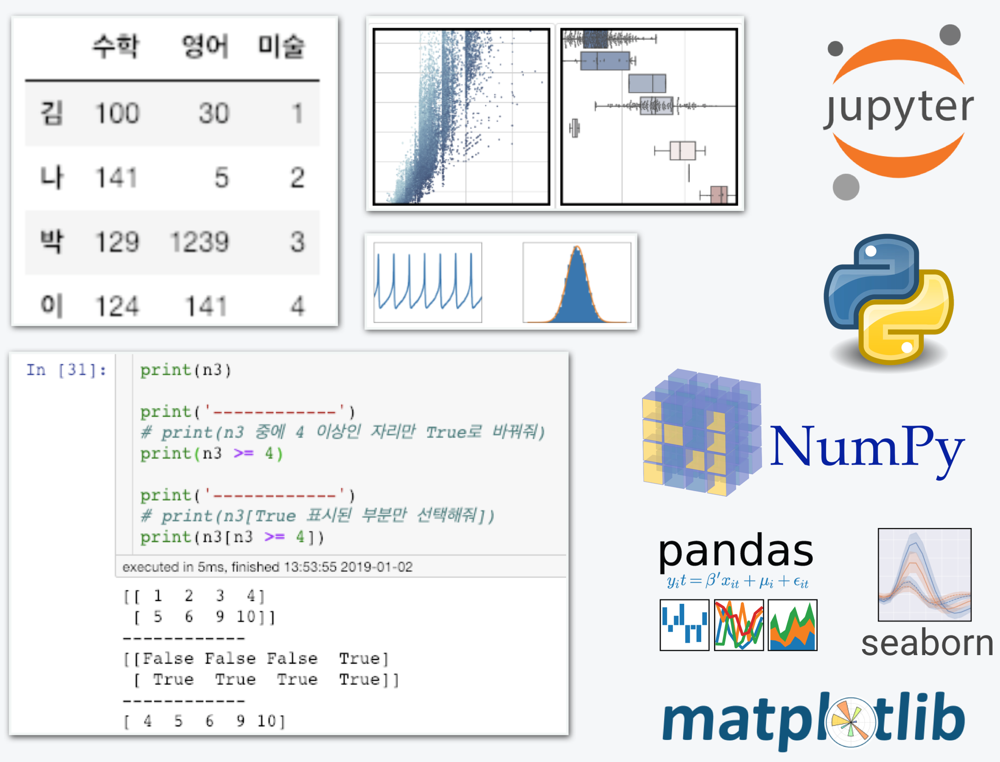

# 2주차 - 딱 데이터 사이언스를 위한 파이썬

## 이번주 목표

### 딱 데이터 사이언스를 위한 파이썬

#### 데이터 사이언스를 위해 필요한 최소한의 파이썬 지식을 최대한 배워봅시다.

수많은 데이터분석이 파이썬을 기반으로 이루어진다고 해도 과언이 아닙니다.

파이썬은 사용자가 작성한 명령을 기준으로 계산, 동작 등을 수행하는 프로그래밍 언어입니다. 우리는 데이터 사이언스를 위한 파이썬의 기본 사용법을 설치부터 데이터 조작, 시각화까지 학습합니다.

