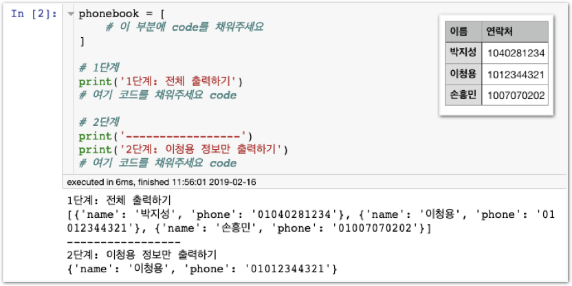

# Challenge1 - 전화번호부 만들기

## 문제

### 전화번호부 만들기

phonebook안에 dictionary를 사용하여 내용을 채워주세요.

1단계 출력 결과가 위 그림과 같아야 합니다. 1단계를 완료하였으면 2단계도 진행해주세요.

## 방법

### **왼쪽** **멤버가** **강의자료를** **열고,** **오른쪽** **멤버가** **메모장을** **열어** **답을** **적습니다.**  **서로** **의논하여** **답을** **채워주세요.**

1. **phonebook은** **어떤** **자료형** **일까요?**  **\[                  \] ex.** **숫자형,** **문자형,** **리스트,** **딕셔너리, …**
2. **phonebook** **안에** **넣을** **수** **있는** **자료형** **중** **3가지만** **적어주세요.**  **\[                  \] \[                  \] \[                  \] \(무수히** **많음\)**
3. **phonebook의** **첫번째** **값만** **출력하려면** **어떤** **구문이** **필요할까요?  \[                                                             \]**




### 2단계 Hint

변수 퀴즈미션 하단부를 복습해보세요.


