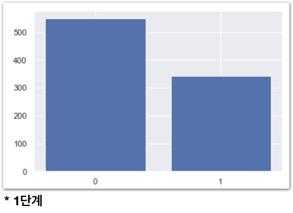
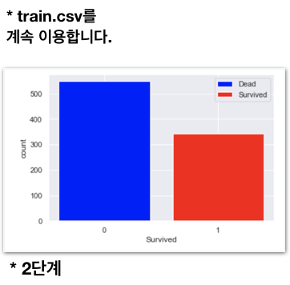

# Challenge2 - 타이타닉 Bar Chart로 표현하기

## 문제

### 타이타닉의 사망자, 생존자를 Bar Chart로 표현해보세요.

### 1단계

**위 그래프를 matplotlib을 이용해 그리는게 목표입니다.**

생존자, 사망자의 count를 하는 방법은 아직 배우지 않았으므로 꼭 아래 힌트를 보고 시작해주세요.

**1\) 남자\(male\)는 몇명인가요?**  
`cnt = train[train['Sex'] == 'male'].shape[0]    
print(cnt)`

**2\) Pcalss가 1인 승객은 몇명인가요?**  
`cnt = train[train['Pclass'] == 1].shape[0]    
print(cnt)`

### 2단계

## **방법**

### **오른쪽** **멤버가** **강의자료를** **열고,** **왼쪽** **멤버가** **메모장을** **열어** **답을** **적습니다. 서로** **의논하여** **답을** **채워주세요.**

1. **사망자의** **수를** **세려면** **어떤** **구문이** **필요할까요?**  **\[                                                                        \]**
2. **생존자의** **수를** **세려면** **어떤** **구문이** **필요할까요?**  **\[                                                                        \]**
3. **matplotlib에서** **bar chart를** **그리는** **명령어가** **무엇일까요?  \[                                    \]** **실행** **후** **plt.show\(\)**
4. **2단계\)** **범례,** **축** **이름,** **막대** **색을** **설정할** **때** **쓰는** **구문은** **뭘까요?**  **\[                  \] \[                  \] \[                  \]**

**2단계까지** **한번에** **하려** **하지말고** **반드시** **1단계부터** **성공해주세요.**



