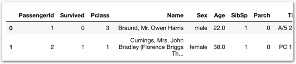
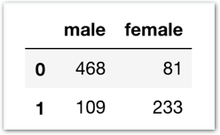

# 과제1 - Pandas DateFrame 연습

## 문제

### Pandas로 성별에 따른 생존자, 사망자 수가 담긴 DataFrame 만들기

#### 바로 위 DataFrame을 만드는게 목표입니다.

앞서 count 방법은 배웠지만, 두 가지 조건을 만족하는 행을 count하는 방법까지는 배우지 못했습니다.

아래 Hint를 참고하여 방법을 익힌 후 과제를 진행해주세요.

#### 1\) 남자\(male\)이면서 Pclass가 1인 승객은 몇명인가요?

`cnt = train[(train['Sex'] == 'male') & (train['Pclass'] == 1)].shape[0]    
print(cnt)`

#### 2\) 남자이면서 Pclass가 1이고 Fare가 50 이상인 승객은 몇명인가요?

`cnt = train[(train['Sex'] == 'male') & (train['Pclass'] == 1) & (train['Fare'] >= 50)].shape[0]    
print(cnt)`

## 방법

### **다음** **단계를** **따라** **과제를** **진행하세요.**

**\[단계1\]** Stage3을 복습합니다.

**\[단계2\]** Challenge2를 복습합니다.

**\[단계3\]** 왼쪽 아래 Hint를 직접 실행하고 이해합니다.

**\[단계4\]** 사망한 여자의 수를 구하려면 어떤 구문이 필요할까요?  
**\[ \]**

**\[단계5\]** 사망한 남자/여자, 생존한 남자/여자의 수를 구해보세요.

**\[단계6\]** Stage3의 함께실습$11을 참고하여 DataFrame을 만들고 구한 값들을 입력하세요.

**\[단계7\]** 모범 답안과 비교해보세요!



