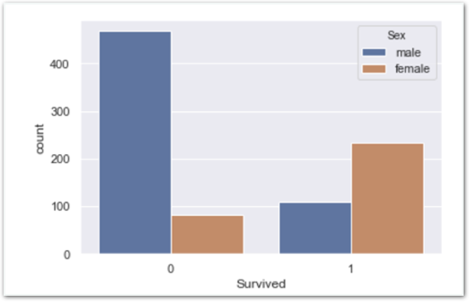
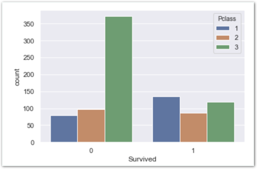

# 과제2 - seaborn의 count plot 사용하기

## 문제

### seaborn의 count plot 사용하기

#### 1\) 성별별로 나누어 사망자, 생존자 수 카운트

#### 2\) Pclass별로 나누어 사망자, 생존자 수 카운트

## **방법**

### **다음** **단계를** **따라** **과제를** **진행하세요.**

**\[단계1\]** 아래 링크에 접속하여 ‘seaborn countplot을 이용하기’ 부분을 숙지해주세요  
[**http://bit.ly/코알라\_DS\_2주차\_챌린지2**](http://bit.ly/코알라_DS_2주차_챌린지2)\*\*\*\*

**\[단계2\]** 좌측 두 차트를 똑같이 그려냅니다.

**\[단계3\]** 선착장\(Embarked\)별로 나누어 사망자, 생존자 수 차트도 만들어봅니다.

**\[단계4\]** 나이\(Age\)별로 나누어 사망자, 생존자 수 차트도 만들어봅니다.

**\[단계5\]** 방금 만든 나이별 차트는 범례가 너무 많고 길어 해석하기 어렵습니다. 해결할 수 있는 아이디어가 무엇이 있을까요? 구상만 해보세요!

**\[ \]**

**\[단계6\]** 모범 답안과 비교해보세요!



