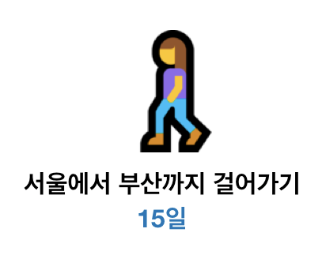
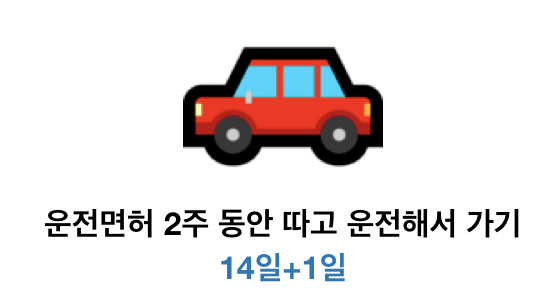

# 쉬는 시간 - 데이터분석을 위해 굳이 파이썬을 배우는 이유

## 누가 더 빠르게 도착할까요?

두 사람이 있습니다. 두 사람 모두 서울에서 부산으로 갈 준비를 하고 있죠.

### A. 걸어가는 사람

### B. 지금부터 운전면허를 따서 차로 가려는 사람

최초에는 큰 차이가 없을 수 있지만 이후 이 미션을 10번 더 수행한다면 두 방법 사이에는 속도, 안정성, 비용, 정확도 등 거의 모든 면에서 엄청난 격차가 벌어지기 시작합니다.

파이썬을 통한 데이터 분석도 이와 같습니다. 배움의 장벽을 조금 넘어서면, 걷는 사람이 운전할 수 있는 사람이 되는 것 입니다.

