# Stage1 - 주피터 노트북 사용해보기

## **주피터** **노트북**

살아있는 파이썬 문서를 만들어 문서화, 시각화, 분석을 용이하게 만들어주는 개발 환경입니다.

### 설명

데이터 분석을 하다보면, 내가 어떤 것을 분석할지 계획하고 어떻게 분석 했는지 정리/기록해야 하며 그 작업들이 파이썬과 같은 프로그래밍 언어를 통해 이루어질 필요성을 느끼게 되는데요.

즉 Jupyter Notebook은 이 필요성을 충족시켜주는 **데이터 분석용 파이썬 편집기**라 할 수 있습니다.

| **재료** | **편집** **환경** |
| :--- | :--- |
| 문서, 워드 | 한글, ms워드 |
| csv, 스프레드 데이터 | 엑셀, 구글스프레드시트 |
| 장표, 발표자료 | 파워포인트, keynote |
| 파이썬 프로그램 | pycharm |
| 데이터 문서 & 파이썬 분석 프로그램 | Jupyter notebook |

### 정리

#### 주피터 노트북

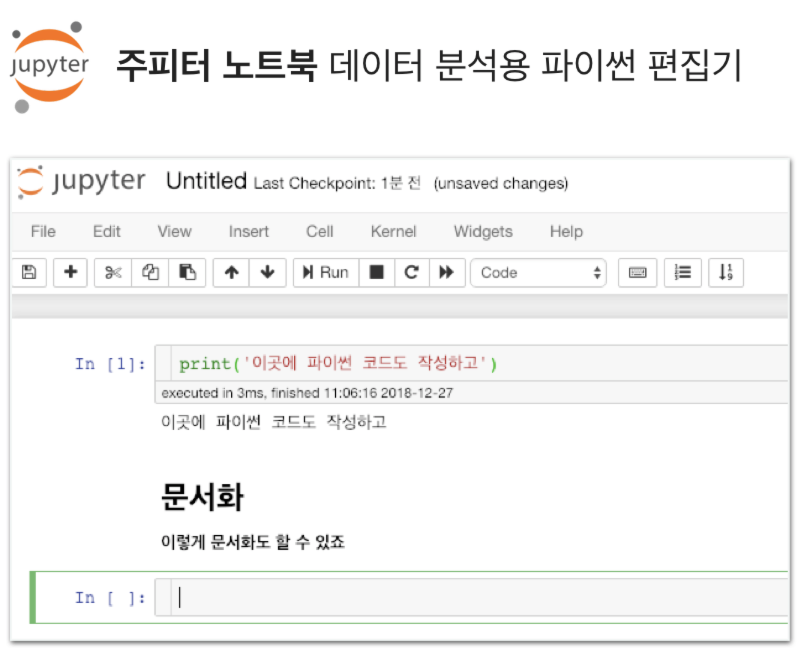

#### 파이참

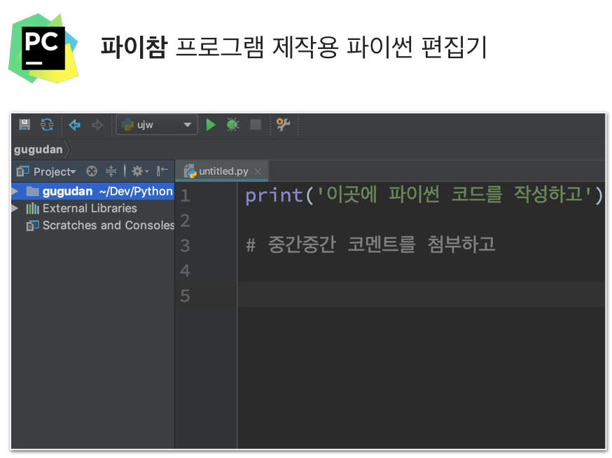


### 하루만 사용해봐도 왜 Jupyter Notebok이 필요한지 알 수 있습니다.

'그래도 난 파이참이 더 편해'라고 생각한다면 굳이 Jupyter Notebook을 사용할 필요가 없습니다! 실제로 그런 분들도 존재하고 아무 문제 없이 데이터를 분석하고 있습니다.

주피터 노트북을 사용은 필수가 아닌 편하기 위해서입니다. 다만 이제 막 시작한다면 주피터 노트북으로 시작하세요.


## 설치 및 실행

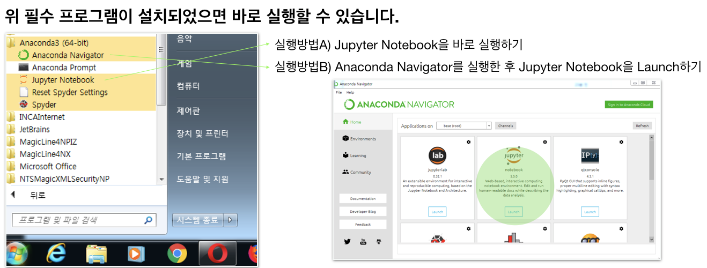


다른 방식으로 설치&구성 할 수도 있으니 각자 편한 방식으로 사용하시면 됩니다.


## 주피터 노트북 사용법

### 함께실습$1

#### **주피터** **노트북** **파일** **만들기**

#### 1. 아래 그림처럼 인터넷 브라우저에서 실행됩니다.

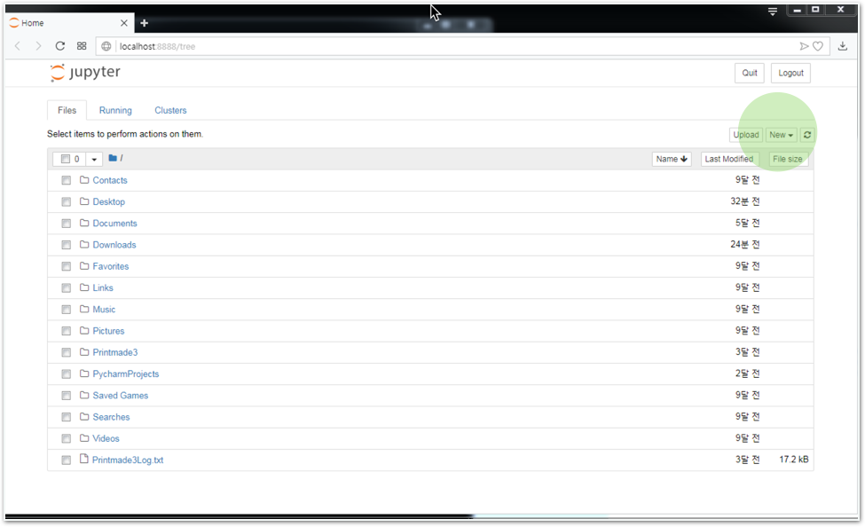

1. 우측 New 버튼을 눌러 Python3를 클릭합니다.

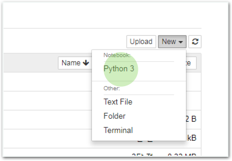

### 함께실습$2

#### 주피터 노트북 코드 실행하기

#### 1. 그대로 입력한 후 Shift+Enter를 누릅니다.

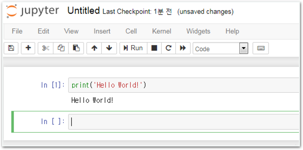

#### 2. 하단 cell이 클릭된 상태에서 Markdown 모드로 변경합니다.

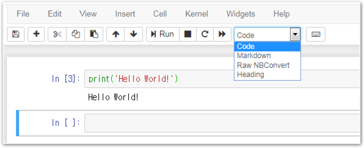

#### 3. 아래와 같이 그대로 입력한 후 Shift+Enter를 누릅니다.

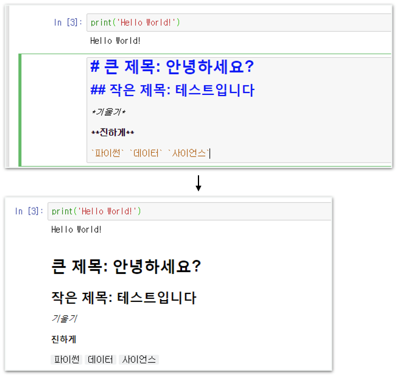

### 함께실습$3

Markdown 제목 입력

### 함께실습$4

#### Markdown 리스트 만들기


#### Markdown

텍스트에 합의된 기호를 넣어 문서를 양식화하는 작업입니다.


### 함께실습$5

#### Markdown 이미지, 링크 넣기

### 함께실습$6

#### Markdown 기타 문법

### 함께실습$7

#### Markdown 표 만들기

### 함께실습$8

#### 라이브러리 import하기

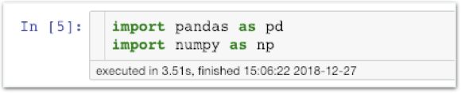

### 미션$1

#### 똑같이 만들어보세요!

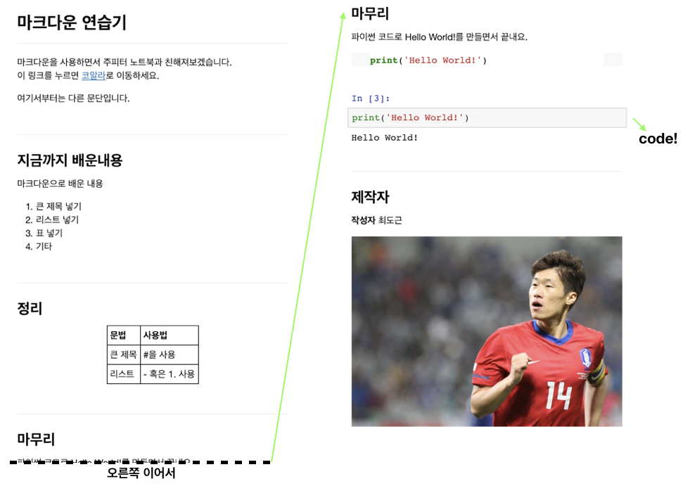

## 문제 발생시 대응방법

설치&실행에 문제가 없을 경우 넘어가주세요.

### 문제1. Anaconda 혹은 Jupyter가 없어요.

cmd\(명령프롬포트, 맥은 terminal\)을 열고 jupyter-notebook이라고 입력 후 Enter를 눌러주세요.

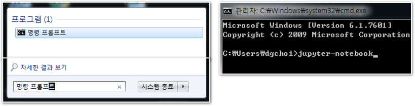

오류가 발생하며 주피터노트북이 실행되지 않으면 anaconda가 제대로 설치되지 않았을 확률이 높습니다. 설치메뉴얼을 보고 anaconda를 재설치해주세요.

### 문제2. python3가 없어요.

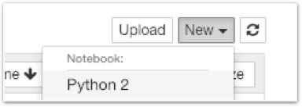

위 이미지처럼 주피터 노트북에 python2만 설치되어 있는 경우입니다.

1. 설치 메뉴얼을 보고 Python3를 설치합니다. 
2. cmd를 실행합니다. \(terminal\) 아래 명령을 차례로 수행한 후 주피터 노트북을 재실행해주세요.

`conda create -n python3 python=3.6`

윈도우 사용자라면, `onda activate python3`  
맥 사용자라면, `source activate python3`

`conda install notebook ipykernel -y`

`ipython kernel install —user`

### 문제3. pandas, numpy import 문제

아나콘다를 설치하면 자동으로 설치됩니다. 이 과정에서 문제가 있어 anaconda를 제대로 설치하지 못했다면 직접 cmd에서 설치해주세요.

`conda install pandas numpy -y`

후일 실습을 위해 아래 라이브러리도 미리 설치해주세요.

`conda install scikit-learn seaborn matplotlib -y`

