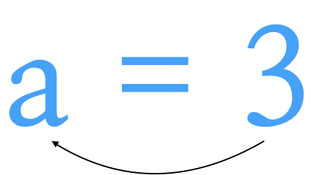
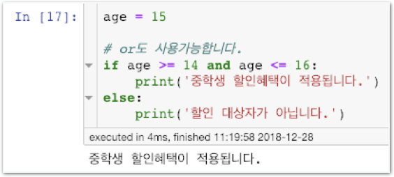
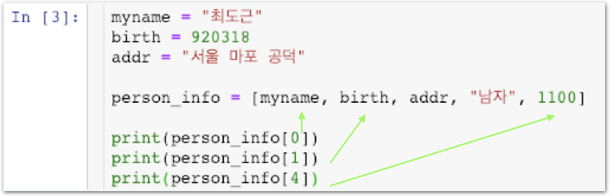

# Stage2 - 파이썬 기본과 데이터 입출력

## 파이썬 기본

### 오늘 배울 네가지 Python 문법



파이썬을 잘 다룰수록 데이터 분석을 수월합니다. 복습, 자습을 충분히하고 부족하다면 ‘파이썬 기본’ 스터디를 수강하세요. 보고 계시는 데이터 사이언스 book처럼, python 기초 스터디 book도 이용하실 수 있습니다.

[파이썬 기초 스터디 book 바로가기](https://book.coalastudy.com/python-basic)


## 변수

변수란 숫자 혹은 문자 같은 자료를 잠시 저장해두는 곳 입니다.



* **수학에** **=\(같다\)와는** **달라요.**
* **‘같다’라는** **의미는** **python에서** **==으로** **대체합니다.**
* **a는 변수의 이름, 3은 값입니다. 둘 모두 사용자가 임의로 지정합니다.**


### 함께실습$1

#### 변수를 이용한 계산


### 함께실습$2

#### 변수를 이용한 문자열 사용




```python
print(10 % 3) # 1출력
# %는 나머지를 계산해줍니다
```



## 미션$1

#### 변수 활용 퀴즈


답은 [여기\(클릭!\)](https://github.com/coalastudy/data-science-lv1/blob/master/week2/stage2.ipynb)에 들어가서, **미션$1 부분**을 찾아서 확인해주세요!



```python
a = 'hi'
print(a + ',' + 'hello') #챌린지에서도 실전에서도 많이 쓰이니 기억하세요!
```



## if

제시한 조건이 맞으면 범위 안의 구문\(탭\)을 실행하는 기능을 가지고 있습니다.


**조건이 맞으면?\(즉 조건이 참이면\)**  
1, 2, 3, 4가 출력됨

**조건이 틀리면?\(조건이 거짓이면\)**  
4만 출력됨 \(1, 2, 3은 실행이 안되므로\)


if는 특정 조건에 따라 흐름을 관장하므로 제어문, 조건문이라고도 불립니다.


함께실습$3

단순 if문




함께실습$4

elif 사용하기



\#은 코드상 메모를 하기 위한 코멘트\(코드로서 실행되지 않음\) 기능입니다.


미션$2

elif, else를 안쓰고도 아래와 똑같은 결과가 나오도록 만들어보세요.


elif, else를 모두 if로 바꾼 후 조건 부분을 수정합니다. 그 실행결과가 위 프로그램과 같도록 하려면 if의 조건을 어떻게 수정해야 할까요?

미션$3

20살 이상은 80점 이상시 합격, 20살 미만은 70점 이상시 합격을, 나머지는 불합격을 출력하세요.


**테스트** **케이스**

1. age = 25, score = 75  답: 불합격
2. age = 38, score = 91  답: 합격
3. age = 15, score = 46  답: 불합격
4. age = 19, score = 71  답: 합격



```python
if a > 10:
    if b > 15:
        print(1)
    else:
        print(2)
else:
    if b > 15:
        print(3)
    else:
        print(4)
```



## list, dictionary

### 리스트

리스트 온갖 데이터를 **순서대로** 담아두는 표라고 생각하면 이해가 쉽습니다.

### 함께실습$5

#### 단순 if문



### 딕셔너리

list와 유사하게 온갖 데이터를 **이름표**로 담아두는 표라고 생각하시면 됩니다.

### 함께실습$6

#### elif 사용하기


### 함께실습$7

#### list 내용물로 list, dictionary 넣기


## 파일 읽기, 쓰기

### 쓰기

쓰기란 파일을 만드는 작업입니다.

### 함께실습$8

#### csv 파일 만들기


### 읽기

읽기란 파일을 불러오는 작업입니다.

### 함께실습$9

#### csv 파일 불러오기


