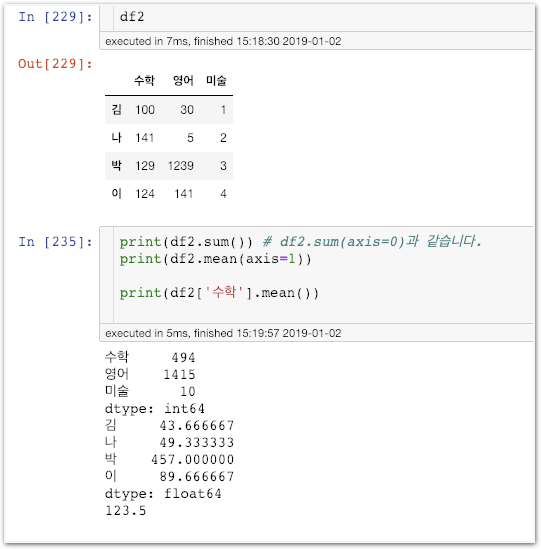

# Stage3 - 데이터 조작 \(Numpy, Pandas\)

## 라이브러리

자주 사용하고 유용한 기능을 누군가 이미 구현해 둔 코드 집합체입니다.

### 넘파이\(Numpy\)

파이썬으로 행렬, 수치 계산 등 데이터를 다루기 쉽게 도와주는 유명 데이터 조작 라이브러리

### 판다스\(Pandas\)

파이썬으로 마치 프로그래밍 버전의 엑셀을 다루듯 고성능의 데이터 구조를 만들 수 있는 유명 라이브러리

실제 분석에서는 Numpy와 Pandas를 함께 사용합니다.


### 판다스를 쓰는 이유: Excel vs Pandas

**엑셀**은 주로 자료분석이 끝나가는 단계에서 사용되는 최종사용자의 편의성 증진을 위한 툴입니다.

**판다스**는 정제되지 않은 raw data를 쉽게 다루게 도와주는 분석 단계의 프로그래밍 툴입니다.

**판다스**의 최종 목적은 데이터 분석을 쉽게하여 최종사용자를 위한 엑셀파일이 제작되도록 하는 일입니다. 반면 **엑셀**의 최종목적은 데이터 정리 그 자체입니다.

**판다스**는 데이터 분석과정에서 주로 앞단, **엑셀**은 뒷단에 가깝다고 생각하시면 좋습니다. \(당연히 항상 그렇게 딱딱하게 사용하는건 아니겠죠?\)


## Numpy 속성

### 함께실습$1

#### 내 마음대로 배열 만들기

### 함께실습$2

#### 0으로 가득찬 배열 만들기

### 함께실습$3

#### 배열의 형태 알기

### 함께실습$4

#### 배열의 필요한 부분 자르기


앞으로 모든 실습은 Jupyter-notebook에서 진행됩니다.


### 함께실습$5

#### 내용 수정하기

### 미션$1

#### 똑같은 결과를 만들어보세요.


### 오늘은 주요기능만 학습합니다.

이외에도 랜덤 배열 만들기, 브로드캐스팅 기능 등의 변형사용과 고급 기능이 있습니다. 앞으로의 실습에서 필요할 때 그때그때 다루겠습니다.


### 함께실습$6

#### 배열에 상수 연산

### 함께실습$7

#### 배열끼리의 연산

### 함께실습$8

#### 계산 기능

### 함께실습$9

#### 요소 선택

## Pandas 속성

### 판다스 개요

판다스를 사용한다면 단순한 배열데이터가 아래처럼 데이터베이스화 됩니다.

각 열과 행에 ‘수학’, ‘영어’ ‘김’, ‘나’와 같은 **레이블이 생겼습니다.**

행 데이터, 열 데이터가 단순 숫자 모음에서 더 의미를 가진 데이터베이스로 바뀌어 분석이 편리해집니다.

### 함께실습$10

#### 시리즈\(Series\) 만들기

### 함께실습$11

#### 데이터프레임\(DataFrame\) 만들기

### 함께실습$12

#### DataFrame에 행과 열 추가하기

### 함께실습$13


### 시리즈? 데이터 프레임?

딱 봐도 데이터 프레임이 시리즈보다 더 많은 정보를 포함하는 구조인것으로 보입니다. 시리즈가 모여 데이터프레임을 이루고 있다고 생각하시면 좋습니다.


### 함께실습$14

#### 원하는 열, 행 고르기

### 함께실습$15

#### 계산 기능

### 미션$2

#### 어떤 명령일지 해석해보세요.

,\(콤마\)를 기준으로 왼쪽은 행, 오른쪽은 열을 필터링합니다.

**영어 100점 이상인 학생의 수학점수만 보여주길 원하는데 그것도 평균값으로 표현해달라는 뜻이네요!**


복습하세요! 조금만 써봐도 익숙해집니다.


