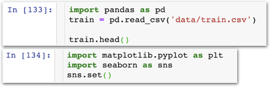

# Stage4 - 데이터 시각화 \(matplotlib, seaborn\)

## 라이브러리

Stage3에서 라이브러리란 '자주 사용하고 유용한 기능을 누군가 이미 구현해 둔 코드 집합체'다라고 설명드렸죠? 많은 사람들이 라이브러리를 제작하였고 생태계 발전을 위해 무료로 공개하였습니다. 이번에는 데이터 시각화를 위한 두 종류의 라이브러리도 사용해보겠습니다.

### matplotlib

파이썬으로 기본적인 차트들을 쉽게 그릴 수 있도록 도와주는 가장 유명한 데이터 시각화 라이브러리

### seaborn

matplotlib을 기반으로 만들어져 통계 데이터 시각화에 최적화된 인기 라이브러리

실제 분석에서는 matplotlib과 seaborn을 함께 사용합니다.


### 저는 plotly나 scipy 라이브러리가 더 좋은거 같은데요?

라이브러리는 엄청나게 많습니다. 저희가 미처 다루지 못한 유명 라이브러리가 산더미 처럼 쌓여있어요.

알면 알수록 분석이 쉬워지고 속도가 빨리지지만 모든 라이브러리를 익힐 수는 없죠. 스터디에서는 가장 유명하고 표준으로 소개되는 라이브러리를 엄선하여 교육합니다.

**다른 라이브러리가 편하시다면 그걸 사용하셔도 무방합니다!**


## matplotlib 속성

## 함께실습$1

#### 기본적인 그래프 그려보기

### 함께실습$2

#### 데이터, 축 이름, 범례 추가

### 함께실습$3

#### 막대 차트 그리기

### 함께실습$4

#### 차트 스타일 변경하기

### 미션$1

#### 똑같이 그려보세요!


### 더 많은 스타일, 방법, 예제들은 어디서 보나요?

쉽게 따라할 수 있도록 matplotlib 공식 홈페이지에 잘 정리되어 있습니다. [https://matplotlib.org/gallery/index.html](https://matplotlib.org/gallery/index.html)


### 함께실습$5

#### 기본적인 산포도 그려보기

내용물 중 train.csv만 꺼내 week2 실습 폴더 안 data 폴더에 넣어주세요.  
[다운로드 http://bit.ly/코알라\_DS\_1주차\_데이터](http://bit.ly/코알라_DS_1주차_데이터)

#### 1. 판다스로 데이터 불러온 후, seaborn 불러오기

#### 2. '나이'와 '생존' 요소를 기준으로 산포도 그리기

### 함께실습$6

#### 범주 데이터 넣기 & 사이즈 조절

### 함께실습$7

#### Categorical Scatter Plot 그려보기

### 함께실습$8

#### 박스 그림 상자\(Box Plot\) 그려보기

### 함께실습$9

#### Pair plot 기능 사용하기

## Box Plot 이해하기


### 이후 실전 분석을 통해 더 많은 차트, 그래프를 배웁니다.

공식 메뉴얼에 잘 정리되어 있으니 미리 공부하셔도 좋습니다. [https://seaborn.pydata.org/tutorial.html](https://seaborn.pydata.org/tutorial.html)


