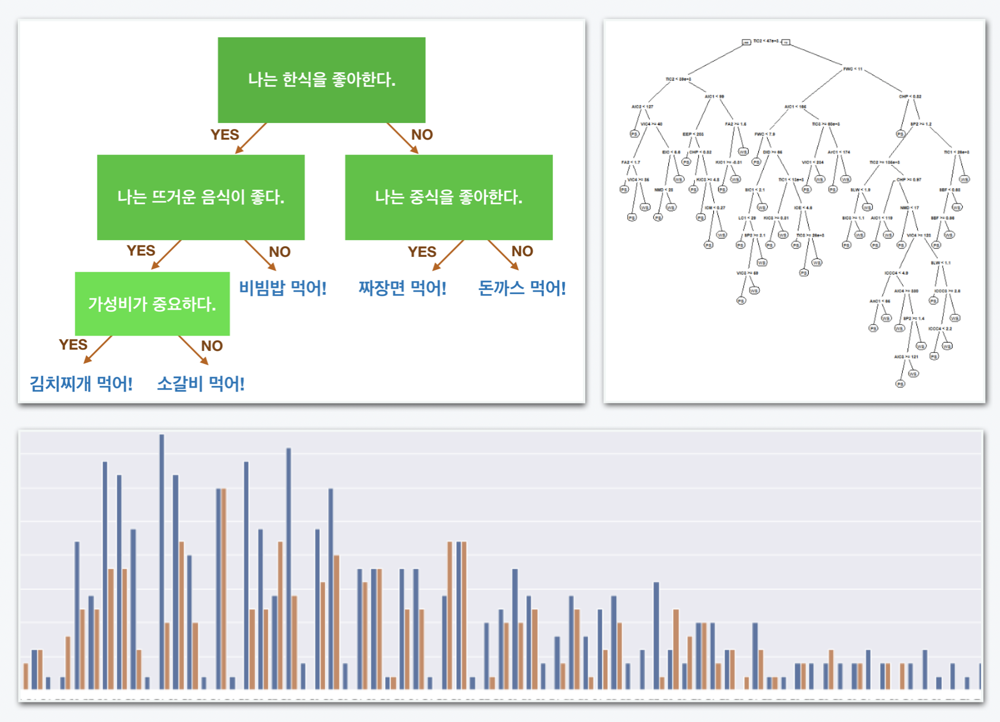

# 3주차 - Decision Tree로 타이타닉 생존자 찾기

## 이번주 목표

### Decision Tree로 타이타닉 생존자 찾아내기

#### Decision Tree를 배우고 이를 적용하여 타이타닉 생존차를 찾아냅니다.

본격적으로 데이터 사이언스의 세계로 들어갑니다. 기본적이고 이해하기 쉬우며 강력한 알고리즘인 Decision Tree를 이용하여 타이타닉 탑승자의 생존 가능성을 예측해봅시다. 이 작업은 그동안 배운 python, numpy, pandas와 더불어 오늘 배울 scikit-learn을 통해 진행됩니다.

