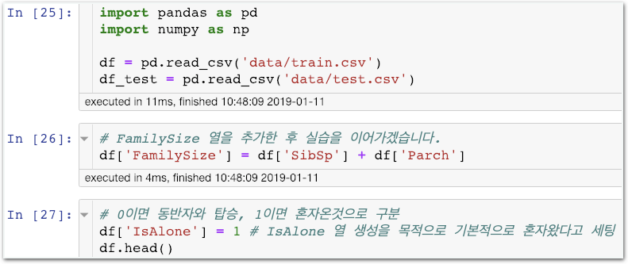
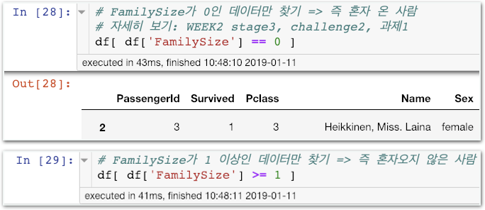
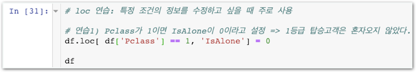
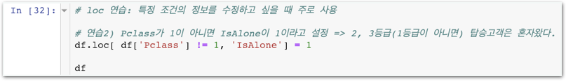

# Challenge1 - IsAlone 열 추가하기

## 문제

### IsAlone\(혼자 탔는가?\) 열 추가하기

파일을 새로 만들고 위 부분부터 시작해주세요.

**Hint. 우선 아래 내용을 이해합니다.**

## 방법

### 왼쪽 멤버가 강의자료를 열고, 오른쪽 멤버가 메모장을 열어 답을 적습니다. 서로 의논하여 답을 채워주세요.

1. 연습1과 연습2를 각자 진행한 후 **값1, 값2, 값3**에 어떤 정보가 들어가야 하는지 채워주세요. \(실제값이 아닌 값의 성질\) **df.loc\[ 값1 , 값2 \] = 값3**  값1 \[                  \] 값2 \[                  \] 값3 \[                  \]
2. df.loc을 이용해 ‘FamilySize가 0이면 혼자왔다’를 설정하려면?  df.loc\[                 ,                  \] = \_\_\_
3. df.loc을 이용해 ‘FamilySize가 0 초과면 함께왔다’를 설정하려면?  df.loc\[                 ,                  \] = \_\_\_

이제 코딩을 시작하세요! 코딩이 끝나면 모범답안과 비교해보세요.



