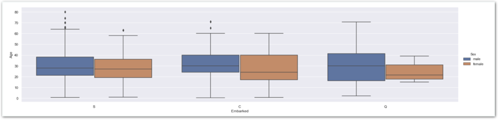

# Challenge2 - box plot 연습하기

## 문제

### box plot 연습하기

승선 항구에 따른 Age 분포를 box plot으로 살펴보세요. 이때 hue는 성별로 설정합니다.

최종적으로 아래와 같은 플롯을 만드는게 목표입니다.

## 방법

### **오른쪽** **멤버가** **강의자료를** **열고,** **왼쪽** **멤버가** **메모장을** **열어** **답을** **적습니다.**  **서로** **의논하여** **답을** **채워주세요.**

1. **지난번** **사용한** **박스** **플롯** **사용** **구문을** **하나만** **적어주세요**  **\[                                                                       \]**
2. **x, y, hue를** **각각** **어떻게** **설정하시겠어요?**  **\[                  \] \[                  \] \[                  \]**
3. **kind=‘box’** **부분을** **kind=‘violin'으로** **바꾸고** **실행해보세요.**  **어떤** **변화가** **있나요?  \[                                                                    \]**

**답안** **작성이** **완료되면** **리더에게** **확인** **받으세요!**



