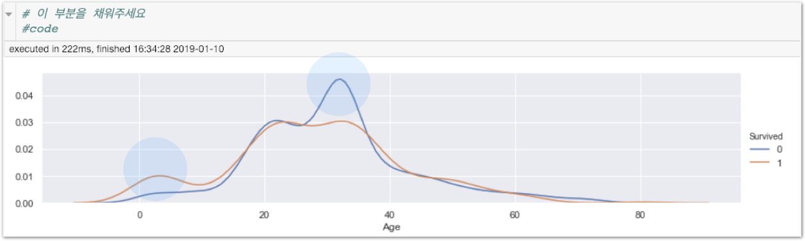

# 과제1 - Name 특징에서 유용한 정보 남기고 kdeplot 사용하기

## 문제

### Name 특징에서 유용한 정보 남기고 kdeplot 사용하기

#### 미션1\) Level Up에서 ‘빈칸\(NaN\)을 더 현명하게 처리하기’를 진행합니다.

#### 미션2\) 앞서 배운 kdeplot을 통해 Name 특징을 사용한 후 그래프가 어떻게 변화되는지 살펴봅니다.

아래와 같은 분포도를 만드는게 목표입니다.

## 방법

**다음** **단계를** **따라** **과제를** **진행하세요.**

**\[단계1\]** Stage2 파일을 복사한 후 실행합니다. \(파일이름은 homework1로 설정합니다\)

**\[단계2\]** 미션1을 진행합니다.

**\[단계3\]** Stage4 plot 부분을 복습합니다.

**\[단계4\]** 미션2를 진행합니다.

**\[단계5\]** 모범 답안과 비교해보세요!



