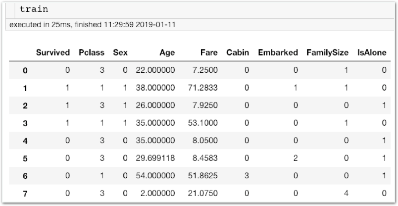

# 과제2 - PClass에 따른 Fare 빈칸 평균으로 채우고 IsAlone 열 추가하기

## 문제

### PClass에 따른 Fare 빈칸 평균으로 채우고 IsAlone 열 추가하기

#### 미션1\) PClass 별로 Fare를 평균내어, Fare가 비어져 있을 경우 그 값으로 대체합니다.

Stage4에서 변형된 Name에 따라 Age를 평균내어 빈칸을 채운것과 동일한 방식입니다.

#### 미션2\) 혼자 왔는지 알려주는 IsAlone 데이터 추가하기

Challenge1과 완전히 동일합니다. 복습하면서 한번 더 진행해주세요.

## **방법**

### **다음** **단계를** **따라** **과제를** **진행하세요.**

**\[단계1\]** Stage2 파일을 복사한 후 실행합니다. \(파일이름은 homework1로 설정합니다\)

**\[단계2\]** Stage4를 복습합니다.

**\[단계3\]** 미션1을 진행합니다.

**\[단계4\]** Challenge1을 복습합니다.

**\[단계5\]** 미션2를 진행합니다.

**\[단계6\]** 최종 train 데이터를 살펴보며 이상이 있는지 확인합니다.

**\[단계7\]** 각 명령을 실행해보고 차이점을 간단히 서술해주세요.  
**\[ \]**

**\[단계8\]** 모범 답안과 비교해보세요!



