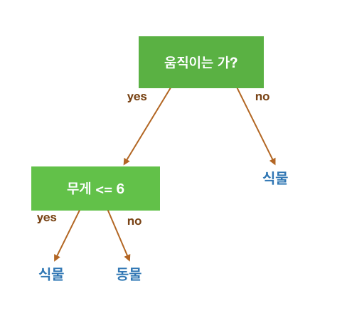
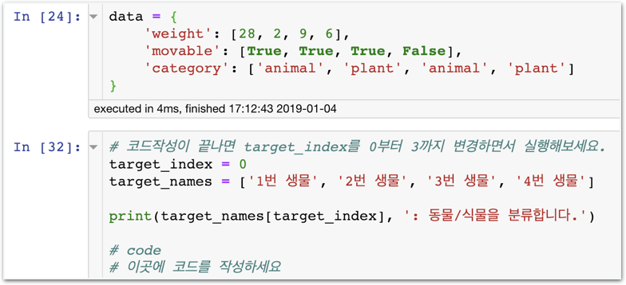
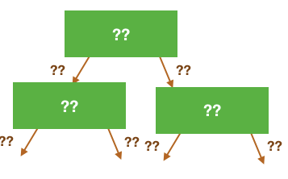

# Level Up - 여러 특성을 지닌 데이터의 Decision Tree 직접 만들어보기

**LEVEL UP** **하고** **싶으면** **도전하세요!**

LEVEL UP 코스는 online book을 참고하여 혼자서 해낼 수 있도록 만들어졌습니다. 커리큘럼 진도와는 상관 없으므로 진행하지 않으셔도 학습에 아무런 지장이 없습니다. 더 높은 수준으로 나아가고 싶다면 진행하세요!

## 여러 특성을 지닌 데이터의 Decision Tree

stage1의 심화입니다. 앞선 실습에서는 카테고리 특성만 존재하는 트리, 연속적 특성만 존재하는 트리를 다뤘는데 이번에는 둘 모두 존재하는 트리를 다뤄보겠습니다.

아래와 같은 train data가 있다고 가정할게요.

| **무게** | **움직이는** **가?** | **동식물** **분류** |
| :--- | :--- | :--- |
| 28 | yes | animal |
| 2 | yes | plant |
| 9 | yes | animal |
| 6 | no | plant |

이제 생물의 무게와 운동성을 보고 **동물인지 식물인지 분류**하세요.

간단하게 트리를 만들어보면 이런게 가능하겠죠?

### 미션$1

#### 여러 특성 데이터 기반의 Tree 만들기

### 미션$2

#### 예시 트리와 다른 방식으로도 만들어보기



