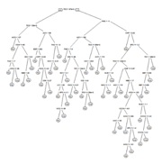
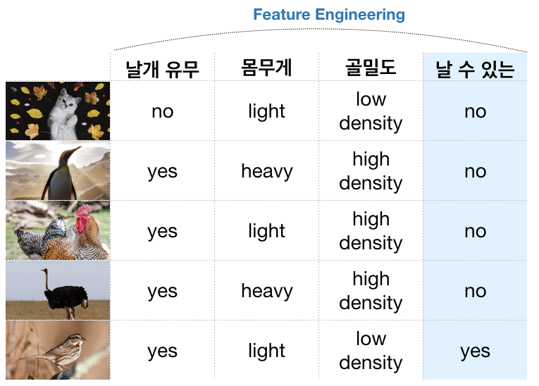
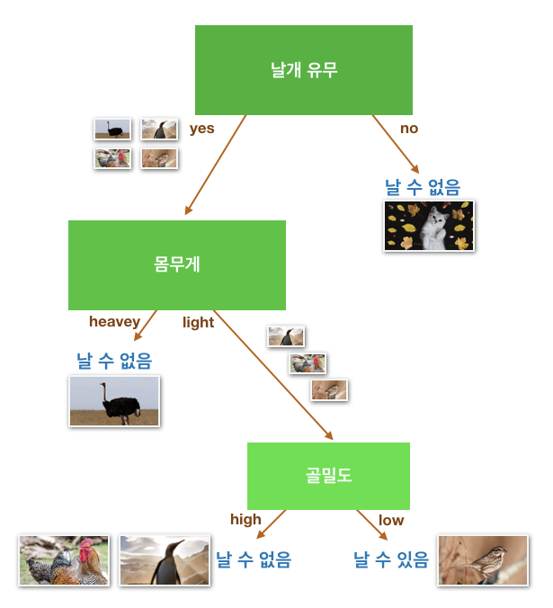
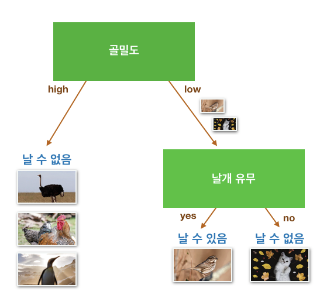
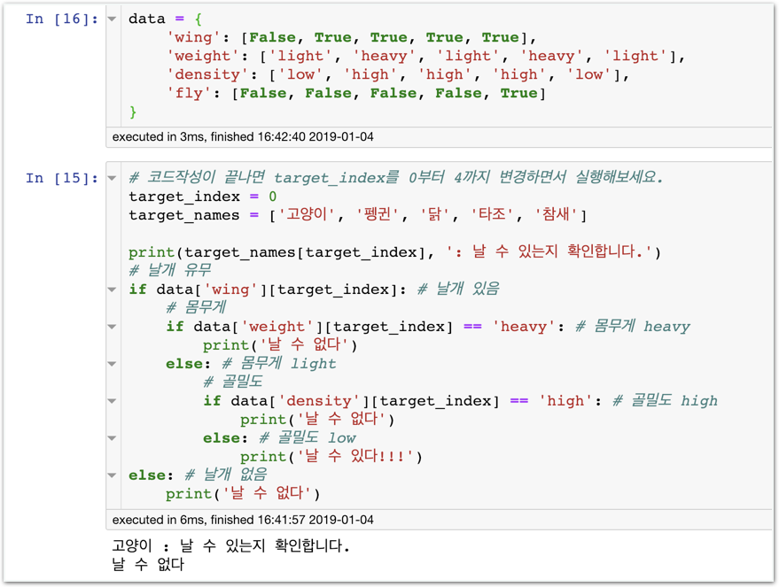
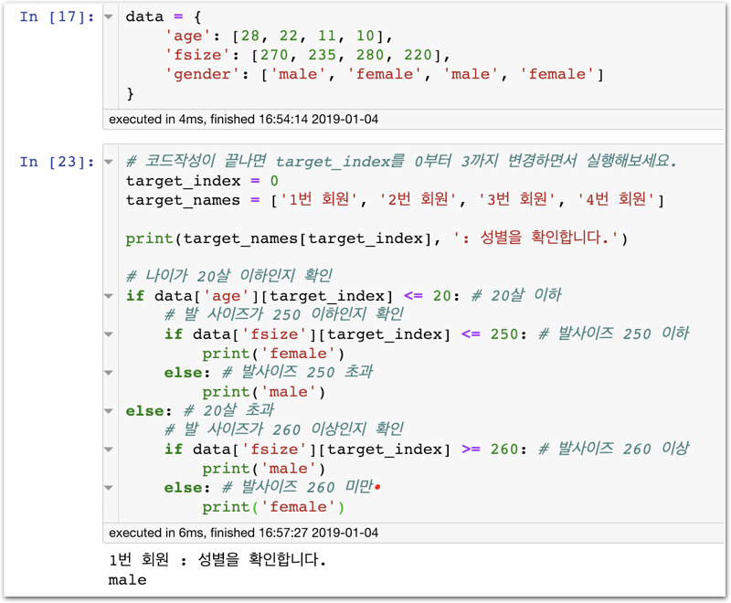

# Stage1 - Decision Tree를 배워보자

## Decision Tree

의사결정나무라고도 불리는 Decision Tree는 그 이름처럼 의사를 결정하는데 도움을 주는 나무 모양의 예측 모델입니다.

우리는 매일 무언가를 판단하고 결정해야하는 상황에 놓입니다. 오늘 점심만 해도 뭘 먹을지 한없이 고민하죠. 무엇으로 할지 쉽게 판단 내리지 못하는 사람들에게 우리는 '결정 장애'가 있다고 하는데 이 말은 참 잘 고안된 용어 같습니다. 만약 당신이 결정장애가 있다면, 모든 선택지를 둘로 남기고 여러 단계에 걸쳐 답을 해보면 어떨까요?

위의 그림이 바로 Decision Tree입니다. **이처럼 Decision Tree는 특별한게 아닙니다.**

Data Science 뿐만 아니라 경영학, 경제학, 컴퓨터공학 등 여러 학문에서 자주 사용되는 모델이며, 사실 일상에서도 의식적으로 또는 무의식적으로 사용하고 있죠.

## Decision Tree 학습법

### 학습 과정

**‘날 수 있는 새’를 구분할 수 있나요?** 누군가 당신에게 부탁하였습니다.

자, 이때 우리는 스스로가 Machine\(머신\)이라고 가정해야합니다.

**"Machine아! 내가 자료를 줄테니 공부해봐. 이거 공부하면 날 수 있는 새 정도는 구분할 수 있을거야"**

**"공부 다 했지? 어떤식으로 구분할 수 있는지 그 방법을 알려줄래?"**  
\(Decision Tree로 설명해주면 참 쉽겠구나!\)

**"그럼 너가 만든 구분 방식이 맞나 확인해볼까? 이 새는 날 수 있을거 같아?"**

`예측: 날 수 있다.`

**"맞았어!"**

### Tree 구성하기

아래처럼 트리를 만들어보면 어떨까요? 이 정도면 저 위에 있는 5개의 학습 데이터 정도는 완벽하게 구분할 수 있습니다.

하지만 이 방법만 있는건 아니죠. 다른 모양으로도 트리가 나올 수 있어요.


### 더 좋은 Tree는 우측 모델

일반적으로 빠르게 정답에 도달할 수록 더 우수한 트리라고 볼 수 있습니다.  
\(항상 더 높은 성공률을 보장하지는 않음\)


## Categorical Data

위에서 살펴본 데이터는 Category 특성을 지닌 데이터입니다. \(날개: 있음, 없음 / 몸무게: 가벼움, 무거움 …\)과 같이 특성이 카테고리로 구분된다는거죠.

카테고리 특성을 지닌 데이터가 들어 왔을 때 코드 상에서는 Decision Tree를 어떻게 구성해야 할까요? 함께 실습해볼게요.

### 함께실습$1

#### 카테고리 데이터 기반의 Tree 만들기

## 연속 데이터

이번에는 연속적인 특성을 지닌 데이터를 살펴보겠습니다. \(나이: 0~100, 발사이즈: 0~350\)과 같이 특성이 연속적인 숫자로 구성된 데이터입니.

### 함께실습$2

#### 연속적 특성 데이터 기반의 Tree 만들기

