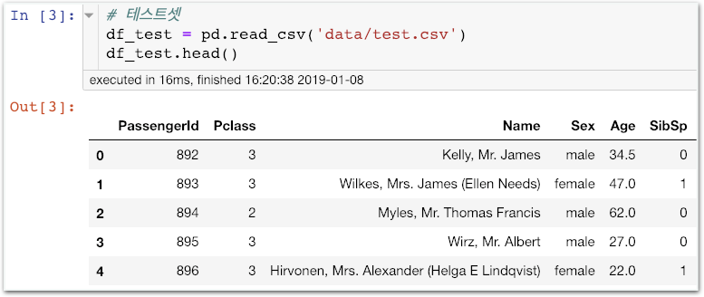
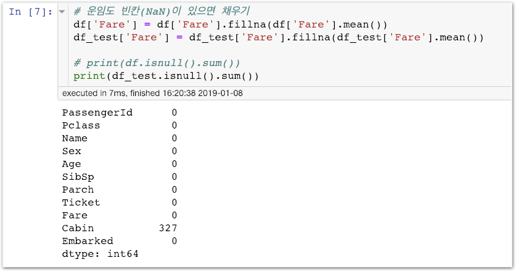
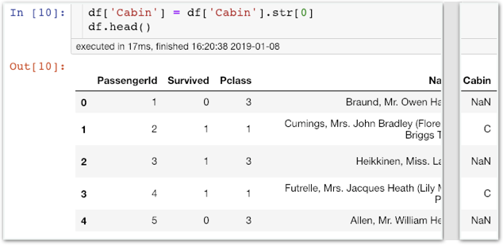

# Stage2 - 기계학습을 위한 Feature Engineering

## Feature Engineering 계획하기

1주차를 다시 기억해볼까요?

타이타닉 생존자를 찾기 위해 아래와 같은 Feature Engineering을 진행했습니다.

**특징** **선택**

1. Pclass\(티켓 등급\) 선택
2. Sex\(성별\) 선택
3. 항구\(Embarked\) 선택

**특징** **생성**

1. Age\(나이\)의 범위 묶기
2. Fare\(운임\)의 범위 묶기
3. SibSp\(형제자매 수\)와 Parch\(부모님 수\)를 가족수로 합치기
4. Cabin\(객실\) 정보에서 번호만 삭제하고 객실 종류에 해당하는 알파벳만 남기기
5. 빈칸은 평균 값으로 대체하기

**특징** **추출**

1. Name\(이름\) 삭제
2. Ticket\(티켓 일련번호\) 삭제
3. SibSp\(형제자매 수\), Parch\(부모님 수\) 삭제

이번에도 같은 데이터를 가지고 같은 방식으로 Feature Engineering을 진행하지만 엑셀을 사용하지 않고 Pandas로 처리합니다.

* **'더 나은 학습과 분석'**이라는 목적은 변하지 않으나 처리 방법에는 차이가 있습니다.

## 특징 선택

지금부터 Pandas를 이용해보겠습니다.

### 함께실습$1

#### 판다스로 training 데이터 불러와 살펴보기

티켓등급\(Pclass\)와 성별\(Sex\), 항구\(Embarked\)는 생존여부에 큰 영향을 끼칠 것으로 예상됩니다. 판다스의 head\(\) 기능을 사용하여 위 정보들을 대략적으로 살펴봅시다.

### 함께실습$2

#### 판다스로 test 데이터 불러와 살펴보기

## **계속하여** Train set과 Test set에 해야할 일

엑셀 혹은 판다스를 통해 데이터를 살펴보거나, 1주차의 기억을 되살려 보면 이 데이터가 완전치 않다는 사실을 알 수 있습니다. 적어도 아래의 두가지 일은 해줘야 분석을 할만한 자료가 되죠.

#### 1. 비어 있는 모든 값을 채우기

이 빈값들은 엑셀에서는 아무 글도 써있지 않지만 Pandas에서는 NaN으로 표기됩니다.

#### 2. 문자를 숫자로 바꾸기

컴퓨터는 데이터를 분석할 때 문자 보다는 숫자로 접근합니다. \(결국 모든게 숫자 놀음인거죠\) 어떤 모델은 이 부분을 자동으로 처리해주기도 하지만 항상 그러한 친절한 처리를 기대할 수는 없습니다. 정석대로 하자면, 모든 문자 카테고리를 숫자로 변경해줘야 합니다.

**Sex의 카테고리**에서 **male은 0으로, female은 1로** 사람은 카테고리를 이해할 수 있지만 **컴퓨터는 오로지 숫자로만 판단합니다.**


Feature Engineering에서 빈 값을 채우고 카테고리를 숫자화하는 작업은 기본&필수입니다.


## **특징 생성**

### **함께실습$3**

#### Age의 빈칸\(NaN\)을 평균으로 대체하기

### 함께실습$4

#### Fare의 빈칸\(NaN\)을 평균으로 대체하기

### 함께실습$5

#### SibSp와 Parch를 더하여 FamilySize 생성

### 함께실습$6

#### Cabin의 객실 알파벳만 남기기 \(첫글자\)

NaN도 채워줍니다. 가장 많은 C로 대체하겠습니다.

### **미션$1**

#### Embarked의 빈칸\(NaN\)을 가장 많이 존재하는 Embarked로 채우기

빈칸을 채우는 방법으로 ‘가장 많이 존재하는 값 대체하기’를 채택하였습니다. 당연히 더 좋은 방법이 많이 있습니다만, 원활한 실습 진행을 위해 이정도에서 만족하겠습니다.

그 결과 아래처럼 NaN 값이 없어져야 합니다.

### 함께실습$7

#### Cabin의 문자값 데이터를 숫자로 변환

여태 그러했던것처럼 Test Set에도 똑같이 적용해줘야겠죠?

아래는 참고용입니다. 위에서 cabin의 C, B, D, E, A, F, G, T 값을 0 ~ 7에 map한 방식 대신 사용할 수 있습니다.

### 함께실습$8

#### Embarked의 문자값을 숫자로 변환

### 미션$2

#### Sex의 문자값을 숫자로 변환

## 특징추출

### 함께실습$9

#### 학습시 필요 없는 5개의 열을 삭제하겠습니다.

* 삭제하지 않으면 해당 열도 중요한 데이터로 간주하고 학습에 영향을 줍니다.
* Name과 Ticket은 생존가능성에 전혀 영향을 안미칠것으로 가정하고 삭제합니다.
* SibSp, Parch는 FamilySize로 합쳤기 때문에 삭제합니다.
* PassengerId는 생존가능성에 아무런 영향을 주지 않는 행번호일 뿐이므로 삭제합니다.

