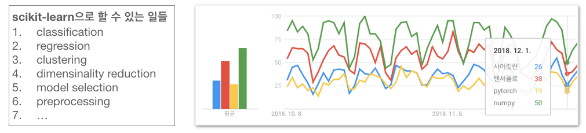
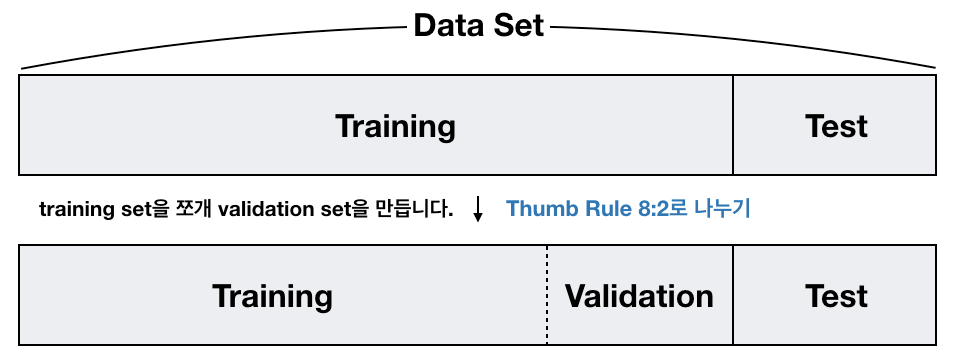
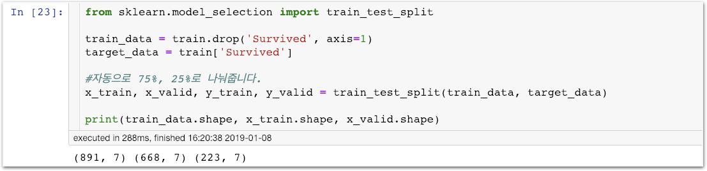
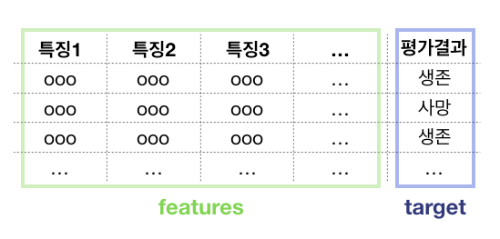
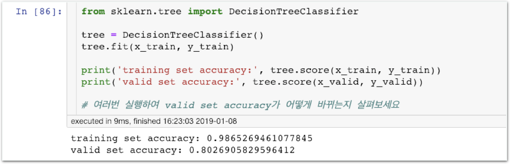
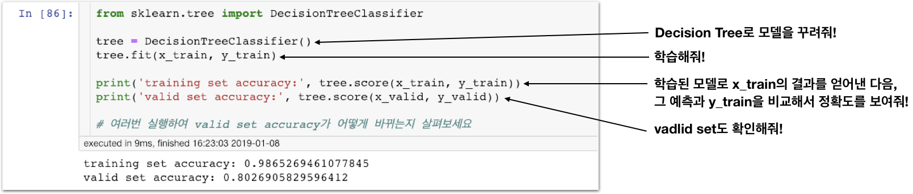
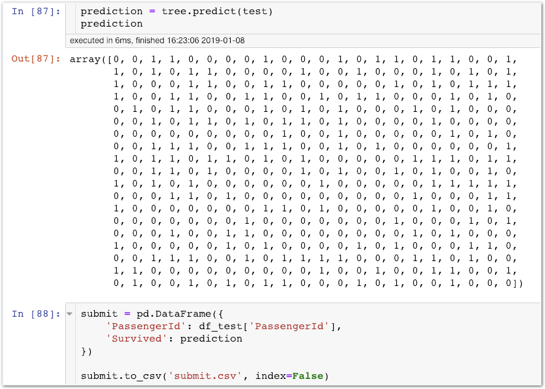
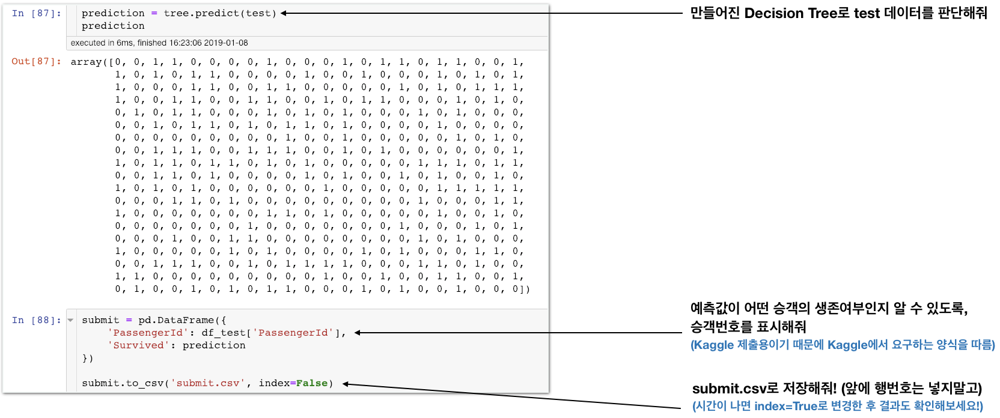
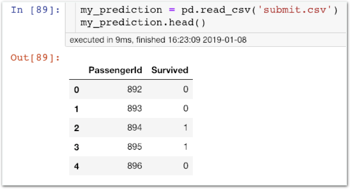

# Stage3 - Scikit-learn으로 실제 코드 구현하기

## scikit-learn 소개

**라이브러리** 자주 사용하고 유용한 기능을 누군가 이미 구현해 둔 코드 집합체

라이브러리의 정의는 지난번 Numpy, Pandas, Seaborn을 배우며 여러차례 설명드린 바 있습니다. 오늘은 싸이킷런을 배워봅니다.

### 싸이킷런\(scikit-learn\)

이렇게 수많은 라이브러리들이 모두 무료로 공개되어 있습니다. 오히려 너무 선택권이 많아 헷갈릴 정도 인데요, 어떤 기준으로 라이브러리를 선택하면 좋을까요?

**라이브러리를** **선택할** **때** **고려해야할** **점.**  
1\) 개발하려는 제품, 의도하는 결과를 얻기에 충분한 성능의 라이브러리  
2\) 인기가 많은 라이브러리\(Q&A자료가 많고 버그수정이 빠름. 1번도 자연스럽게 충족됨\)  
3\) 사용해봤을 때 실제로 편리하고 작업 효율을 높여주는 라이브러리

**\*** **특히** **초보자일수록** **인기** **라이브러리를** **선택해야합니다.**


### 유명 머신러닝 라이브러리

scikit-learn: 전통적인 머신러닝 알고리즘 사용을 목적으로 사용

Tensorflow: 주로 딥러닝 목적으로 사용\(low-level\)

Pytorch, Keras, Caffe, Theano, DL4Jd…


## Training set, Validation set, Test set

### **Data set**

러닝 모델의 설계, 학습, 테스트를 위해 확보한 데이터

**Training set**  
모델의 학습에 사용되는 데이터

**Validation set**  
모델 제작 과정 중, 학습된 모델의 성능을 측정하기 위한 데이터

p.p1 {margin: 0.0px 0.0px 9.0px 0.0px; line-height: 16.0px; font: 37.0px 'Apple SD Gothic Neo'; color: \#1a1a1a; -webkit-text-stroke: \#1a1a1a; background-color: \#ffffff}  
span.s1 {font: 37.0px Helvetica; font-kerning: none}  
span.s2 {font-kerning: none}

**Test set** 모델의 최종 성능을 평가하기 위한 데이터  
모델의 최종 성능을 평가하기 위한 데이터


### Validation Set vs. Test Set

validation set은 모델을 만드는 과정, 여러 모델 중 가장 나은 모델을 선택하는 상황과 같이 최종적으로 머신러닝 모델이 나오기 전에 활용하는 성능평가용 데이터 입니다. 즉 목적은 ‘성능 가늠’입니다.

test set은 모델 선택이 끝난 후 최종적으로 머신러닝 모델의 성능을 측정하는 데이터입니다. 목적은 ‘성능 최종 평가’입니다.

test은 모델의 성능을 개선하기 위한 용도로 사용할 수 없으며 어떠한 경우에도 학습에 영향을 주어서는 안됩니다. 모델 제작과는 완전히 분리되어 성능 평가 그 자체만을 위해 완전히 분리해 둔 데이터라고 할 수 있습니다.


## Training Set과 Validation Set 나누기

### 함께실습$1

#### train\_test\_split 함수를 이용하여 Training Set과 Validation Set 나누기

**scikit-learn에 학습데이터를 넣을 때는 feature 데이터와 target 데이터를 분류해서 넣습니다.**  
\(대다수의 머신러닝 라이브러리들이 채택한 방법\)


### train data와 valid data를 나누는 비율

8:2 정도면 적당하다고 알려져 있습니다. 7:3, 9:1도 괜찮습니다. 특수한 경우가 아니라면 8:2 전후에서 처리하시면 됩니다.


### 함께실습$2

#### scikit-learn의 Decision Tree Classifier를 사용하여 학습하기

**생각해보기1**  
“재실행하면 valid set accuarcy가 바뀌는 이유가 뭘까요?”

**생각해보기2**  
“재실행해도 training set accuracy가 바뀌지 않는 이유가 뭘까요?”

### 함께실습$3

#### Test data를 predict하고 얻은 최종 결과를 csv 파일로 저장하기

### 함께실습$4

#### Pandas로 submit.csv 불러와 확인

### 미션$1

#### Kaggle에 제출하세요!

Kaggle 제출하기 [https://www.kaggle.com/c/titanic/submit](https://www.kaggle.com/c/titanic/submit)

