# Stage4 - 분석 노하우로 학습 성공률 높이기

## 필요한 정보를 얻는 효과적인 시각화

### 그동안 배우 차트 6종

#### Line Plot

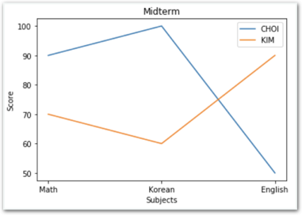

#### Bar Chart

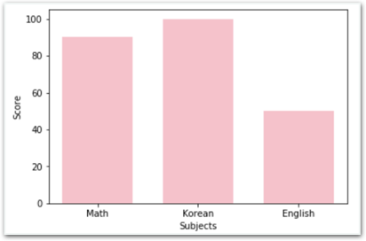

#### 기본 산포도

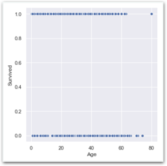

#### Box Plot

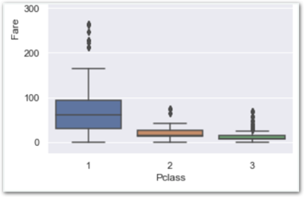

#### Count Plot

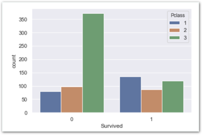

#### Categorical Scatter Plot

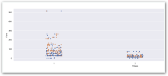

### 함께실습$1

#### Count Plot으로 Age에 따른 생존여부 히스토그램 얻기

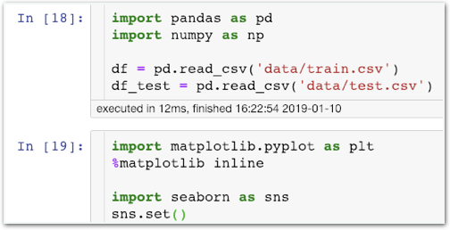

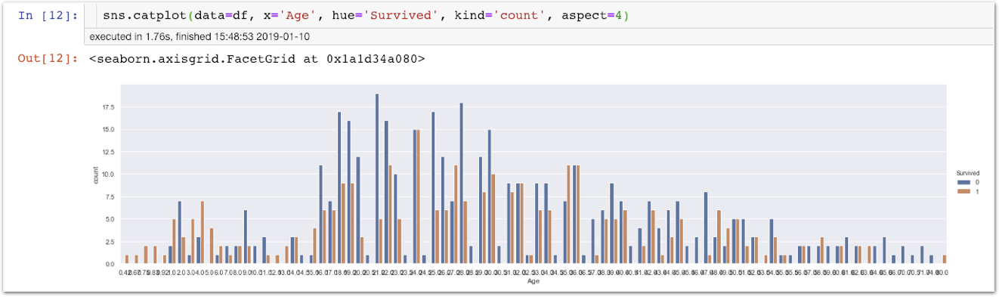

**히스토그램을** **보고** **할** **수** **있는** **가정**

=&gt; 가운데 나이대가 특히나 많이 죽었다.

**문제점**

1. **x축을** **읽기** **힘들어** **가운데** **나이대가** **정확히** **어떤** **구간인지** **알** **수** **없다.**
2. **히스토그램이** **매끄럽지** **못해** **좋은** **판단을** **내리기** **어렵다.**
3. **Age의** **종류가** **너무** **많아** **히스토그램의** **x축** **분포의** **스케일이** **고르지** **않다.**
4. **불필요한** **정보를** **너무** **많이** **포함하여** **전체적으로** **해석하기** **어렵다.**

### 함께실습$2

#### kdeplot을 사용하여 매끄러운 곡선 분포도 얻기

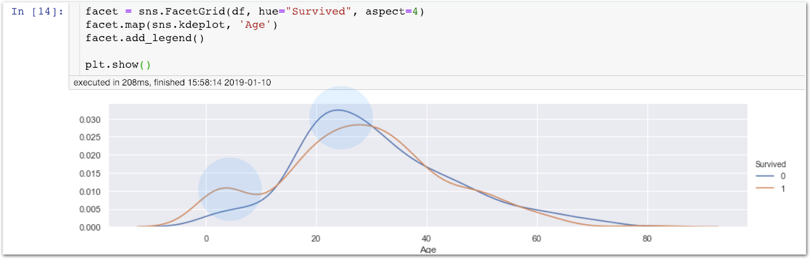

seaborn이 kernel density를 측정하여 밀집 정도를 계산한 값입니다. 0.03, 0.015와 같은 각 값이 무엇인가가 중요한게 아니라, 높을수록 ‘밀집’, 낮을수록 ‘희소’하다는 의미만 기억하면 됩니다.

“10대 이하의 어린이들이 많이 살았고, 20대 초반이 많이 죽었구나!”

👉🏻 **나이** **특징이** **생존에** **큰** **영향을** **미치는** **만큼** **정밀한** **처리가** **필요함을** **알** **수** **있습니다.**

## 빈칸\(NaN\)을 더 현명하게 처리하기

### 함께실습$3

#### Name에서 유용한 정보 남기기

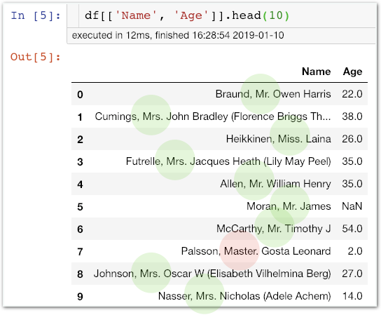

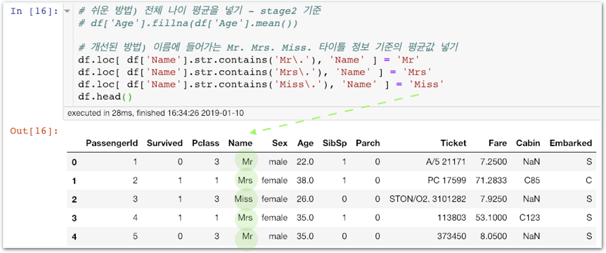

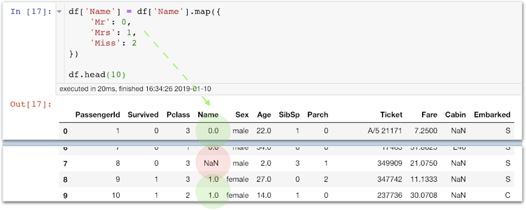

원래는 Henry, James와 같은 이름 그 자체는 생존에 영향을 주지 않을거라 판단하고 Name 특징을 삭제했었습니다.

Name을 자세히 살펴보니 Mr, Mrs, Miss 같은 나이를 추측할 수 있는 특징들이 포함되어 있고 이를 활용하기 위해 위와 같이 작업했습니다.

### 함께실습$4

#### Name의 빈칸\(NaN\)을 3으로 채워 넣기

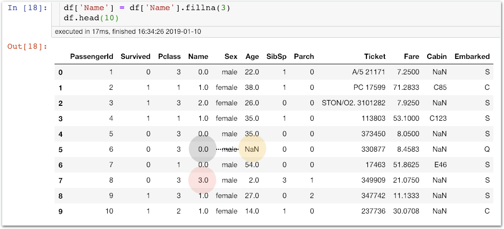

원래는 이 부분을 전체 Age의 평균으로 채웠습니다. 이제는 Name이 0인 승객들의 평균으로 대체하겠습니다. \(즉 Mr. 들의 나이 평균으로 채우겠습니다.\)

|  | **mapping** **값** |
| :--- | :--- |
| Mr | 0 |
| Mrs | 1 |
| Miss | 2 |
| 그 외 | 3 |


빈칸을 전체 평균으로 대체하던 것보다 훨씬 현명한 방법입니다. 실제로 모델 성능에도 큰 영향을 미칩니다. 알면 알수록 Feature Engineering은 굉장히 어려운 부분입니다.


## 채워진 Age 살펴보기

### 함께실습$5

#### 수정된 Name과 채워진 Age를 확인합니다.

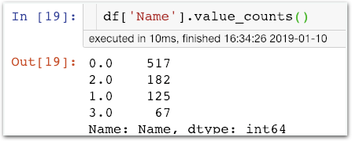

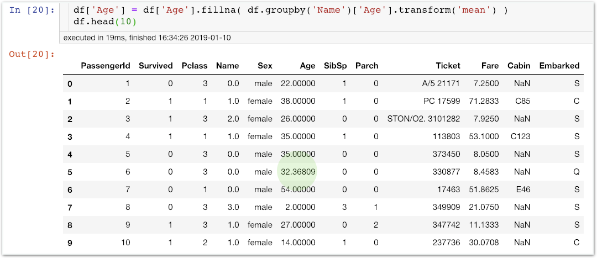

## 채워진 Age에 따른 생존 분포도 확인하기

### 미션$1

#### 방금 전 실습한 kdeplot을 이용해 곡선분포도를 얻어보세요.

아래는 Age의 빈칸을 채우기 전 kdeplot입니다. 많이 달라졌죠?

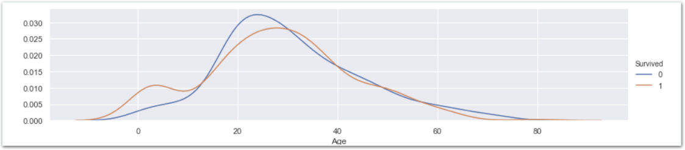

