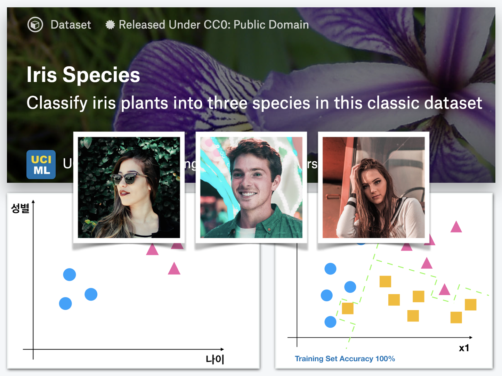

# 4주차 - Random Forest로 아이리스 종 구분하기

## 이번주 목표

### Random Forest로 아이리스 종 구분하기

#### Random Forest를 배우고 아이리스 종을 구분합니다.

지난 시간 배운 Decision Tree를 발전시킨 Random Forest 알고리즘을 학습합니다. 이후 육안으로는 구분하기 어려운 아이리스를 분류해봅시다.

Decision Tree, Random Forest를 지난 시간에 진행한 타이타닉 문제에도 적용하여 그 차이점과 효과를 이해하는 것도 또다른 실습목표입니다.

그동안 배운 python, numpy, pandas, sicikit-learn을 사용하며 seaborn을 이용한 새로운 플롯도 배우겠습니다.

