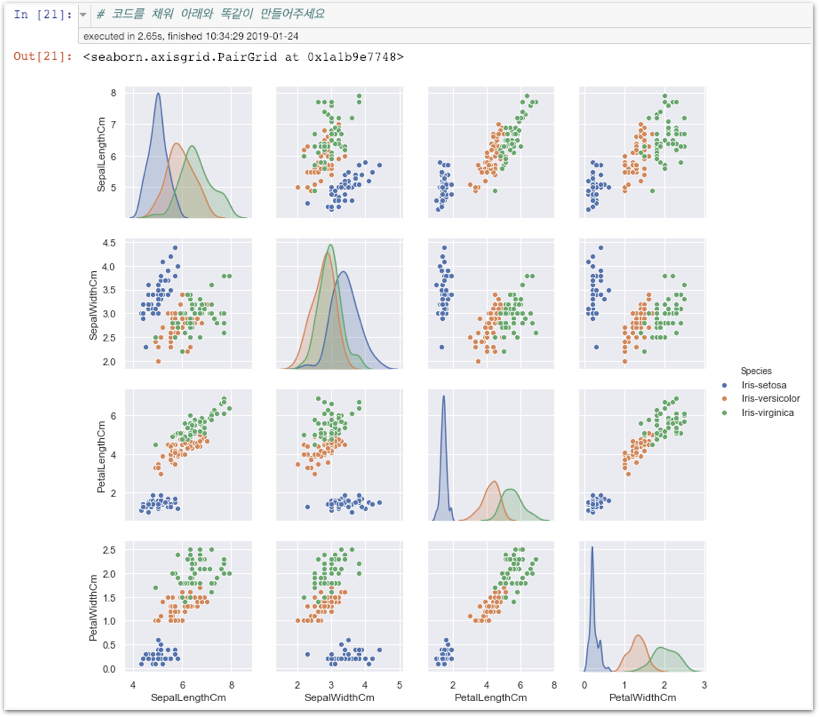

# Challenge1 - Pair plot 만들기

## 문제

### Pair plot 만들기

## 방법

### 왼쪽 멤버가 강의자료를 열고, 오른쪽 멤버가 메모장을 열어 답을 적습니다. 서로 의논하여 답을 채워주세요.

1. **pair plot은** **언제** **배웠을까요?**          **\*\*** 주차         **\*\*** **스테이지**         **\*\*** 번째 ****실습\*\*
2. **x\_vars에** **들어갈** **항목은** **무엇이** **있을까요?**  **\[                  \] \[                  \] \[                  \] \[                  \]**
3. **y\_vars에** **들어갈** **항목은** **무엇이** **있을까요?**  **\[                  \] \[                  \] \[                  \] \[                  \]**
4. **hue에** **어떤** **값을** **넣어야** **할까요?  \[                  \]**

이제 코딩을 시작하세요! 코딩이 끝나면 모범답안과 비교해보세요.



