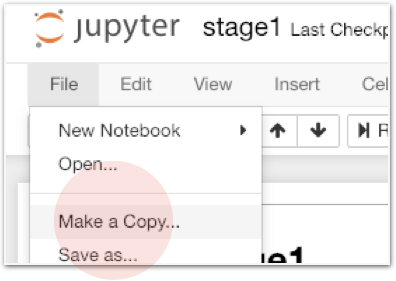

# Challenge2 - 타이타닉 문제에서 학습 부분을 Random Forest로 바꿔보기

## 문제

### 타이타닉 문제에서 학습 부분을 Random Forest로 바꿔보기

모델 학습을 다루는 부분에서 Decision Tree를 Random Forest로 바꿔 진행하면 됩니다.

## 방법

### **오른쪽** **멤버가** **강의자료를** **열고,** **왼쪽** **멤버가** **메모장을** **열어** **답을** **적습니다.**  **서로** **의논하여** **답을** **채워주세요.**

1. **어디** **부분을** **수정해줘야** **할까요?**  **\[                                                                     \]**
2. **파라미터** **n\_estimators의** **역할은** **무엇인가요?**  **\[                                                                     \]**
3. **n\_estimators가** **10일** **때, 3000일** **때** **아래** **항목들이** **어떻게** **다른가요?**  속도 **\[                  \]** 정확도 **\[                  \]**

**최종적으로는 kaggle** **제출까지** **진행하시면** **됩니다.**

이제 코딩을 시작하세요! 코딩이 끝나면 모범답안과 비교해보세요.



