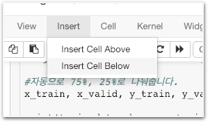

# Stage1 - Random Forest를 배워보자

## Ensemble

Ensemble\(앙상블\)이란 여러 머신러닝 모델을 연결하여 더 강력한 모델을 만드는 기법입니다.

더 쉽게 살펴볼까요? 아래와 같은 질문이 들어왔다고 가정해봅시다.

**Q. 타이타닉 호에 탄 391번째 승객은 생존할거 같아?**

그냥 혼자만의 의견으로 답하기보다는 여러명의 전문가에게 조언을 듣는게 더 좋지 않을까요? 세명의 전문가에게 의견을 들어봅시다. 이 전문가들의 이름은 간편하게 머신1호, 머신2호, 머신3호라고 칭할게요.

일반적으로는 혼자 판단하기 보다 각기 전문 영역을 가진 여러명의 전문가들의 의견을 들어 종합하는게 더 합리적인 의사결정이라 할 수 있습니다. Ensemble이 그렇습니다. 다른 모양으로 형성된 모델 여러개를 연결하여 마치 여러명의 전문가에게 의견을 듣는 구조를 이용하는 것 입니다.

Ensemble 활용시 거의 모든 경우 정확도가 상승합니다. 다만 여러명에게 의견을 물어야하니 처리 속도가 느려지겠죠?

## Random Forest

Random Forest가 바로 여러개의 Decision Tree를 만들고 연결하여 결과를 취합한 후 평균내어 성능을 높인 모델입니다. 즉 Ensemble의 원리를 이용한 방법이라고 생각하시면 됩니다.

Decision Tree는 꽤 좋은 모델이라 여러 상황에서도 예측을 잘 하는 편이지만, 일부 데이터에 대해 overfitting하는 경향이 있습니다. 그러한 원리, 문제를 해결하는 방법이라고 생각하셔도 좋습니다.

### Overfitting

이쯤에서 Overfitting이 뭔지 궁금하실거예요. Overfitting\(과적합\)이란 학습 데이터를 과하게 학습한 나머지 학습 상황에서는 오차가 줄지만 실제 데이터들에 대해 오차가 증가하는 현상입니다.

즉, 너무 지나치게 훈련 데이터를 맹신해서 실제 예측이 자주 빗나가는 현상입니다.

### overfitting 예시

* **머신러닝에서\)** Train Accuracy가 100%가 나오는데 실제 테스트는 현저하게 떨어지는 50%가 나온다.
* **일상에서\)** 볼링공에 머리를 한번 맞아 봤는데 전혀 아프지 않았다. 볼링공으로 사람 머리를 때리는건 하나도 위험하지 않구나.

즉 일부 데이터에 너무 특화된 학습으로 인해 실제 예측이 빗나가는 상황이라고 보면 됩니다.

## Decision Tree를 Ensemble 해보기

### 함께실습$1

#### 여러개의 Decision Tree 만들기

1. 가장 최근 만든 모델 파일을 복사해주세요. \(지난 과제를 했다면 WEEK3의 과제2, 안했다면 WEEK3의 stage3 파일\)
2. WEEK3의 data 폴더도 그대로 복사하여 WEEK4 폴더안에 넣어주세요. \(데이터는 그대로 사용합니다.\)
3. 최하단 Modeling 부분 부터 이어나가겠습니다. 아래 부분을 찾아주세요.

1. 해당 셀을 클릭하고 메뉴에서 Insert Cell Below를 눌러주세요.

1. 추가된 셀에 세개의 트리를 구성하고 각각의 정확도를 확인해보세요.

### 함께실습$2

#### 여러개의 Decision Tree Ensemble 하기

submit 파일을 만들고 제출까지 해보세요!

* tree1 점수: 0.66507

* ensemble 점수: 0.67464

