# Stage2 - Iris 문제 Feature Engineering

## Iris 종 구분하기

생김새만으로는 구분하기 어려운 Iris\(붓꽃\)의 데이터를 받아 정확한 종을 구분하는 문제입니다.

이제 타이타닉 문제를 벗어나 새로운 문제에 도전해봅니다.

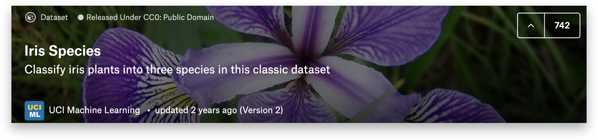

아이리스의 꽃잎과 꽃받침의 너비, 길이 정보를 바탕으로 setosa 종인지 versicolor 종인지 혹은 virginica 종인지 구분하는 문제입니다.

## Iris 문제 분석하기

### 함께실습$1

#### Iris 데이터 불러오기

데이터 다운로드 [http://bit.ly/코알라\_DS\_1주차\_과제2](http://bit.ly/코알라_DS_1주차_과제2)

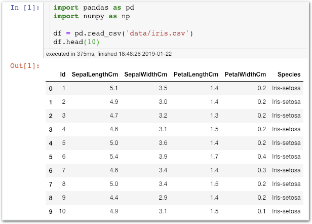

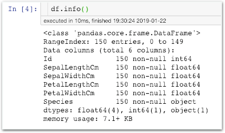

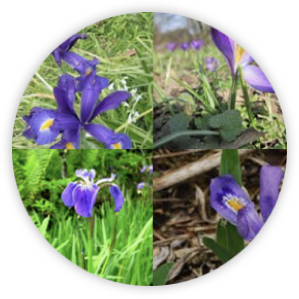

데이터를 살펴보니 꽃잎과 꽃받침의 너비, 길이 정보로 부터 Iris의 종을 구분하는게 목표라는 것을 다시한번 확인할 수 있네요.

## Feature Engineering and Visualization

### 함께실습$2

#### 꽃받침 길이, 너비에 따른 종 분포도 보기

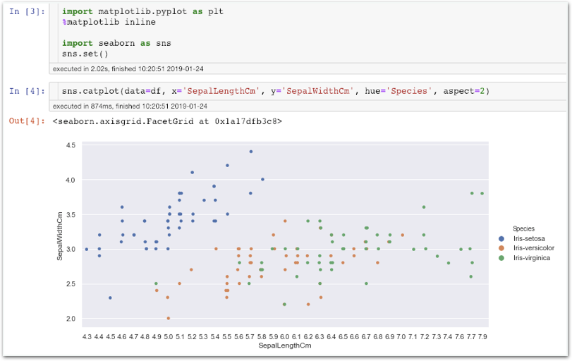

### 미션$1

#### 꽃잎의 길이, 너비에 따른 종 분포도 보기

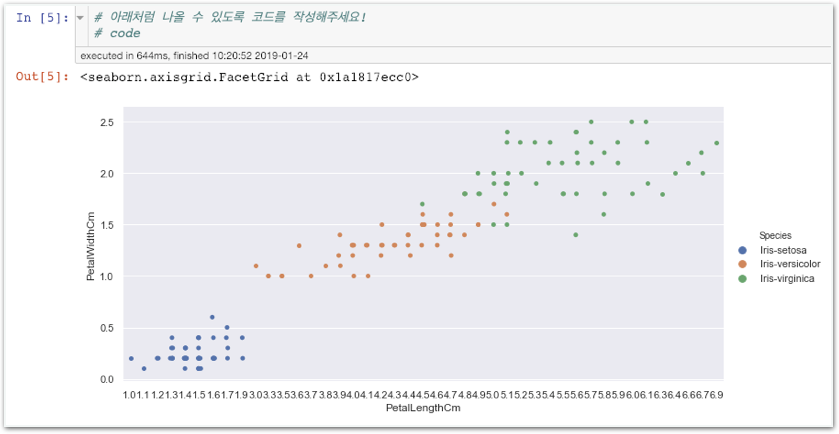

## 특징 생성 - Feature Engineering with Pandas

### 함께실습$3

#### kdeplot으로 꽃받침 길이별 밀집 수준 파악

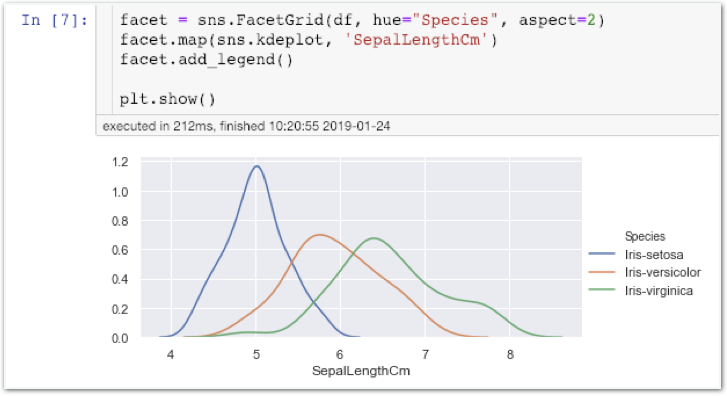

### 함께실습$4

#### box plot으로 종별 꽃받침 길이 범위 파악

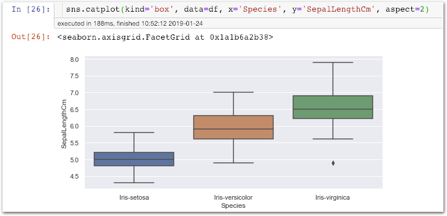

### 함께실습$5

#### violin plot - x: 종, y: 꽃받침 길이

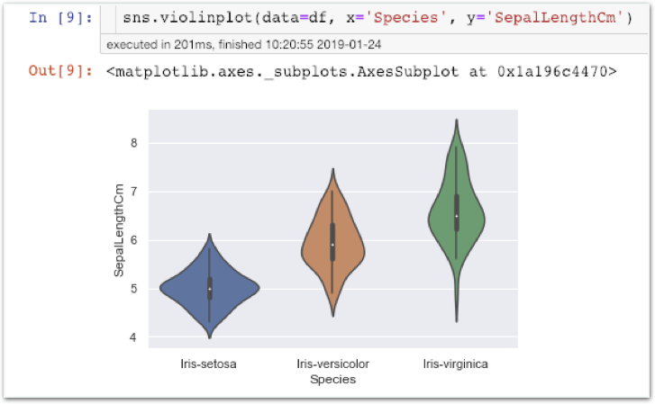

### 함께실습$6

#### violin plot - x: 종, y: 꽃받침 너비

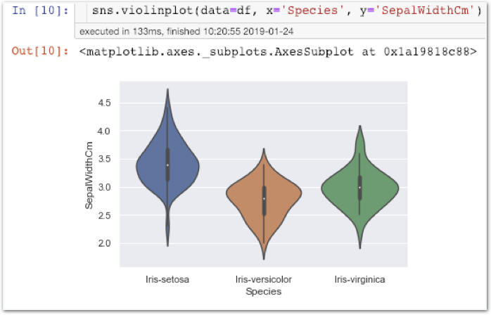

### 함께실습$7

#### violin plot - x: 종, y: 꽃잎 길이

### 함께실습$8

#### violin plot - x: 종, y: 꽃잎 너비

## 바이올린 플롯

Violin Plot은 값 범위와 밀집정도를 시각적으로 동시에 확인할 수 있는 플롯입니다.

우선 카테고리 플랏을 사용해봅시다.

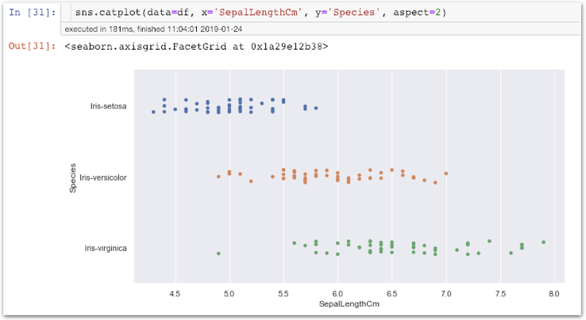

꽃받침길이\(SepalLength\)에 따라 종이 어느정도 구분되는구나!

**근데 값의 범위랑 그 부분에 데이터가 몇개나 있는지 알기 어렵네…**

그래서, 박스플롯과 kdeplot을 사용합니다. 밀집도와 값의 범위를 쉽게 확인할 수 있죠.

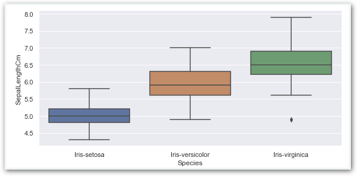

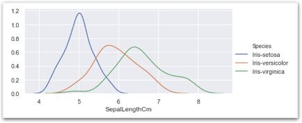

만약 이 두가지 방식을 혼합할 수 있는 플롯이 있다면 어떨까요?

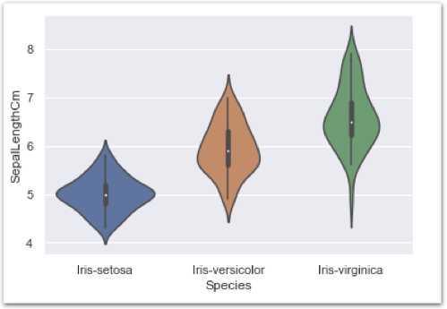

**값의 범위\(최소, 최대, 이상값\)와 밀집 정도까지 시각적으로 한번에 알 수 있구나!**


### 왜 바이올린 플랏일까?

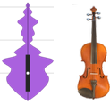

좌측이 바이올린 플랏, 우측이 실제 바이올린입니다. 닮았죠?


