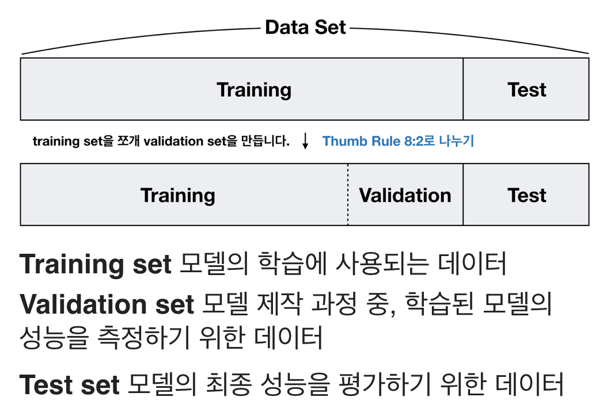
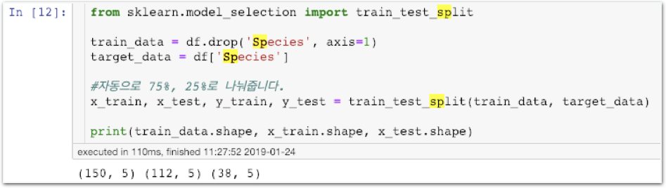
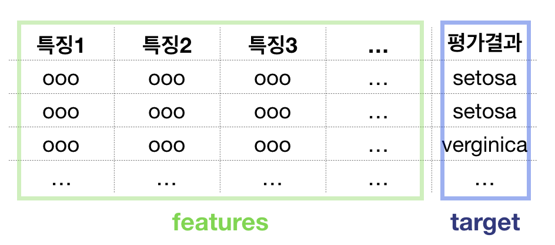
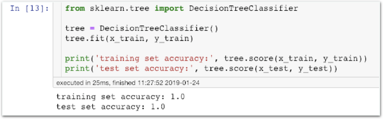
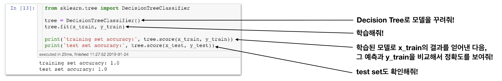
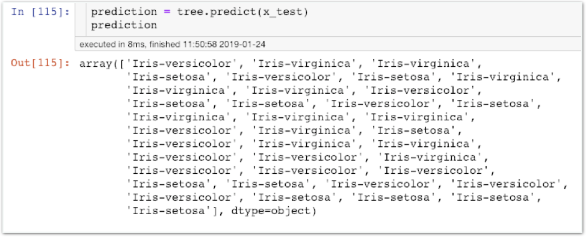
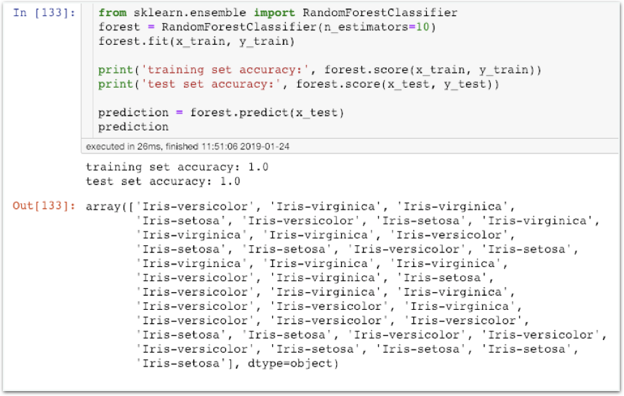
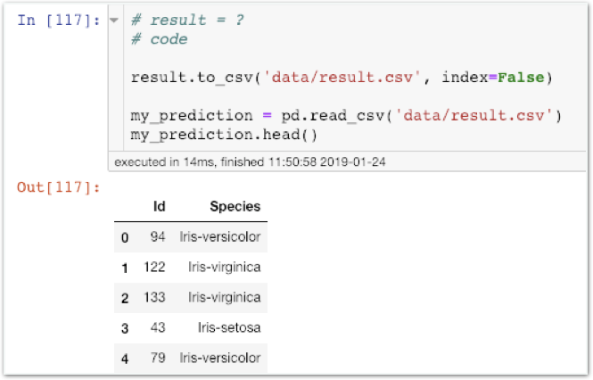
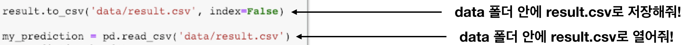

# Stage3 - Scikit-learn으로 Random Forest 구현하기

## Data set 구성 계획 짜기

### Data set 구성 계획

1. **지난번** **Titanic** **문제에서는** **Training set과** **Test set이** **이미** **나누어져** **있었습니다.**  교육 목적으로 제작된 데이터로 학습 편의를 위해 Kaggle 제작팀에서 미리 나눠둔것 뿐입니다. 실제 세상의 데이터는 학습 데이터처럼 친절하게 나뉘어져 있지 않습니다.
2. **현재** **우리는** **데이터** **보유량이** **매우** **적습니다. \(150개\)**  우수한 결과를 내기위해서는 훨씬 많은 데이터가 필요합니다. 따라서 데이터를 직접 만들거나 더 수집해야 합니다. 우리는 Random Forest 사용법을 익히는 중이므로 이 과정을 생략합니다.
3. **따라서** **Validation Set은** **만들지** **않겠습니다.**  데이터가 너무 적어 효율이 적을 뿐만 아니라 잘못된 시그널을 얻을 수도 있습니다.
4. **최종적으로** **150개** **중** **75%를** **Training set으로** **25%를** **Test set으로**  **구성하겠습니다.**  8:2 정도로 나누면 됩니다.

## Training Set과 Validation Set 나누기

### 함께실습$1

#### train\_test\_split 함수를 이용하여 Training Set과 Validation Set 나누기

**scikit-learn에** **학습데이터를** **넣을** **때는** **feature** **데이터와** **target** **데이터를** **분류해서** **넣습니다.**  
\(대다수의 머신러닝 라이브러리들이 채택한 방법\)


### 타이타닉 문제와 같은 방식입니다.

코드는 거의 동일합니다. 무엇이 바뀌었는지 비교하면서 확인하세요.


## Decision Tree 학습 및 평가

### 함께실습$2

#### iris 구분 Decision Tree 모델링

**생각해보기1**  
“train set accuracy는 왜 항상 1.0이 나올까요?”

### 함께실습$3

#### Decision Tree 모델로 predict하기

## Random Forest 구현해보기

### 함께실습$4

#### Scikit-learn의 RandomForestClassifier 사용해보기

## 결과를 csv 파일로 만들기

### 미션$1

#### 아래와 같은 결과가 나오도록 csv 파일을 만들어보세요

