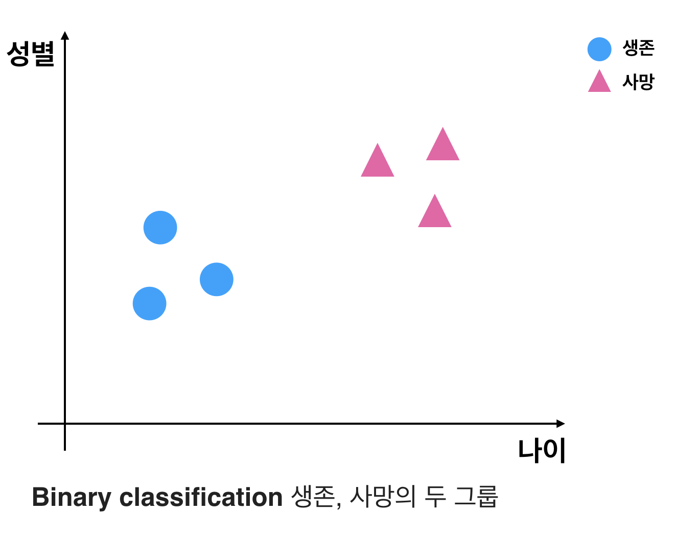
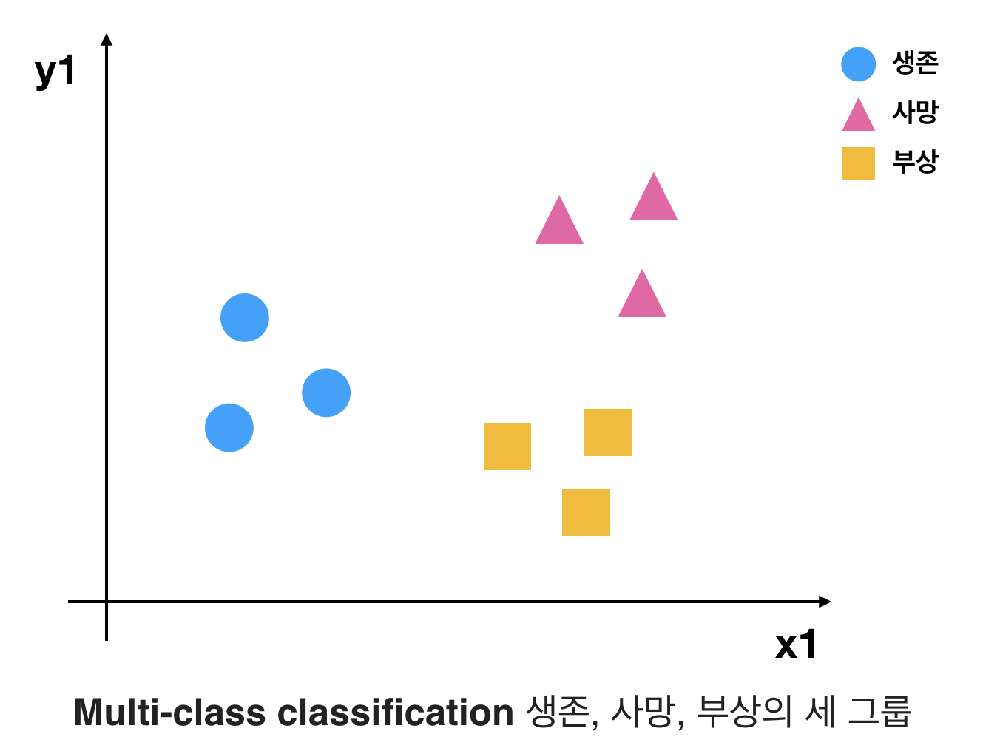
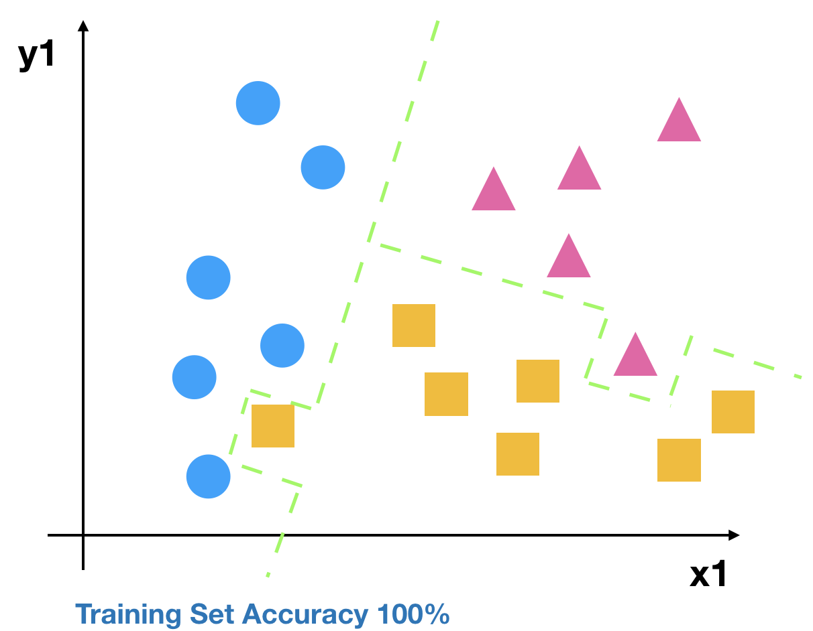
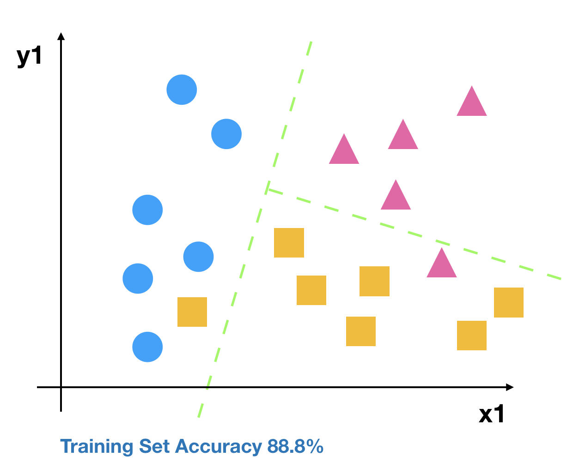
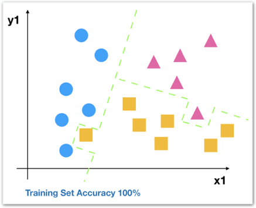
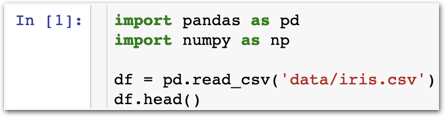
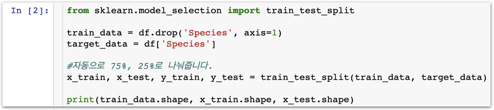
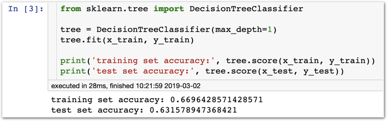
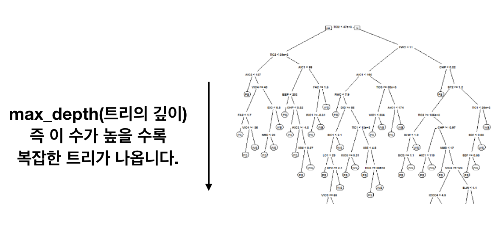
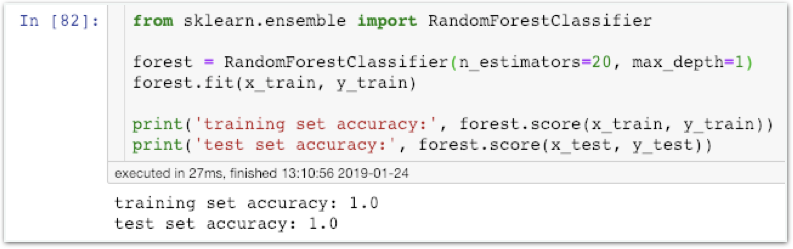

# Stage4 - Multi-class Classification Problem

## Binary classification 그리고 Multi-class classification

### Binary classification

데이터를 2개의 그룹으로 구분하는 분류

### Multi-class classification

데이터를 3개 이상의 그룹으로 구분하는 분류​

## Decision Tree의 성격

Decision Tree는 굉장히 강력한 classification 모델입니다. 다만 심각하게 overfitting되는 경향이 있습니다.

#### 과연 어떤 모델이 더 좋은 모델일까요?

저는 후자를 택하겠습니다. 너무 과하게 트레이닝되어 실전에서 오히려 잘못된 예측을 남발하는 전자의 모델보다는 훈련 정확도가 88.8%인 모델이 나을 거라고 예상합니다.

## Decision Tree의 overfitting 원인과 해결법

모든 데이터를 구분하는 지나치게 깊은 트리를 만드는게 overfitting의 원인입니다.

너무 깊고 자세한 트리가 만들어지면 아래와 같은 지나칠 정도 구분을 하게 됩니다.

### 함께실습$1

#### max\_depth 설정하기


### max\_depth를 설정하지 않으면 어떻게 되나요?

여태까지 max\_depth를 설정한적 없었죠? 설정하지 않아도 잘 동작합니다. 다만 엄청나게 세세한 지점까지 분류하는 매우 깊은 트리가 탄생합니다.


### 함께실습$2

#### random forest 사용하기

| 파라미터 | 기본값 | 영향 |
| :--- | :--- | :--- |
| n\_estimators | 10 혹은 100 | 작을 수록 overfitting이 완화된다 |
| max\_depth | 무제한 | 클 수록 트리가 깊어진다 |
| max\_features | sqrt\(특징 개수\) | 작을 수록 트리가 깊어진다 |
| 더 많은 옵션이 있지만 이정도면 충분합니다. |  |  |


### 이 파라미터들의 적정값은 어떻게 되나요?

n\_estimators는 클수록 좋습니다. 다만 클수록 학습이 느려지고 모델이 비대해지며 더 많은 컴퓨팅 자원을 필요로 합니다. 시간 등 비용의 문제가 없는 선, 더이상 성능의 향상이 없는 선까지 최대한 크게 잡으면 됩니다.

max\_depth의 경우 직접 수를 넣어보며 경험적으로 설정하면 됩니다. max\_feature의 경우 이미 적정값이 설정되어 있습니다. 특별히 최적화할 것이 아니라면 수정할 필요 없습니다.


