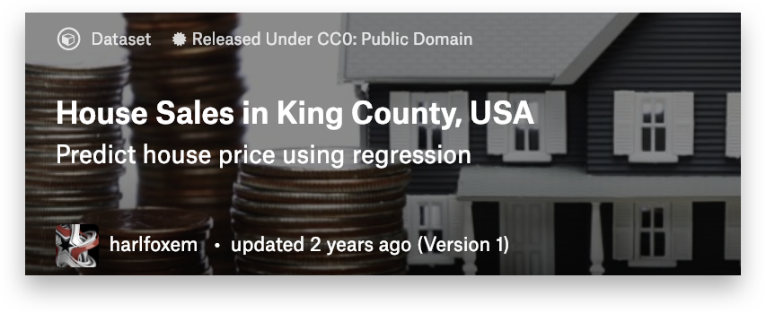

# 5주차 - 회귀분석으로 집 값 예측하기

## 이번주 목표

### 회귀분석으로 집 값 예측하기

#### **Linear Regression으로** **집** **값을** **예측하고** **성능을** **높일** **수** **있는** **여러** **알고리즘을** **배웁니다.**

그동안 분류 할 수 있는 능력을 쌓았습니다. 이제는 ‘집 값 분석’과 같이 값을 예측하는 방법을 배워보겠습니다.

연속적인 값 예측 문제를 위한 Visualization을 진행한 후 가장 기본적인 Linear Regression의 원리를 익히고 Decision Tree와의 차이점을 이해합니다.

추가로 성능을 높일 수 있도록 Polynomial Regression, Ridge, Lasso 모델도 학습하겠습니다.

