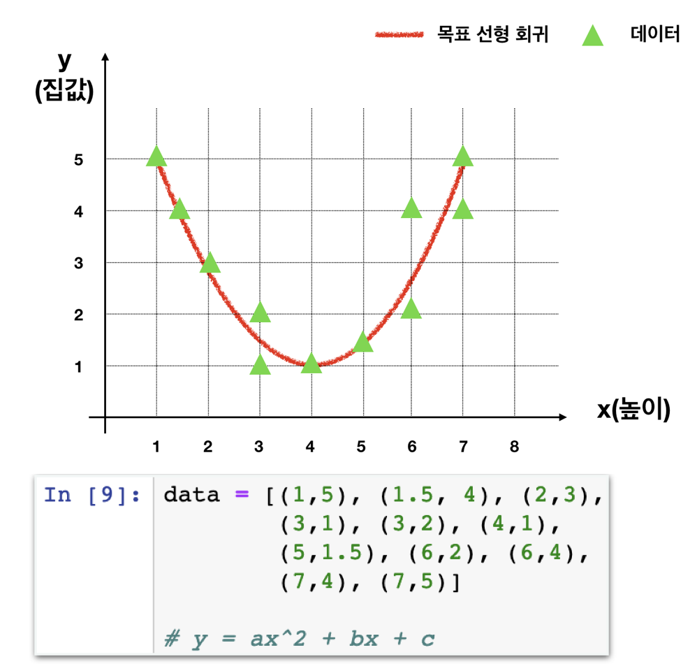

# Challenge1 - Polynomial Linear Regression

## 문제

### Polynomial Linear Regression

#### stage1을 참고하여 이차함수 형태의 선형회귀식을 찾아보세요.

stage1과 거의 같은 방식으로 최소값을 출력하는 a,b,c를 찾아봅니다.​

## 방법​

### **왼쪽** **멤버가** **강의자료를** **열고,** **오른쪽** **멤버가** **메모장을** **열어** **답을** **적습니다.** **서로** **의논하여** **답을** **채워주세요.**

1. **stage1** **코드에서** **어디** **부분을** **수정해줘야** **할까요? \(총** **세군데\)**  **\[** **데이터** **할당부분** **\] \[                  \] \[                  \]**
2. **만드려는** **식은** **어떻게** **생겼나요? \(stage1은** **y=ax+b\)**  **\[ y =                                                              \]**
3. **이제** **각자** **코딩을** **시작하세요..!**
4. **오차제곱의합이** **100이하면** **성공입니다.** **찾은** **a,b,c는?**  **a**                   **\*\*** b                   **\*\*** **c**                  _\*\*_

**답안** **작성이** **완료되면** **리더에게** **확인** **받으세요!**

이제 코딩을 시작하세요! 코딩이 끝나면 모범답안과 비교해보세요.



