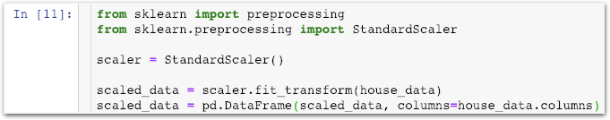

# Challenge2 - Feature Scaling을 적용한 데이터의 Visualization

## 문제

### Feature Scaling을 적용한 데이터의 Visualization

stage2에서 진행한 데이터는 feature scaling이 적용되지 않은 데이터입니다.

feature scaling을 적용한 데이터를 visualization하면 어떻게 될까요? state2와 똑같은 종류의 시각화 작업을 진행해주세요.

scaled\_data를 만들고 이 데이터를 대상으로 진행하면 쉽습니다.

## 방법

### **오른쪽** **멤버가** **강의자료를** **열고,** **왼쪽** **멤버가** **메모장을** **열어** **답을** **적습니다.**  **서로** **의논하여** **답을** **채워주세요.**

1. **어떤** **시각화** **자료를** **만들어야** **할까요?**  **\[                  \] \[                  \] \[                  \]**
2. **stage2** **코드에서** **어디** **부분을** **수정해줘야** **할까요?**  **\[                                                                     \]**
3. **각자** **visualization을** **진행합니다.**  어떤 점이 바뀌었나요? **\[                                   \]**  그래프의 모양이 바뀌었나요? **\[                                   \]**

**답안** **작성이** **완료되면** **리더에게** **확인** **받으세요!**

이제 코딩을 시작하세요! 코딩이 끝나면 모범답안과 비교해보세요.



