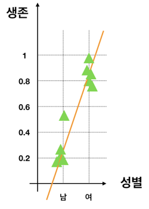

# 과제2 - Linear Regression으로 타이타닉 생존자 예측해보기

## 문제

### Linear Regression으로 타이타닉 생존자 예측해보기

오늘 배운 Linear Regression으로 타이타닉의 생존자도 예측할 수 있지 않을까요?

분류 알고리즘\(decision tree\)는 분석결과 0\(사망\), 1\(생존\)이 **딱** **나뉘어져** 나왔습니다.

그러나 Linear Regression은 집값 분석에서 봤듯이 100원, 100.3원, 110.1원처럼 **선형적인** **예측** **값**이 출력됩니다.

**예측** **결과** **1에** **가까운** **수가** **나오면** **‘생존’, 0에** **가까운** **수가** **나오면** **‘사망’으로** **표시하는** **결과물을** **만들고** **Kaggle에** **제출해보세요!**

## 방법

### **다음** **단계를** **따라** **과제를** **진행하세요.**

**\[단계1\]** week4의 stage2를 복사한 후 실행합니다. 파일이름은 homework2로 해주세요.

**\[단계2\]** Stage1을 복습합니다.

**\[단계3\]** 모델을 만들고 테스트할 때, model.predicti\(\) 후 그 배열을 출력해 내용물의 구성을 알아봅니다.

**\[단계4\]** 좌측 아래 prediction 수정 과정을 적용하고 이해합니다.

**\[단계5\]** Kaggle에 제출해보세요!  
몇 점 나오셨나요? **\[ \]**


### Linear Regression vs Logistic Regression

오늘 배운 Linear Regression을 타이타닉 문제에 적용해봤습니다. 점수가 잘 나오기도 하지만 사실 분류문제에 linear regression은 적합하지 않습니다. 이 부분을 해결하는 방법으로 Logistic Regression이 있습니다.


이제 코딩을 시작하세요! 코딩이 끝나면 모범답안과 비교해보세요.



