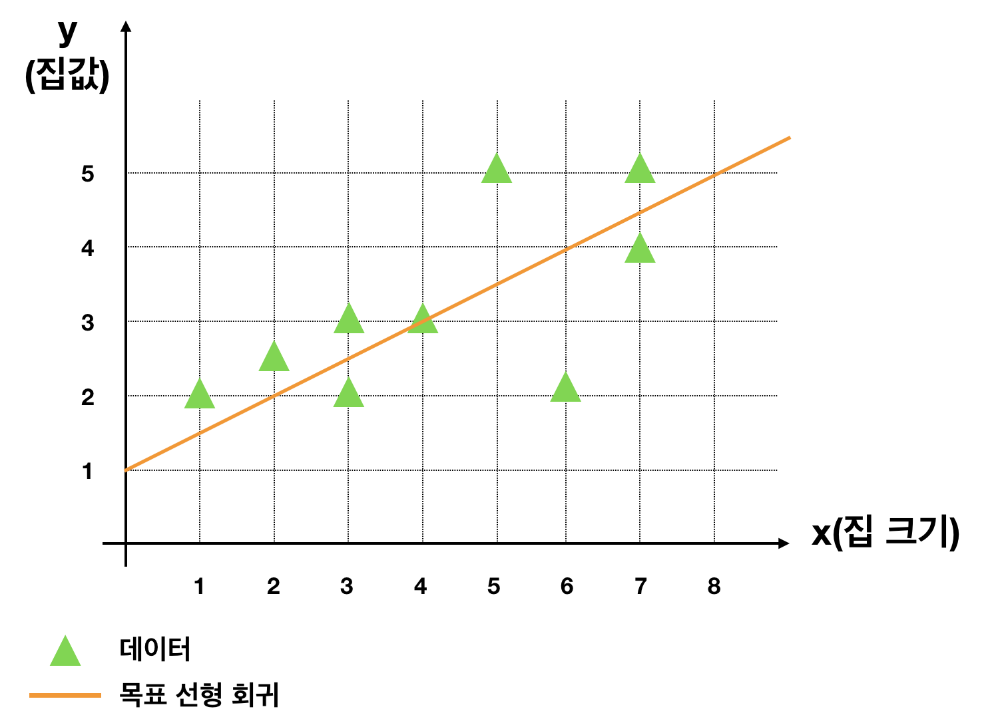
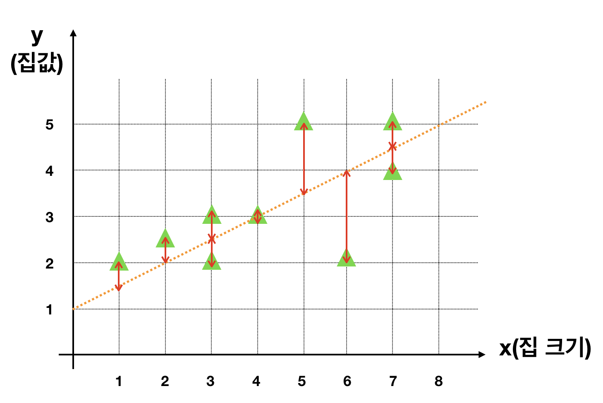
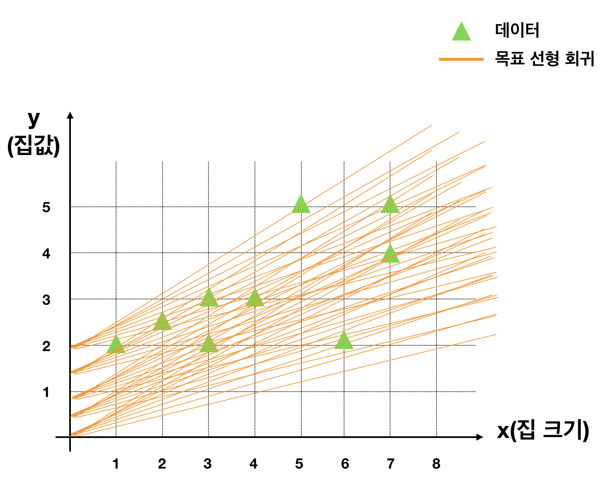

# Stage1 - Linear Regression을 배워보자

## Linear Regression

**선형회귀**란 종속변수 y와 독립변수 X의 상관관계가 선형으로 설명되는 회귀 분석입니다.

정의가 어렵다면 아래 그래프를 살펴보시죠.

**집크기에** **따른** **집 값을** **예측하려고** **할** **때** **위 그래프처럼** **간단하게** **선** **하나로** **표현할** **수** **있습니다.**

수학적으로 파고들면 더욱 엄격한 정의가 있지만, 현재 수준에서는 간단한 일차함수부터 시작하는 분석을 떠올리시면 됩니다. \(즉 위와 같은 직선부터\)

**이해하기** **쉬어** **모델을** **수립하기** **좋기** **때문에** **통계** **모델링에서** **굉장히** **많이** **활용됩니다.**

그러나 매우 복잡한 상황에서는 정확성이 떨어지는 한계가 있습니다.

## 수학적으로 이해하기

직접 코드로 작성한다면, 이 방법론의 원리를 이해하기 쉬워집니다.

이 데이터를 가지고 작업해보겠습니다. 먼저 수학적으로 접근해볼까요?

### 함께실습$1

#### 손으로 수학 문제 풀기

**위 그래프에 주황색으로 적당한 선을 하나 그었습니다. 저 주황색 선의 식을 구할 수 있다면 어느정도 집값을 예측할 수 있겠네요. 그러면 지금부터 주황색 선형회귀식을 찾아보겠습니다.**

`y = ax + b`  
**\(0, 1\)**을 지나고 **\(8,5\)**를 지납니다.

`1 = a✖️0 + b`  
`5 = a✖️8 + b`  
결국 `b = 1, a = 0.5` 를 얻을 수 있습니다.

y = 0.5x + 1  
만약 집 크기가 7이라면 `y = 0.5✖️7 + 1`, 즉 집 값은 **4.5**라고 추정할 수 있습니다.

## 직접 코드를 짜서 원리 이해하기

파이썬 코드로 이러한 식을 찾아내려면 어떻게 해야할까요?

먼저 오차를 구하는 방법을 정의하고, 여러 식을 테스트하여 그 중 가장 오차가 적은 식을 선별하면 됩니다.

즉 선으로 부터 데이터까지 화살표로 표시된 **거리 제곱의 합이 오차**입니다. 수많은 식을 그려보고 이 오차 합이 가장 적은 식을 고르면 됩니다.

저 수많은 선의 오차를 직접 구해보라고 어떠실것 같아요? 전 도저히 못할것 같습니다.

파이썬의 장점을 저러한 단순 반복 작업을 1초에 수천만번 대신해준다는 겁니다. 우리가 가지고 있는 일반사양의 데스크탑으로도 말이죠. 심지어 스마트폰의 성능으로도 가능합니다.

자, 이제 코드 작성으로 넘어가보겠습니다.

### 함께실습$2

#### a가 0.5, b가 0.5일 때 오차제곱의 총합

### 미션$1

#### a와 b가 \(0.5, 1\), \(0.4, 1\), \(0.4, 1.4\)일 때

미션을 진행하면서 아래 답을 채워보세요.

1. **\(0.5, 1\)**  **오차제곱의** **합** **\[                  \]**
2. **\(0.4, 1\)**  **오차제곱의** **합** **\[                  \]**
3. **\(0.4, 1.4\)**  **오차제곱의** **합** **\[                  \]**

### **이해하기**

**a가 0.4, b가 1.4**인 선형회귀식이 바로 우리가 최종적으로 찾은 회귀식입니다. \(더 좋은 식도 있습니다.\)

**눈으로 확인하려니 빨간색선과 주황색선의 차이가 별로 없어보이나요?**

오차제곱의 총합을 계산해보면 **주황색** 선의 경우 **7.5**, **빨간색** 선의 경우 **6.65**로 빨간색 선이 더 오차가 적다는 것을 확인할 수 있습니다.

간단한 데이터는 눈으로 파악하고 대강 선을 그어도 그럴듯한 식을 찾을 수 있지만, 앞으로 우리가 분석해야할 데이터는 집크기, 화장실 수, 설립연도 등 **수십개의** **특징을** **가진** **2만건** **이상의** **데이터** 입니다.

이 경우 직감적으로 선을 찾기보다, 파이썬 등을 이용해 **보다** **과학적인** **방법**들을 적용해야 하며 대표적인 방법으로 **머신러닝**이 있습니다. \(그래서 우리가 배우는 중이죠!\)

