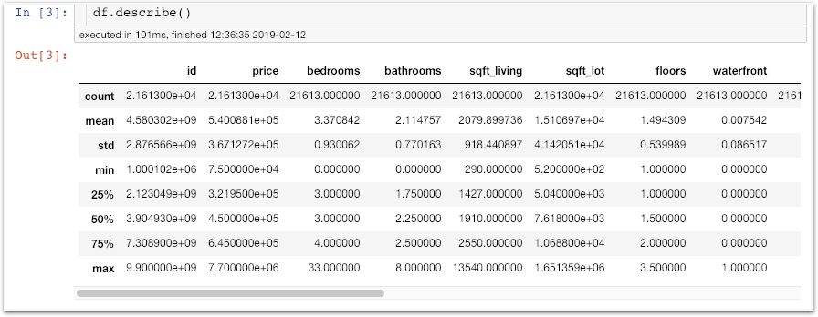
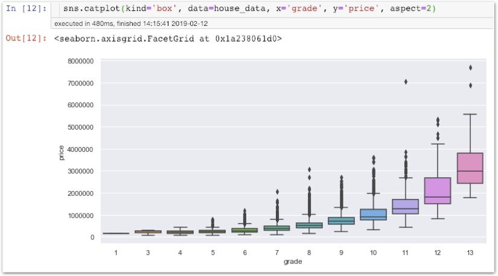

# Stage2 - Visualization 연습하기

## 워싱턴 King 카운티의 집 값 예측하기

집 크기, 욕실 수, 건설일 등의 특징을 가진 2만여 데이터를 바탕으로 집 값을 예측하는 문제입니다.

선형회귀로 분석하기 좋은 문제입니다. 집 크기, 욕실 수, 건설일 등 18가지 종류의 특징을 기반으로 얼마나 정확히 집 값을 예측하실 수 있나요?

## 집값 예측 문제 분석하기

### 함**께**실습$1

#### house 데이터 불러오기

**데이터** **다운로드** [**http://bit.ly/코알라\_DS\_5주차\_데이터**](http://bit.ly/코알라_DS_5주차_데이터)

### **함께실습$2**

데이터 특성 살펴보기

### **함께실습$3**

**필요없는 특징 없애기**

## **상관계수**

어떤 특징이 정말로 결과에 영향을 미친다고 확실할 수 있나요? 지금까지는 우리의 주관적인 추리능력으로 그 상관성을 예측했지만 이제 상관계수를 통해 객관적으로 관련 정도를 파악할 수 있습니다.

**상관계수** 변수와 변수의 관련성을 수치화  
**피어슨 상관계수** 두 변수의 선형적 상관관계를 표현

위 그래프를 보면, 발바닥의 크기와 키는 대체로 비례합니다. 발바닥이 클 수록 키가 크다고 생각하는건 매우 합리적이란 거죠. 이러한 경우 우리는 '두 변수가 상관관계에 있다'라고 말합니다.

발바닥과 키의 관계처럼, 발바닥이 클 수록 키가 커지는 모양새를 양의 상관관계라 합니다.

물건을 파는 사람이 많아지면 가격이 싸지는 것처럼, x축은 커지나 y축이 작아지는 모양새는 음의 상관과계라고 합니다.

### **함께실습$4**

#### 피어슨계수 히트맵으로 시각화하기

### **함께실습$5**

#### catplot으로 산포도 시각화하기

### **함께실습$6**

#### 특징의 범위 파악하기

### **미션$1**

#### **집 값의 범위 알기**

### **함께실습$7**

#### **거주면적에 따른 가격 분포도**

### **함께실습$8**

**박스 플롯**

\*\*\*\*

