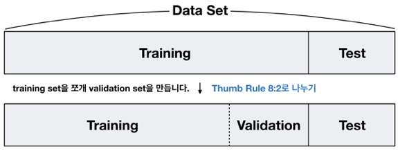
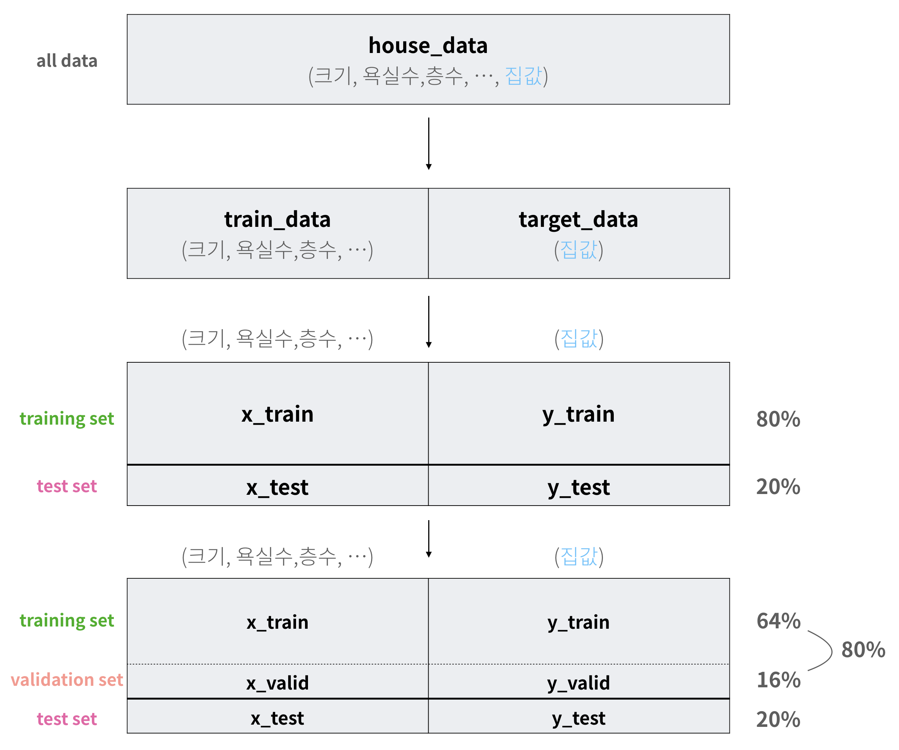
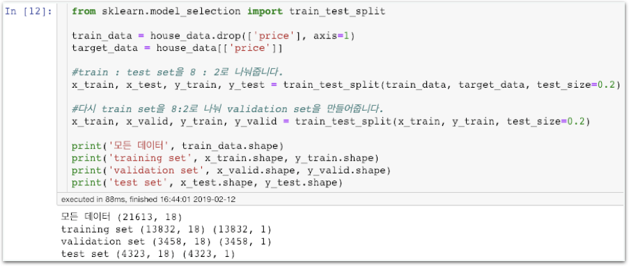
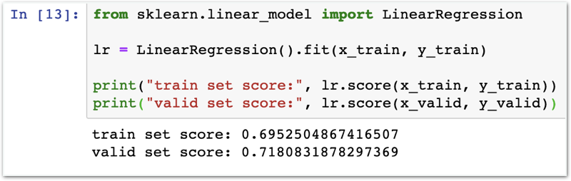
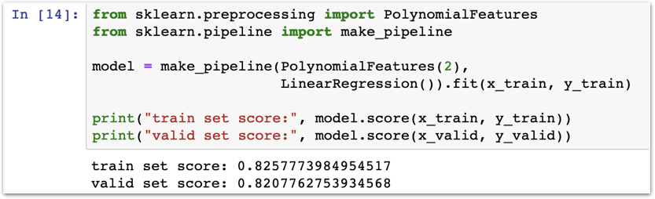
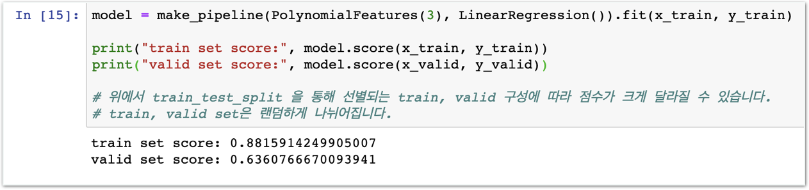
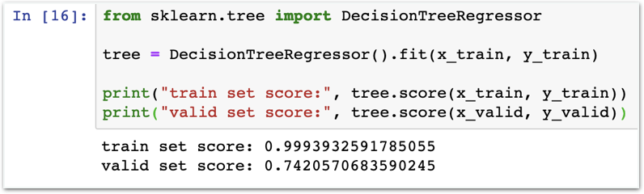
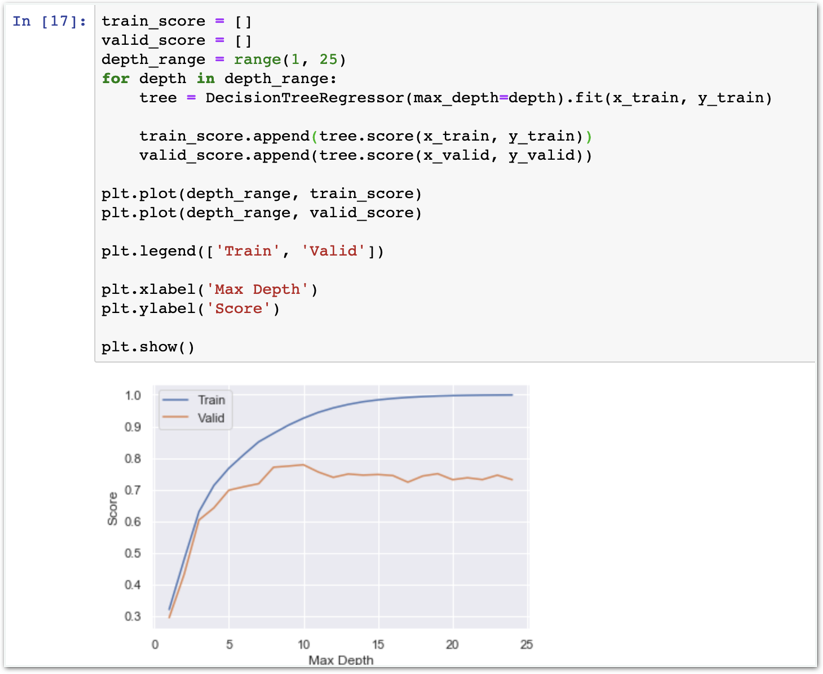

# Stage3 - Scikit-learn으로 Linear Regression 구현하기

## Data set 구성하기

### data set 구성 계획

1. 모든 데이터를 8:2로 나누고 8 부분을 다시 8:2로 나누어, training set, validation set, test set을 구성하겠습니다. **보유하고 있는 데이터는 총 21,613개입니다.**
2. training set만으로 여러 종류의 모델을 학습하고 validation set으로 각 모델의 성능을 측정할 예정입니다. **test set은 건드리지 않습니다.**
3. 최종적으로 21,613개 중 64%를 Training set으로, 16%를 Validation set으로 남은 20%를 Test set으로 구성하였습니다. **train set 13,832개, valid set 3,458개, test set 4,323개**

우리는 현재 모든 데이터를 house\_data라는 변수에 가지고 있습니다. 위와 같은 계획에 따라 데이터를 나눠주려고 할 때 다음과 같은 3단계를 거쳐야 합니다.

1. **훈련용 특징 부분과 정답부분\(레이블\)로 나누기** train\_data와 target\_data로 나눠집니다.
2. **80%를 training set으로 나머지 20%를 test set으로 나눠줍니다.** training set\(x\_train, y\_train\)과 test set\(x\_test, y\_test\)로 나눠집니다.
3. **training set을 다시 8:2로 나누어 training set과 validation set을 구성합니다.** training set\(x\_train, y\_train\)과 validation set\(x\_valid, y\_valid\)로 나눠지며 최종적으로 training set, validation set, test set을 가지게 됩니다.

조금 더 쉽게 살펴볼까요?

이 도표를 이해하시면 실습이 매우 쉬워집니다. 특히 x는 훈련용 특징 부분의 데이터, y는 정답부분\(레이블\)을 가리킨다는 것도 기억해주세요!

### 함께실습$1

#### 데이터 셋 구성하기

## scikit-learn으로 모델 구현 & 성능 평가

### 함께실습$2

#### Linear Regression

### 함께실습$3

#### Polynomial Regression

### 미션$1

#### Polynomial Features가 3인 모델 만들기

생각해보기 “함께실습$2보다 좋은 모델이라고 볼 수 있나요?”

### 함께실습$4

#### Decision Tree Regressor

### 함께실습$5

#### 여러 모델을 그래프로 표현하기

