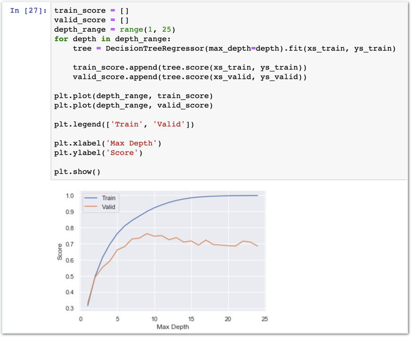

# Stage4 - Feature Scaling과 성능 개선

## Feature Scaling

Feature Scaling은 특징 값의 범위를 균일하게 맞춰주는 작업입니다.

집값 분석에서 몇개의 특징을 살펴보면,

| 특징 | 최소 | 최대 | 표준편차 |  |
| :--- | :--- | :--- | :--- | :--- |
| 집 층수 | 1 | 3.5 | 0.539989 | 좁은 범위 |
| 거주면적 | 290 | 13540 | 918 | **범위가** **너무** **넓다** |
| 화장실 수 | 0 | 8 | 0.770163 | 좁은 범위 |

두 특징값의 범위가 너무 크게 차이가 나다보니 이런 고민이 생기기 시작합니다.

우리가 scikit-learn으로 학습을 시작하면,  
모델이 거주면적과 집 층수를 같은 비중으로 생각하고 학습할까요?

모델에 따라 다르지만, 일반적으로 특징의 범위가 크게 다르면 모델은 각 특징의 중요성을 오인하기 마련입니다.


### 수학적 원리에 따라 스케일링 합니다.

특징의 데이터 폭이 너무 좁거나 너무 넓은 데이터를 적당한 범위로 조정해줍니다.


## StandardScaler 적용하기

### 함께실습$1

#### feature scaling 적용하기


### 어떤 원리인가요?

feature scaling 방법에는 여러가지 방법이 있습니다. StandardScaler는 정규분포에 속성을 이용한 방식입니다.


### 함께실습$2

#### feature scaling 적용된 결과 살펴보기

## Polynomial Regression

### 함께실습$3

#### Linear Regression with Feature Scaling

### 함께실습$4

#### Polynomial Regression with Feature Scaling

생각해보기1 “feature scaling하지 않았을 때보다 성능이 증가했나요?”  
생각해보기2 “-\(음수\) score가 나오는 이유는 무엇일까요?”


### stage3과 방식은 완전히 같습니다.

달라진 점은 어떤 데이터로 학습하느냐 입니다. 이번에는 feature scaling된 데이터로 학습합니다. 뒤에 이어지는 실습도 마찬가지입니다.


### 미션$1

#### polynomial features가 3인 Polynomial Regression 모델을 만들어주세요.

### 함께실습$5

#### Ridge - PolynomialFeatures\(2\)

### 미션$2

#### Ridge - PolynomialFeatures\(3\)

생각해보기 “alpha값은 어떻게 정해야 할까요?”


### Ridge

decision tree의 복잡도를 낮춰 overfitting 문제를 해결하는데 자주 사용됩니다.


### 함께실습$6

#### Decision Tree Regressor

### 함께실습$7

#### 여러 모델을 그래프로 표현하기

