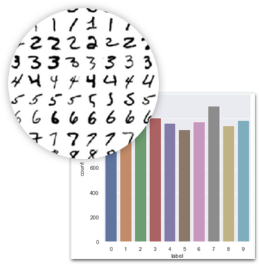
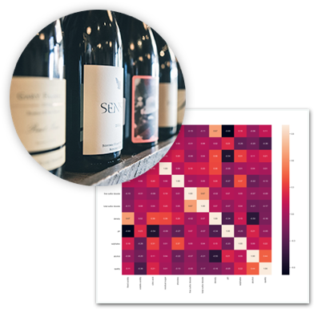

# 6주차 - LV1 데이터 사이언티스트 되기

## 이번 주 목표

### 두가지 실전 프로젝트 중 원하는 프로젝트를 골라, 자신의 힘으로 실전 분석을 실시합니다.

#### 프로젝트1 "숫자 손글씨 분석"

#### 프로젝트2 "와인 품질 측정"

‘숫자 손글씨 분석’ 혹은 ‘와인 품질 측정’ 미션 중 하나를 골라 자신의 힘으로 실전 분석합니다. 그동안 익힌 데이터 사이언스 실력을 유감없이 발휘해주세요.

