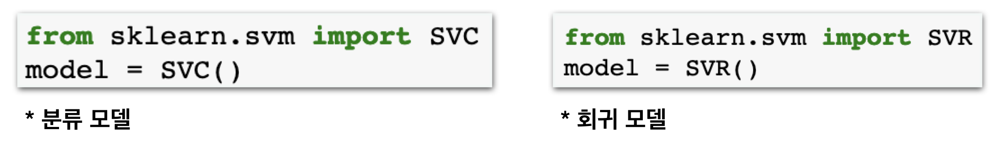

# Challenge - Support Vector Machine 사용해보기

## 문제

### Support Vector Machine 사용해보기

SVM\(Support Vecotr Machine\)은 Decision Tree, Random Forest와 같이 인기 있는 모델입니다. 사용하기 쉬우면서도 꽤 좋은 성능이 보장되기 때문에 실제로 굉장히 많은 분야에서 쓰이고 있습니다.

아쉽게도 SVM을 이해하려면, 그동안 배운위 모델들에 비해 더 많은 수학적 지식이 필요하기 때문에 수업 내에 다룰 수는  
없었습니다.

그래도 **사용법은** **똑같습니다.** 자세한 작동 원리를 몰라도 아주 간단한 코드를 통해 구현이 가능합니다. 그동안 학습에서 진행했던 부분을 아래와 같이 변경해주면 됩니다.

수년간 데이터사이언스를 공부하여 SVM의 자세한 원리를 알고 있는 인공지능 박사라 하여도 더 좋은 SVM을 쓰는건 아닙니다. 단지 위 코드를 입력할 뿐이죠. 원리를 몰라도 놀라울 정도로 강력한 머신러닝 모델들을 이용할 수 있다는 사실, 그것이 지금 시대의 데이터 사이언스가 강력한 이유이며 우리 모두 배워야하는 까닭입니다.

**자, 그럼 오늘 진행한 프로젝트에 SVM을 적용해보세요!** 시간이 난다면 다른 프로젝트에도 적용해보시죠:\)

## **방법**

### **오른쪽** **멤버가** **강의자료를** **열고,** **왼쪽** **멤버가** **메모장을** **열어** **답을** **적습니다. 서로** **의논하여** **답을** **채워주세요.**

1. **내가** **선택한** **프로젝트는** **어떤** **문제인가요?**  **\[** **회귀** **or** **분류** **\]**
2. **내** **코드에서** **어디** **부분을** **수정해줘야** **할까요?**  **\[                                                                     \]**
3. **각자** **코딩을** **시작하세요!**
4. **성능이** **좋아졌나요?** **떨어졌나요?**  성능이 이렇게 바뀌었습니다.  **\[                                                                      \]**



