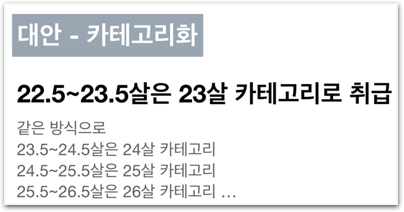

# 과제2 - 더 좋은 평가지표 고안하기

## 문제

### 더 좋은 평가지표 고안하기

stage4에서 검증방안에 대해 배워봤습니다.

**카테고리화\(우측** **이미지\)**는 **회귀** 문제의 성능평가 지표로 활용하기에 좋습니다. \(우리 입문자 수준에 딱 맞죠\)

> 이 커리큘럼에서는 이해하고 활용하기 좋은 평가지표를 소개해드렸습니다. 미처 소개못한 수학적이고 고도화된 평가방법이 많지만, 공통적으로 모든 문제마다 적절한 검증방법을 스스로 고안해내야 한다는 점은 변하지 않습니다.

이 과제는 ‘와인 품질 측정하기’ 프로젝트를 선택하신 분이 진행하실 수 있습니다. ‘숫자 손글씨 인식’ 프로젝트를 선택하셨다면 와인 품질 측정 문제도 도전해보세요.

## **방법**

### **다음** **단계를** **따라** **과제를** **진행하세요.**

**\[단계1\]** 내가 선택한 프로젝트는 어떤 문제인가요? **\[** **분류** **or** **회귀** **\]**

**\[단계2\]** 어떤 특징에 카테고리를 적용해 볼 수 있을까요?  
**\[ \]**

**\[단계3\]** 자습자료를 보고 내용을 이해해주세요.

**\[단계4\]** 직접 코딩해보세요!



