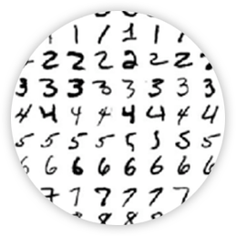
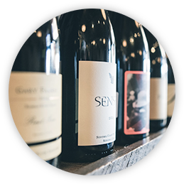
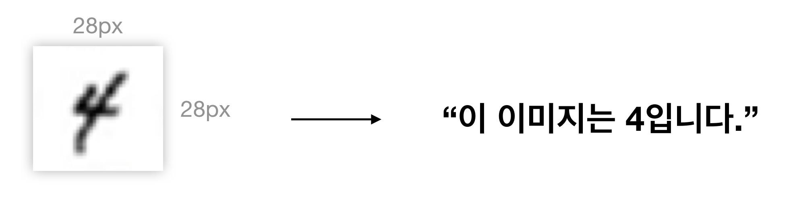
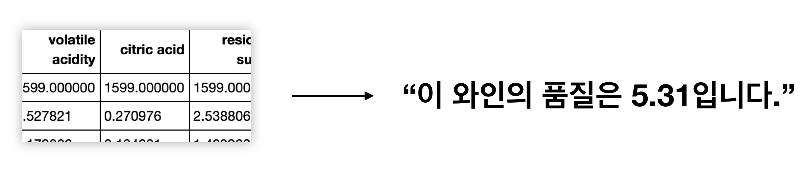

# Stage1 - 문제 탐색

## 문제 소개

### 숫자 손글씨 인식하기

#### OCR 숫자 인식기

OCR이란 사진, 스캔 등 글자의 픽셀 이미지로 부터 기계가 읽을 수 있는 문자로 변환하는 작업입니다. 자동차 번호판 인식, 카드 스캔 등에 쓰입니다.

**DATASET** 28\*28 사이즈의 숫자이미지 10,000개와 각 숫자이미지에 대응되는 실제 숫자 정보

### 와인 품질 측정하기

#### 레드와인 품질 측정하기

와인의 품질을 평가하려 할 때 마다 소믈리에가 찾아와 알려주기는 어렵습니다. 몇몇 데이터만으로도 와인의 품질을 추정할 수 있다면 어떨까요?

**DATASET** 산성도, 도수, 설탕 잔량 등 11가지 입력 정보와 그에 대응되는 퀄리티 값을 가진 1,599개의 데이터

## 문제 정의 및 가설 수립

### **숫자 손글씨 인식하기**

#### 문제 정의

28\*28 픽셀의 손글씨 숫자 이미지를 입력받아 실제로 의미하는 숫자를 인식한다.

#### 가설 수립

28\*28 픽셀 데이터, 즉 784종의 특징 데이터를 구성한 후 머신러닝을 통해 실제로 어떤 숫자인지 추측할 수 있다.

#### 목표

28\*28 사이즈의 숫자 손글씨 이미지로 부터 label값을 얻어낸다.

### 와인 품질 측정하기

#### **문제** **정의**

와인의 화학 측정 데이터로 부터 기존에는 미각, 후각으로 측정하던 와인의 품질을 추정한다.

#### 가설 수립

산성도, 알코올 도수 등 정량적으로 측정하는 화학데이터로 특징 데이터를 구성한 후 머신러닝을 통해 미각 측정 없이 와인의 품질을 추정할 수 있다.

#### 목표

화학 특징 데이터를 입력받아 0~10 사이의 숫자로 와인 품질을 추정해낸다.

## 데이터 확보

### 숫자 손글씨 인식하기

#### 데이터 확보 방법

1. **직접 제작** 타블렛, 스마트폰, 촬영 등을 이용하면 5명 기준 1시간에 1000개의 데이터를 만들 수 있다. 
2. **온라인 수집**  크롤링을 통해 온라인에 널린 숫자 손글씨 수집한다. 
3. **synthesizing**  폰트를 이용해 숫자를 찍고 자간, 장평, 기울기, 노이즈 등을 조정하여 손글씨 처럼 합성한다. 
4. **데이터 구입**

#### **데이터** **구성**

1. **최소** **개수**  10,000건 수집을 목표로 한다.
2. **특징** **데이터**  28 x 28 크기의 손글씨 숫자 이미지를 수집한다.

#### **데이터** **확보**

직접 제작했다고 가정합니다.  
준비된 데이터 파일을 다운로드해주세요. [http://bit.ly/코알라\_DS\_6주차\_데이터](http://bit.ly/코알라_DS_6주차_데이터)

### 와인 품질 측정하기

#### **데이터** **확보** **방법**

1. **직접** **제작**  자신이 운영하거나 혹은 타인, 의뢰자의 와인 창고를 이용하여 직접 데이터를 수집한다. 하루에 약 100건의 데이터를 수집할 수 있다.
2. **데이터** **구입**

#### **데이터** **구성**

1. **최소** **개수**  1,500건 수집을 목표로 한다.
2. **특징** **데이터**  11개의 입력 특징 데이터
   1. fixed acidity 
   2. volatile acidity 
   3. citric acid 
   4. residual sugar 
   5. chlorides 
   6. free sulfur dioxide 
   7. total sulfur dioxide 
   8. density 
   9. pH 
   10. sulphates 
   11. alcohol 

#### **데이터** **확보**

직접 제작했다고 가정합니다.  
준비된 데이터 파일을 다운로드해주세요. [http://bit.ly/코알라\_DS\_6주차\_데이터](http://bit.ly/코알라_DS_6주차_데이터)

