# Stage2 - Feature Engineering

## EDA\(exploratory data analysis\)

EDA\(탐색적 자료 분석\)란 _\*\*_특성에 숨겨진 패턴을 찾아내고 구조를 이해할 수 있도록 단서를 찾아 동분서주하는 방식의 데이터 분석 방법입니다.

우리가 흔히 하는 분석 방법이기도 하죠.

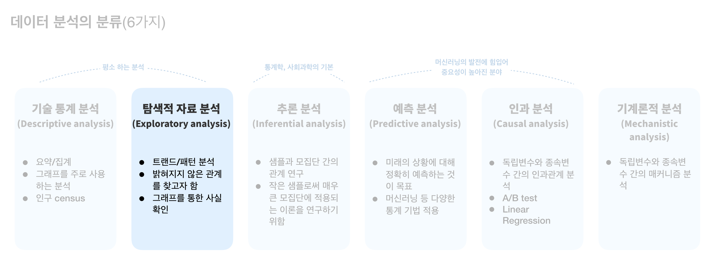

## Visualization

그동안 배운 차트, 플롯들은 아래와 같습니다.

### Line Plot

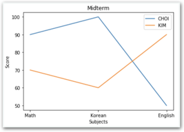

### Bar Chart

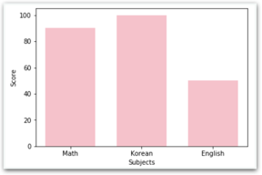

### 기본 산포도

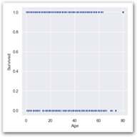

### Categorical Scatter Plot

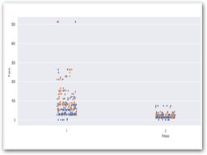

### Pair Plot

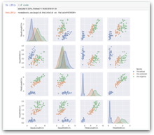

### Box Plot

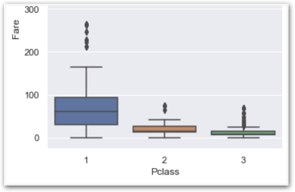

### Violin Plot

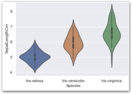

### Count Plot

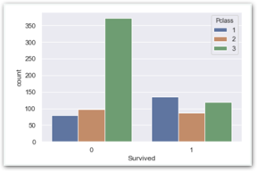

### 밀집도

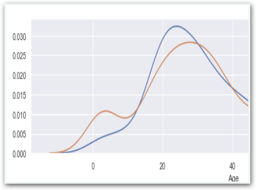

### 히트

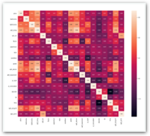

## EDA & Feature Engineering

### 숫자 손글씨 인식하기

#### **일반적으로** **OCR** **문제에서** **고려할만한** **요소들**

1. **이미지를** **모두** **흑백으로** **바꾸기**  이미지가 컬러든 흑백이든 인식률은 거의 차이가 없습니다. 머신러닝을 용이하게 할 수 있도록 흑백으로 바꿔줍니다.
2. **이미지** **사이즈를** **28 x 28로** **조정하기** 이미지 사이즈가 28x28이 아닐 경우 모델이 작동하지 않습니다. 따라서 입력되는 모든 데이터의 이미지가 균일한 크기가 되도록 조정해줍니다.
3. **준비된 이미지 데이터는 이미 위 요소들이 고려되어 있습니다.**

#### EDA & Feature Engineering 최소 요구사항

EDA 파트에서 아래 두가지 미션은 반드시 진행해주세요. 다른 분석을 추가하시면 더 좋습니다.

**1. label\(숫자 종류: 0~9\)별로 몇개의 데이터가 있는지 시각화하기**

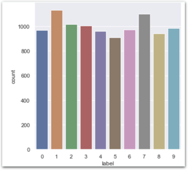

**2. 픽셀 특징이 가지고 있는 최솟값, 최댓값 파악하기**

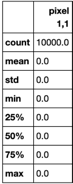

### 와인 품질 측정하기

**일반적으로** **품질** **추정** **문제에서** **고려할만한** **요소들**

1. **EDA, visualization을** **통해** **문제가** **있는** **특징** **찾아주기**  데이터 수집을 자신이 처음부터 끝까지 관장한게 아니라면, 그 데이터 자체의 품질도 100% 신뢰하기 어렵습니다. 자신이 직접 수집했다 하더라도 실제로 데이터를 얻는 과정에서는 반드시 문제가 생기기 때문에 오차가 생길 수 밖에 없습니다. 생략하거나 어림짐작하여 수집한 데이터가 존재하기 마련이고 이러한 특징들은 분석 정확도를 크게 낮추는 원인이 됩니다.
2. **비어있는** **값이** **있는지** **확인하기**  비어있는 값은 반드시 다른 값으로 대체되어야 합니다. 해당 특징의 평균값, 중앙값, 0 등 여러가지 방식으로 비어있는 값을 설정해줍니다.
3. **특징의** **중요도** **파악하기**  차트, 피어슨계수 등을 출력하여 특징의 중요도를 대략적으로 파악하고 원하는 특징만을 선택해 모델링 할 수 있도록 준비합니다.

#### EDA & Feature Engineering 최소 요구사항

EDA 파트에서 아래 두가지 미션은 반드시 진행해주세요. 다른 분석을 추가하시면 더 좋습니다.

**1. 와인 품질의 밀집도 파악하기**

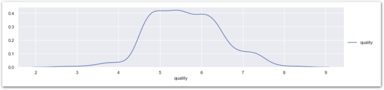

**2. 특징 상관계수 히트맵**

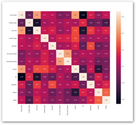

## 이미지 출력하기

**숫자 손글씨 인식** 프로젝트의 경우, 학습 데이터 즉 각 숫자들이 어떻게 생겼는지 이미지를 출력할 필요가 있습니다.

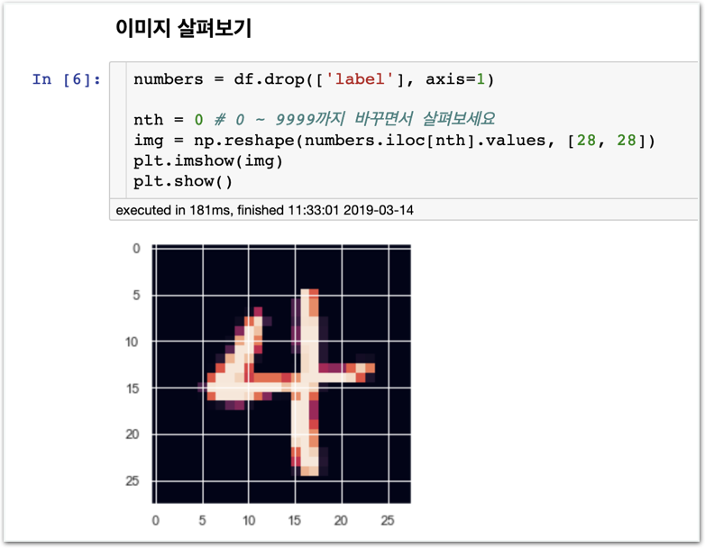

* **데이터를 불러온 직후 혹은 Feature Engineering 단계**에서 이미지의 생김새를 알아보기 위한 용도로 사용해주세요.

